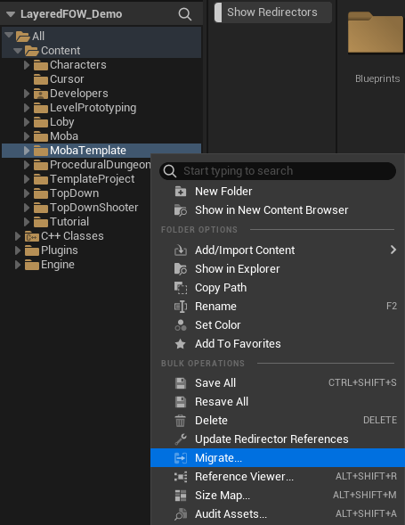
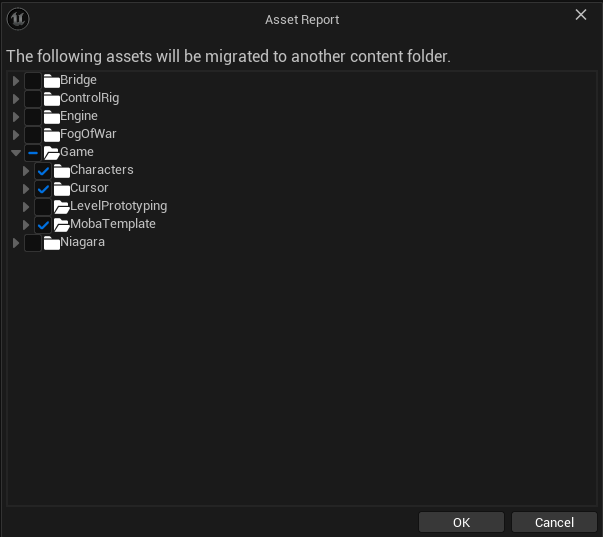
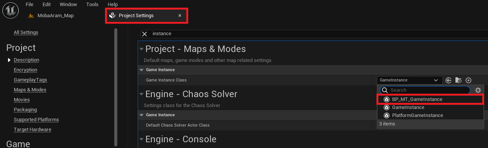
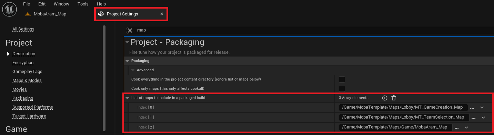
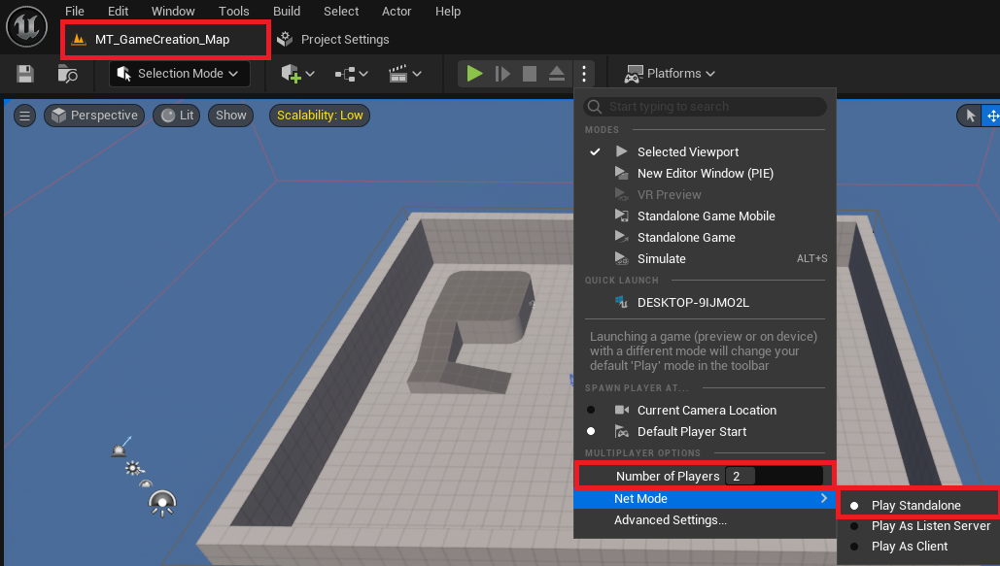

# MOBA Template

- [Migration](#migration)
- [Explanation](#explanation)

This tutorial is about making an online MOBA game with the `LFOW` enabled. I've created a lightweight template for you to migrate to your current project under UE5.4.
You will find the template folder in the content folder provided in the [Demo Project](https://github.com/gandoulf/LayeredFOW_Demo)  
The template includes:
- Create/Join game lobby.
- Team selection lobby.
- ARAM-like map with the fog enabled for 2 teams.

## Migration

Use this template in your project by following these steps. 
First, ensure that the Layered Fog of War plugin is correctly installed and enabled.

Go to the `MOBATemplate` folder in the `Demo Project`, right-click on it, and select `Migrate`.

A window will open and allow you to select what you want to migrate. Be very careful to select only what's under the `TemplateProject`. 
If you've created an empty project, you can also export the `Character` and the `Cursor`. Unreal will then ask you for the content folder of your `New Project`.

In your `New Project`, open the `Project Settings` and change the `GameInstance` to `BP_MT_GameInstance`.

Still in the `Project Settings`, add the 3 maps provided to the list of maps to include for packaging:
- `MT_GameCreation_Map`
- `MT_TeamSelection_Map`
- `MobaAram_Map`

Finally, set the `NetMode` to `PlayStandalone` and add some players. Hit the play button to `Create` and `Join` a game.

## Explanation

The template has been made to allow fast implementation of the `LFOW` with network support enabled. The initialization pipeline in Unreal can be troublesome,
especially when adding additional layers like a plugin. The `LFOW network` setup assigns players during their connection, which is helpful for the plugin
pipeline but might seem too fast and, without the correct knowledge, could become an issue. 

To make this pipeline work correctly, three external elements are needed:
- `GameMode`: Used to detect when a pawn is controlled and to set up the `FogTeam` and `Location`.
- `GameState`: Used to get the `FOWHandler`.
- `GameInstance`: Used to associate the client's `UniqueNetID` with a `Team`.

A `PlayerState` element will also be necessary, but only during the `Lobby` phase. It will be responsible for communication between the server and the client
using RPC functions.

Regarding the `LFOW`, only two elements will need to be created:
- `FOW_NetworkSettings`: To provide a server class, set the team number, and determine if the fog needs to be replicated.
- `FOW_FogStateReplication_Server`: To override `GetClientTeamIdx` and correctly get the client's `Team` based on the `UniqueNetID`.

Don't forget to copy and use the files from the template for the development of your project!

---
_Documentation built with [**`Unreal-Doc` v1.0.9**](https://github.com/PsichiX/unreal-doc) tool by [**`PsichiX`**](https://github.com/PsichiX)_