# First set up

## Table of Contents

- [Installation](#installation)
- [Set up the fog](#set-up-the-fog)
- [Going further](#going-further)

## Installation

Download the Demo project [Here](https://github.com/gandoulf/LayeredFOW_Demo)  
Install the plugin in the project, helping video [Here](https://www.youtube.com/watch?v=BVz-TQKzHNY)  

## Set up the fog

This part will explain how to use the Fog Of War in the easiest and fastest possible way!

Drag and drop a `BP_FOWHandler` from the quickly add button, keyboard is enabled to allow you fast search

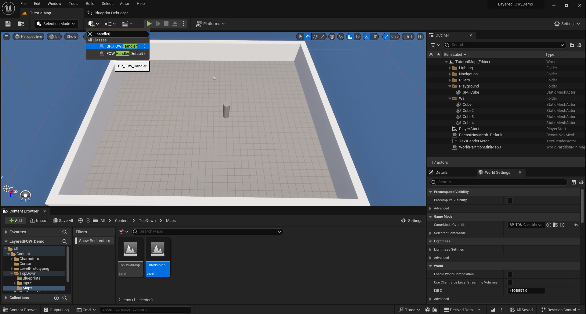

Once in your scene you will see two boxes:
- Yellow one, representing the Fog in 3D
- Pink one, representing the fog aligned to the tile grid

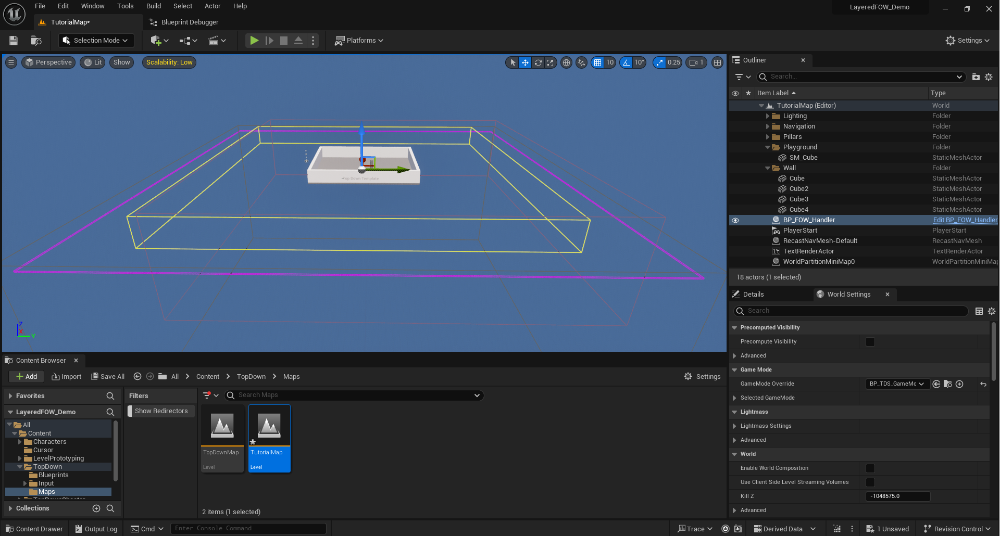

Add a `FOW_Drawer_FOV` to the BP_TutorialCharacter

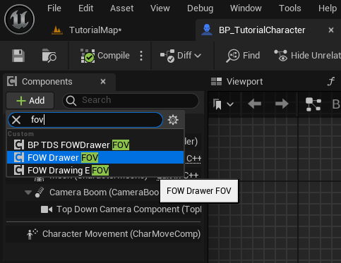

Hit the play button for the first preview of the FOW !!

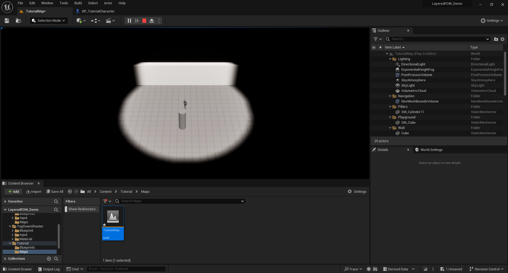

Now that the FOW is running we're gonna add collision to limit the sight of character.
Add `FOW_CollisionEntity_BoxComponent` to the four walls in the map

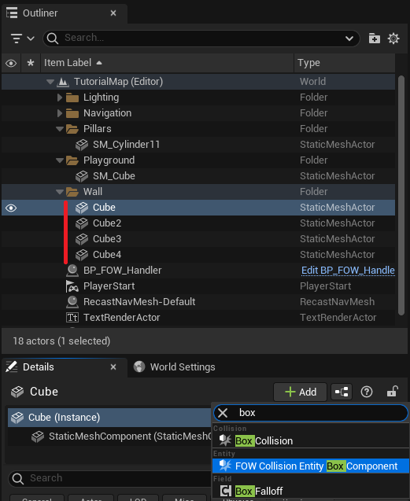

You will have to reset the scale of the box collision to 1 to make them fit to the asset

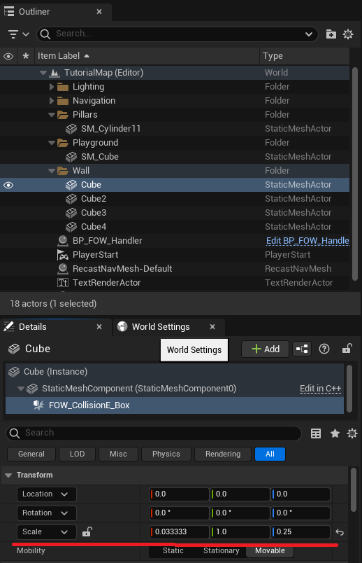

Boxes are cool but might be a bit limited, let's see how to do otherwise
Add `FOW_CollisionEntity_CustomComponent` to the cylinder in the map.

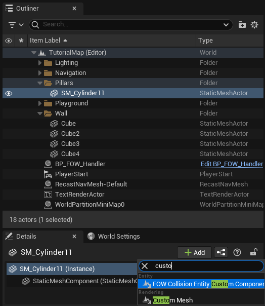

In the details panel, select the component and Add 8 vertices to the `CustomGeometryVertices` array.
Position the vertices in top view such as they fit to the object, grid snapping might be annoying.

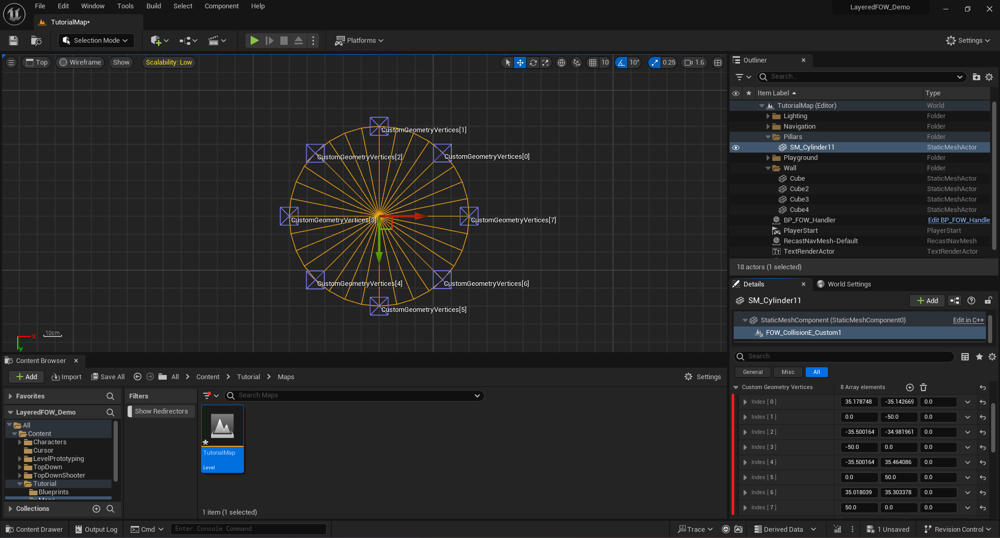

You can hit the play button again and see that the cylinder collision is projected!

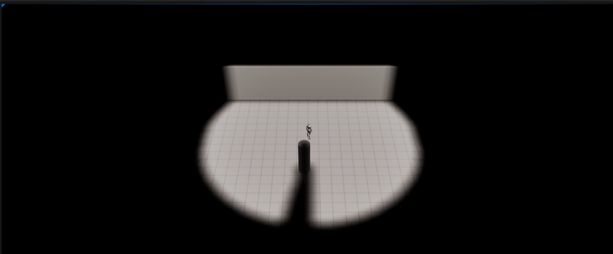

## Going further

If you are setting up the FOW for a custom map you can change the size and position of the floor
in BP_FOWHandler in the details panel. You can also add other floors to extend your game however
you want. check the [Floor page](Floor_Verticality.md) for more information to set up the fog in your level.

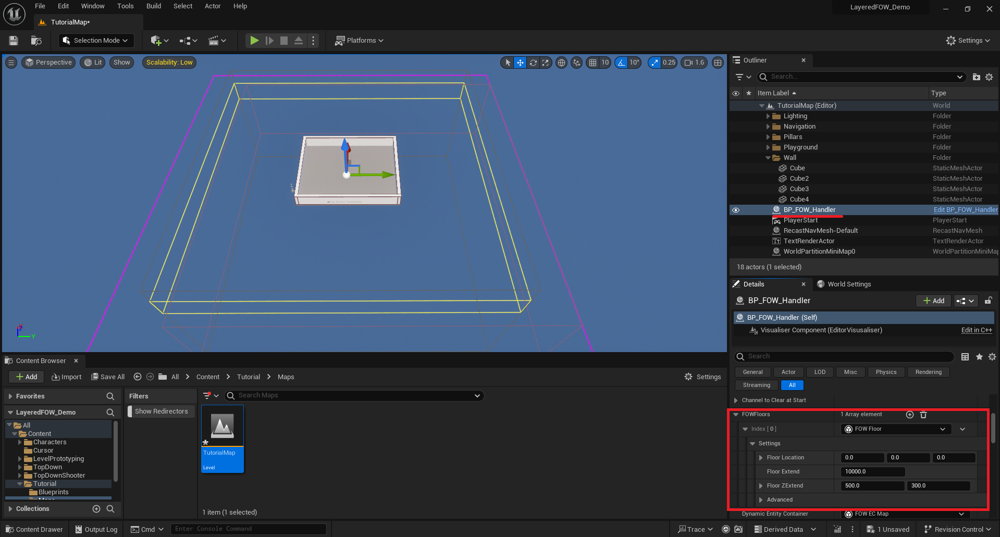

The base radius of the `FOW_Drawer_FOV` component might be too small, don't hesitate to change it
in the actor holding the component. Modify the `DrawerRadius` value to provide a larger sight to your units.

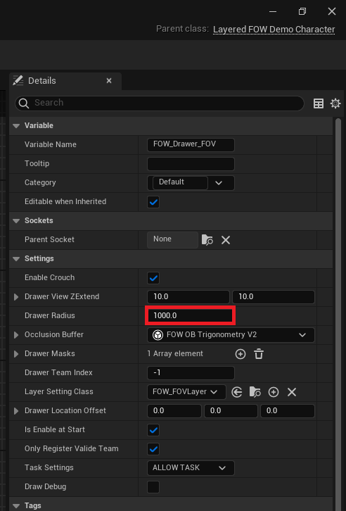

You can change the fog precision of the FOW in the `BP_FOW_Handler` by going in the details panel
and by changing the `PixelSize` value. By default, the fog pixel is set to 25 centimeters

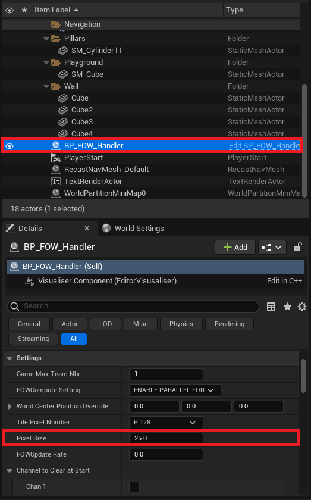

---
_Documentation built with [**`Unreal-Doc` v1.0.9**](https://github.com/PsichiX/unreal-doc) tool by [**`PsichiX`**](https://github.com/PsichiX)_