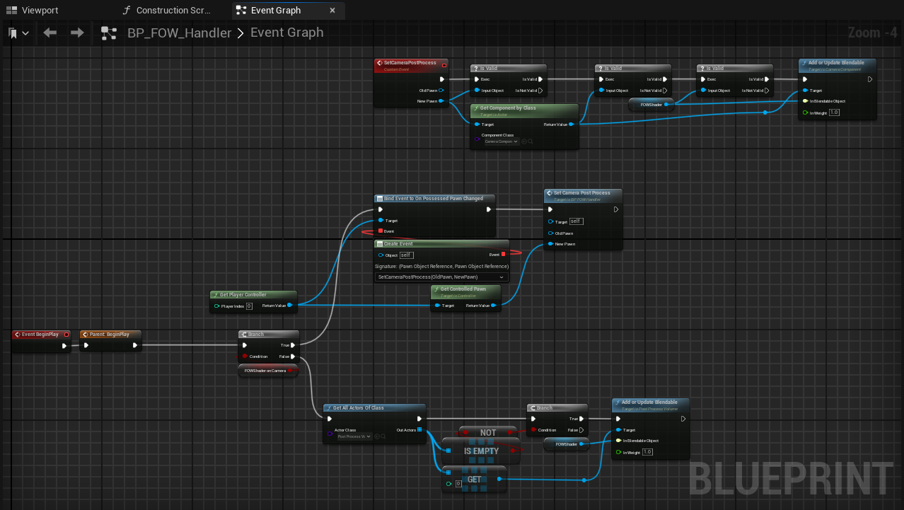

# First set up

## Table of Contents

- [Installation](#installation)
- [Set up the fog](#set-up-the-fog)
- [Going further](#going-further)
- [Setup issues](#set-up-issues)

## Installation

This tutorial has been realised in the `Tutorial/Maps/TutorialMap_Minimaps` map providen in the demo project.
If not done yet, download the Demo project [Here](https://github.com/gandoulf/LayeredFOW_Demo)  
Install the plugin in the project, helping video [Here](https://www.youtube.com/watch?v=B9pieujL91c)  

## Set up the fog

> **/!\ The `FOWHandler` will use the camera on the `Controlled Pawn` for the Post Process. If your game has a
different setup for the camera, open the `BP_FOW_Handler` and tweak the code to correctly find the game camera. **

This part will explain how to use the Fog Of War in the easiest and fastest possible way!

Drag and drop a `BP_FOWHandler` from the quickly add button, keyboard is enabled to allow you fast search

Once in your scene you will see two boxes:
- Yellow one, representing the Fog in 3D
- Pink one, representing the fog aligned to the tile grid

Add a `FOW_Drawer_FOV` to the BP_TutorialCharacter

> **Note that the `FOW_Drawer_FOV` is an effective solution if you have a few instances of it. If you plan to have more
than 20 drawing objects, consider using [FOW_DrawingEntity_FOVComponent](entities/Drawing_Entity.md), which perform significantly faster.  **

Hit the play button for the first preview of the FOW !!

Now that the FOW is running we're gonna add collision to limit the sight of character.
Add `FOW_CollisionEntity_BoxComponent` to the four walls in the map

You will have to reset the scale of the box collision to 1 to make them fit to the asset

Boxes are cool but might be a bit limited, let's see how to do otherwise
Add `FOW_CollisionEntity_CustomComponent` to the cylinder in the map.

In the details panel, select the component and Add 8 vertices to the `CustomGeometryVertices` array.
Position the vertices in top view such as they fit to the object, grid snapping might be annoying.

You can hit the play button again and see that the cylinder collision is projected!

## Going further

If you are setting up the FOW for a custom map you can change the size and position of the floor
in BP_FOWHandler in the details panel. You can also add other floors to extend your game however
you want. check the [Floor page](Floor_Verticality.md) for more information to set up the fog in your level.

The base radius of the `FOW_Drawer_FOV` component might be too small, don't hesitate to change it
in the actor holding the component. Modify the `DrawerRadius` value to provide a larger sight to your units.

You can change the fog precision of the FOW in the `BP_FOW_Handler` by going in the details panel
and by changing the `PixelSize` value. By default, the fog pixel is set to 25 centimeters

# Setup issues

If you import the plugin to an existing project, you might encounter rendering issues, and the fog won't appear.
The problem arises from the `BP_FOW_Handler` PostProcess initialization. By default, it attaches the PostProcess
to a camera present on the `Controlled Pawn` or to the first `PostProcessVolume` found.

To solve this issue, you can change the Blueprint code or simply create a new Blueprint inheriting from `FOW_Handler_Default`.
Once created, you will just need to override the `Begin Play`, write your logic, and replace the `BP_FOW_Handler` present in
your scene with the new one.

---
_Documentation built with [**`Unreal-Doc` v1.0.9**](https://github.com/PsichiX/unreal-doc) tool by [**`PsichiX`**](https://github.com/PsichiX)_