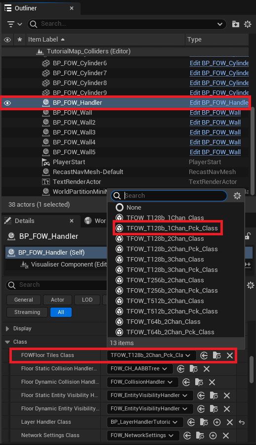
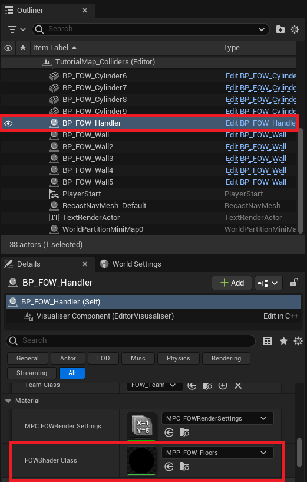
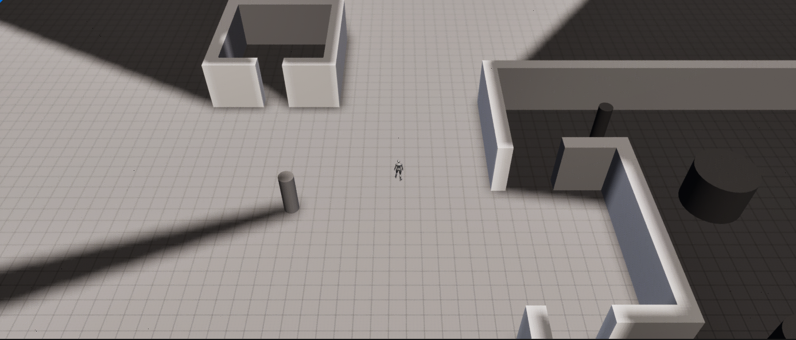

# Fog Channels

- [Basic](#basic)
- [Advanced](#advanced)

This tutorial is based on solo games; everything related to channels needs to be taken with caution when applied to
teams. However, everything works the same; teams will only limit the number of available channels.

## Basic

The FOW has up to 8 configurable channels that you can use. (Be careful with games having teams) The channels may
or may not all be used. For the default setup of the FOW, only two channels are used:
* The first channel defines what the player currently sees.
* The second channel defines what the player has seen.

This setup is mostly used for narrative games or RTS with procedural maps, but you might want to make a game more
MOBA-oriented with everything revealed to the players, which means that you only need the first channel to represent
the sight of the player.

Let's change the FOW to have only one channel. First, select the `BP_FOW_Handler`, go to the details panel and click
on the `FOWFloorTilesClass` input field, and select `TFOW_T128b_1Chan_Pck_Class`.

Still in the `BP_FOW_Handler` details panel, find the `FOWShaderClass` variable and open the provided material; it
should be `MPP_FOW_Floors`.

Find the material function with 8 channel output pin and unlink the `chan2` from the linked `lerp` node. The `Alpha`
value should be set to 1.

You should be done; press play and check that the FOW correctly displays only one channel.

You might have figured out that only doing the material part would have done the trick, and yes it would have. But you
would have let the FOW do all the computation in CPU and GPU of the `Chan2`.

## Advanced

In the advanced part, I'll show you how to implement and use more than 2 channels by creating new `FOW_Tile_Class` and
`FOW_LayerSetting`. To be done ...

---
_Documentation built with [**`Unreal-Doc` v1.0.9**](https://github.com/PsichiX/unreal-doc) tool by [**`PsichiX`**](https://github.com/PsichiX)_