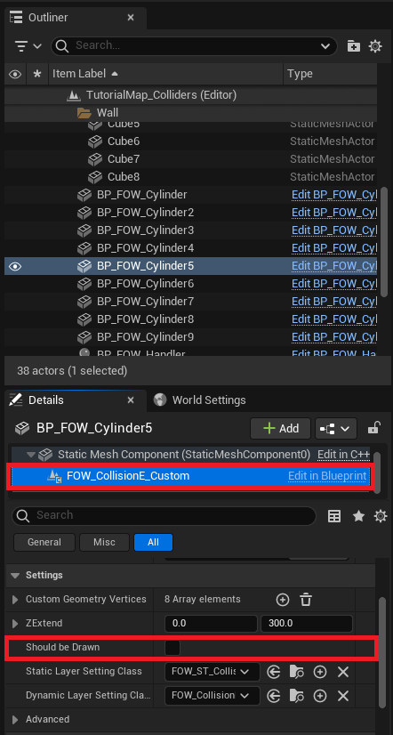

# Layers

- [Create and Add Layers](#create-and-add-layers)
- [Static Layers and Optimization](#static-layers-and-optimization)

For this tutorial use Tutorial/Maps/TutorialMap or Tutorial/Maps/TutorialMap_Collider map provided in
the [Demo Project](https://github.com/gandoulf/LayeredFOW_Demo)

## Create and Add Layers

This part will explain how `LayerSettings` work and how you can create new ones for your games. First, you have
to know that they are dissociated to provide different information to the FOW but also to provide a computation
order during the fog fragment merging. It can be compared to a rendering pipeline. To register a new layer, you
will have to create a `LayerHandler`.

Let's try to change the behavior of the drawer on your character. We want him to reveal only the black fog but
not to give him sight.

Create a new BP_MyLayerHandler derived from `FOW_LayerHandler`

Create a new BP_MyFOVLayer derived from `FOW_LayerSettings`

Open your layer handler and add the new layer you've just created. Add it just under the `FOW_FOVLayer`

Now we need to tell the `FOW_Handler` that we are using a new layer pipeline. Select the `BP_FOW_Handler` and
change in the details panel, in the class section, the value of the `LayerHandlerClass` to the one you've created

Open the blueprint holding the `FOVDrawer`, select it and go to the detail panel. Scroll to the `LayerSettingClass`
and replace it with the one you've created

Now that everything is correctly set, we can change the behavior of the `LayerSetting`. Open the blueprint, turn
the `InverseBits` to true (I'm going to ask you to trust me on that, every FOV Layers will need this to be true)
and set the `RevealSight` to false and `RevealFog` to true. Doing so will prevent the player from having sight
on `VisibilityEntity` however the layout will be revealed

Enjoy your new layer setting! Check out the [Visibility Entity page](/book/Tutorials/Visibility_entity.md) to really understand
the difference between `RevealSight` and `RevealFog`.

## Static Layers and Optimization

The FOW is a heavy piece of code to update and optimization is present almost everywhere. Sadly optimization can
have counterparts. Static layers can be really interesting to reduce the computation time; it will prevent the
re-generation of a fog fragment (heaviest update) if the drawer and the entities bound to it haven't moved.

The plugin uses static layers only for collision; geometry will be collected and drawn into a fog fragment and be
merged with other fragments during every update. Doing so prevents the sight drawing from using the whole collider
vertices to cast shadow.

To enable this optimization first open your `LayerHandler` and check the `DrawFOWCollider` box.

> **Caution, this optimization is really effective for colliders if the owning actor is static.**

This setting provides the possibility for every collider to send its geometry to a `SharedDrawer`. By default,
every collider is set to do so. You can disable this feature by unchecking `ShouldBeDrawn` from the `CollisionEntity`.

If the colliders are drawn, the collision shadow will remain even if the collider isn't in sight. `ShouldBeDrawn`
is enabled on the left and disabled on the right.

It might sound weak as an optimization since there are only 4 vertices in a rectangle. But if you multiply the few
triangles by the number of colliders and by the number of AI, we're talking about milliseconds saved by the update.
It's even more effective for custom collision with a lot of vertices.

---
_Documentation built with [**`Unreal-Doc` v1.0.9**](https://github.com/PsichiX/unreal-doc) tool by [**`PsichiX`**](https://github.com/PsichiX)_