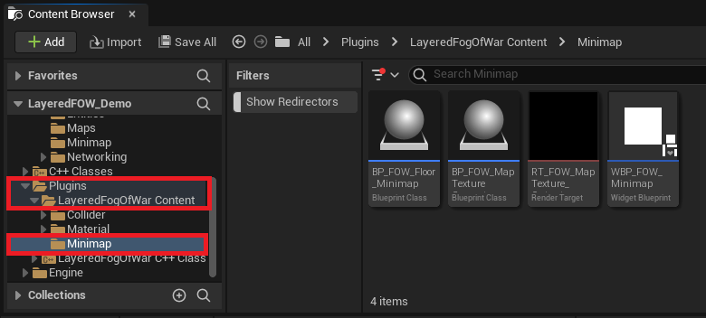
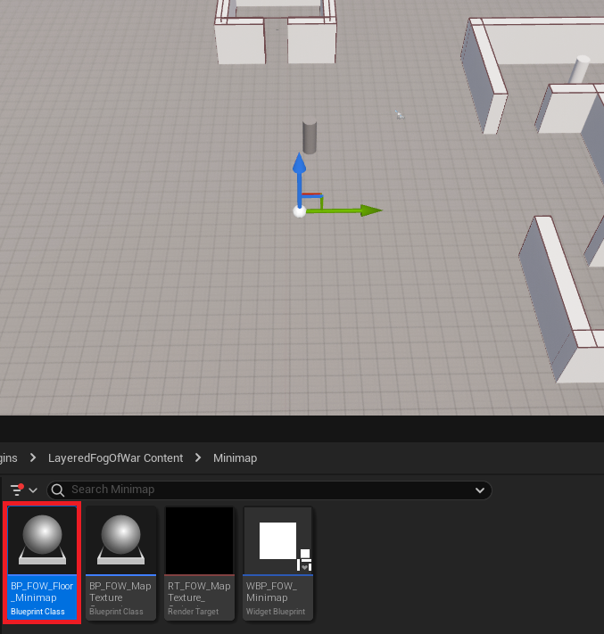
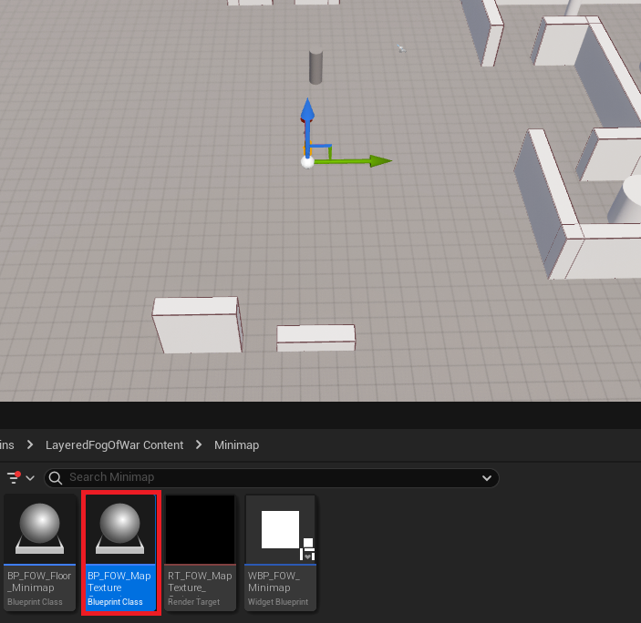
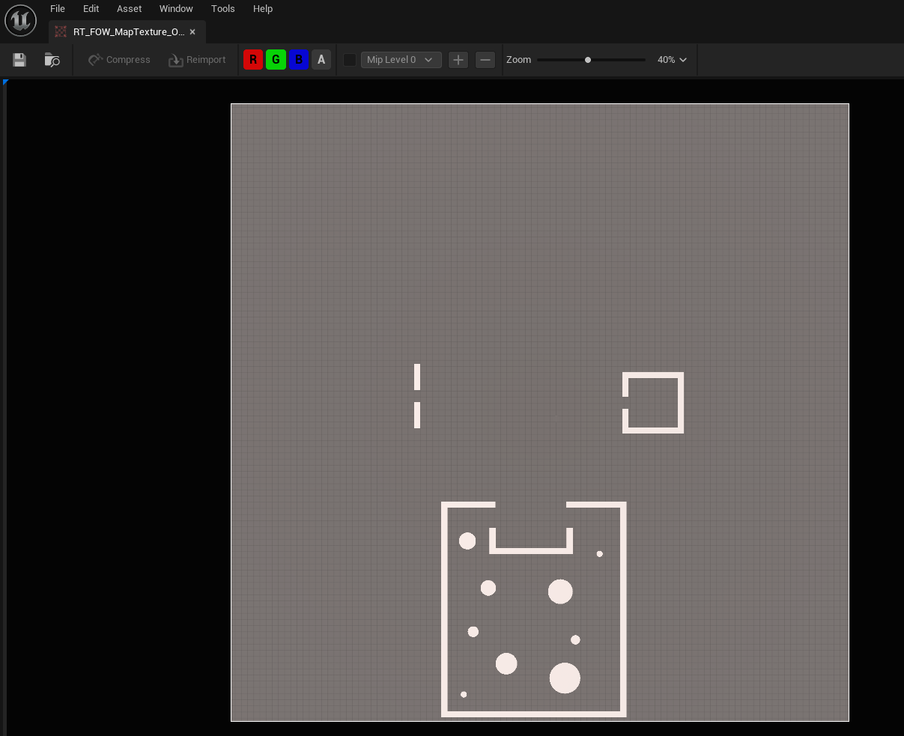
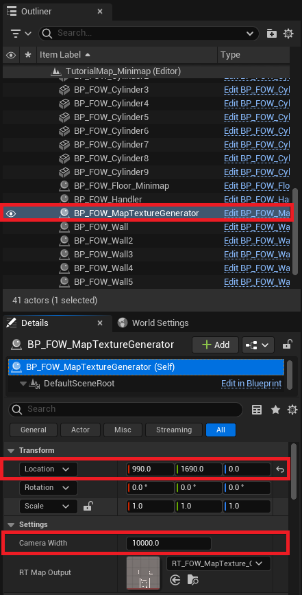
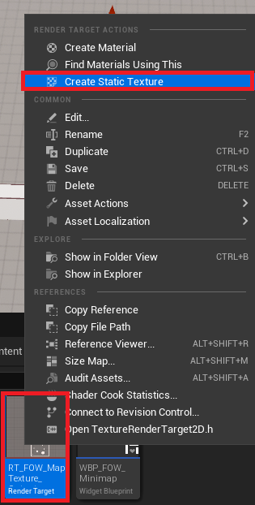
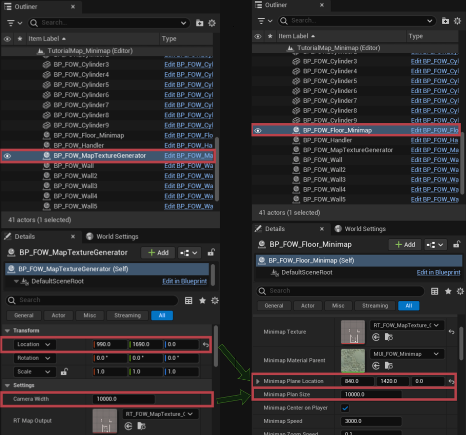
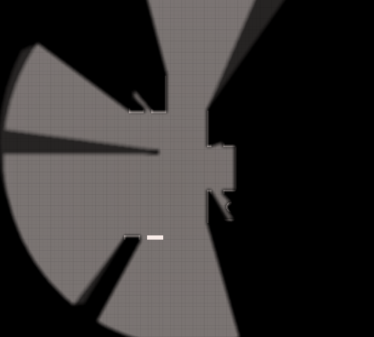
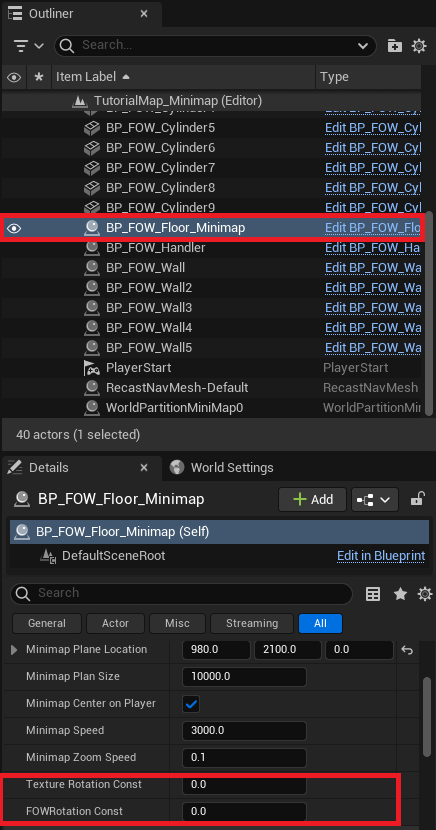

# Minimap

- [Minimap setup](#minimap-setup)

This tutorial has been realised in the `Tutorial/Maps/TutorialMap_Minimaps` map providen in the
[Demo Project](https://github.com/gandoulf/LayeredFOW_Demo)

# Minimap setups

The plugin has a minimaliste integration of a minimap. the tutorial will show you how to set it up and the
providen blueprint will give all the necessary knowledge to generate fog sample and link it to a custom material
if you wanna make your own system.  
Go into the `Plugins/LayeredFogOfWarContent/Minimap` folder in the content browser. You will find 4 files:
* `BP_FOW_Floor_Minimap`, In-game blueprint catching input, instancing and updating Fog sample, Material, Widget. 
* `BP_FOW_MapTextureGenerator`, An actor with a 2D scene camera to generate map texture of your level.
* `RT_FOW_MapTexture_Output`, Render target used by the camera of Map texture generator.
* `WBP_FOW_Minimap`, Widget added to the viewport displaying the minimap.

Add the `BP_FOW_Floor_Minimap` to your scene inside a `FOW_Floor`. The position of the actor is important because
it will collect the data of the floor it overlappe to send it to the material.

Add the `BP_FOW_MapTextureGenerator` to your scene.

Open the `RT_FOW_MapTexture_Output` which is already linked to the camera of the Map texture generator, it will
display the result of the map.

Now change the `Location` and the `Camera Width` of the `BP_FOW_MapTextureGenerator` to generate an acccurate picture
of the level.

When the setting are done, find the `RT_FOW_MapTexture_Output` in your content browser, right click on it and generate
a `StaticTexture`. Move it to another folder out of the plugin.

Now you have to copy the settings used to generate the texture to the `BP_FOW_Floor_Minimap`. They are requiered to
generate a corresponding plane in the material to apply the texture.

You can now hit the play button and see a minimap on the bottom right. You can display a bigger version by pressing
`Tab` which will display a full screen version of it.

The minimap can handler displacement, rotation and scale (zoom). if the minimap havn't the correct orientation you
can apply static rotation to the texture and the Fog sample

---
_Documentation built with [**`Unreal-Doc` v1.0.9**](https://github.com/PsichiX/unreal-doc) tool by [**`PsichiX`**](https://github.com/PsichiX)_