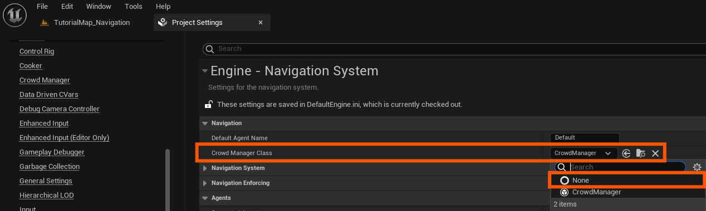
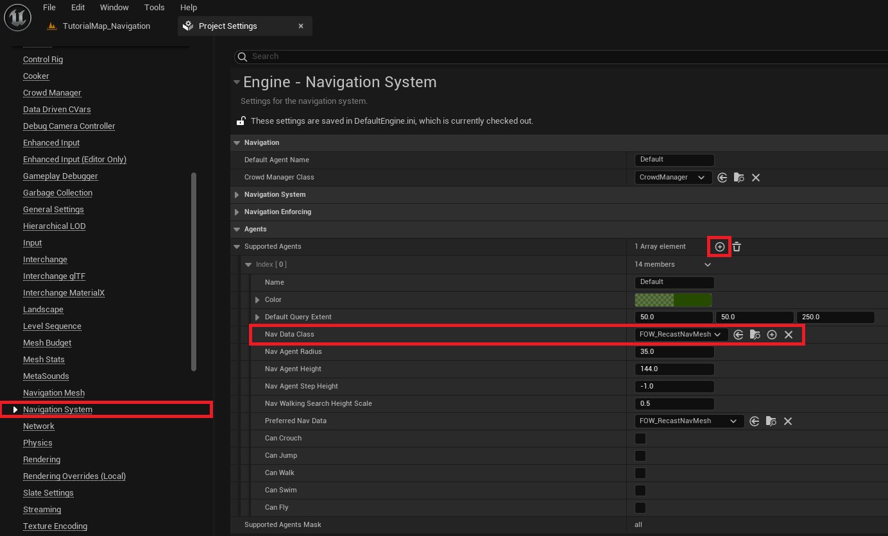
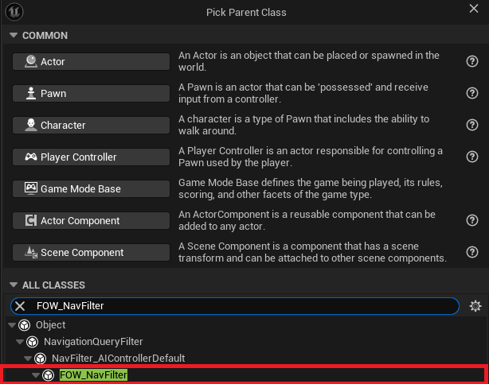
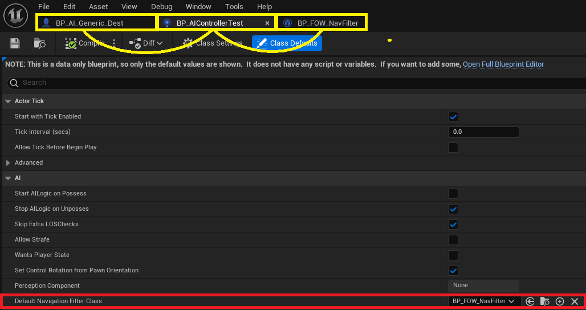
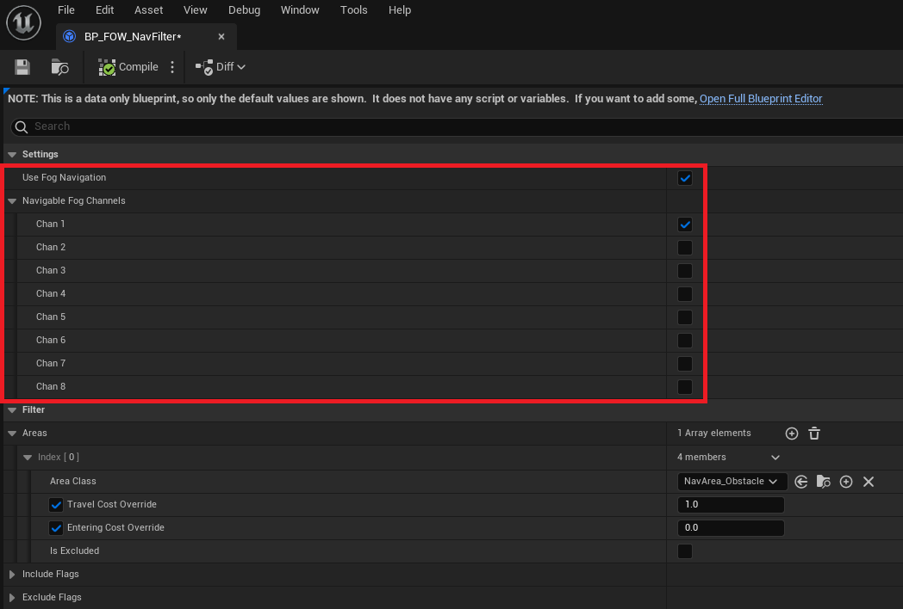

# Navigation

- [Navigation Setup](#navigation-setup)
- [Navigation Filter](#navigation-filter)

This tutorial is based on the `Tutorial/Maps/TutorialMap_Navigation` map provided in the [Demo Project](https://github.com/gandoulf/LayeredFOW_Demo). 
Everything is already set up, and this document will cover the modifications required to make it work.

The `Fog Navigation` feature is especially useful for maze-like projects, preventing units from navigating through areas that the player hasn't
discovered yet. There are many potential use cases, which can vary depending on your game, so the implementation remains intentionally simple.

> **/!\ It's important to understand that each agent using the `FOW Navigation Filter` will have longer path update times, as the system now checks FOW visibility along the path.**

## Navigation Setup

To use the `FOW Navigation Filter`, you'll need to change the `RecastNavMesh`. Do this by going to your project settings under the `Navigation System` section.

You must disable the crowd manager for the system to function correctly in its current state.

Now, add a new `Supported Agent`, then change the `NavDataClass` to `FOW_RecastNavMesh`. This custom NavMesh is required for the proper use of `FOW_NavFilter`.

> **/!\ If you don't change it, the engine will crash. No fix has been found yet to prevent this.**

## Navigation Filter

The Navigation Filter is the core of this system. It generates the `Query Filter` used by the `NavigationSystem` and provides constant data. The user can configure
it using `NavArea` or `FogChannel`.

First, create a new `FOW_NavFilter`.

Then, assign the filter to your `Character Controller`'s `Navigation Filter` setting. Make sure the controller is correctly set on your pawn.

Now, open the navigation filter to configure its behavior. You'll see two new options:
- `Use Fog Navigation`: Toggles the fog visibility check during the pathfinding request.
- `Navigable Fog Channel`: Defines which types of fog the agent is allowed to navigate through.

---
_Documentation built with [**`Unreal-Doc` v1.0.9**](https://github.com/PsichiX/unreal-doc) tool by [**`PsichiX`**](https://github.com/PsichiX)_