# Networking

- [Default Replication Setup](#default-replication-setup)
- [Manage Player Team](#manage-player-team)
- [Infinite Team](#infinite-team)

> **/!\ This tutorial is made to show how the FOW works with networks, replication knowledge won't be provided.
Networking `GameMode`, `GameState`, `Controller`, and `Character` are provided. You have absolutely the right to
read, copy, and use any code you find :)  **

This tutorial has been realized in the `Tutorial/Maps/TutorialMap_Networking` map provided in the [Demo Project](https://github.com/gandoulf/LayeredFOW_Demo)

# Default Replication Setup

The `TutorialMap_Networking` has been set up to show you how replication and teams work. To do so a
`BP_TutorialNetworking_GameMode` has been set up with a `BP_TutorialNetworking_PlayerController` to spawn a
`BP_TutorialNetworking_Character` at a `PlayerStart` location depending on the Client team.  
To visualize the replication, the server will clear the fog of another spawn point for each team before the
client connection.  
* The circle represents the spawn point
* The square is the associated revealed spawn point

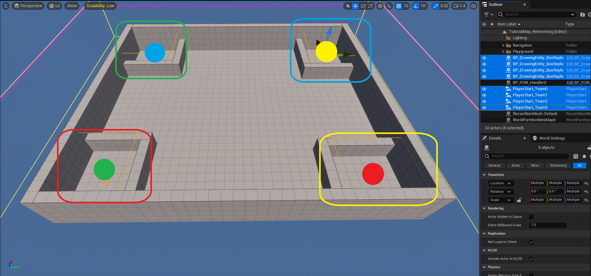

There is a little trouble with Unreal and singleton instance when they are stored in a static variable. If you
hit the play button with multiple players in the editor, multiple worlds will be created but inside the same
application, which means static variables are shared and overridden. To prevent this, the FOW is designed to look
for an implementation of `FOW_GetHandlerInstance_Interface` in the `GameState`.  

Let's set up the game state. Create a new `My_FOWNetworking_GameState` derived from `GameStateBase`

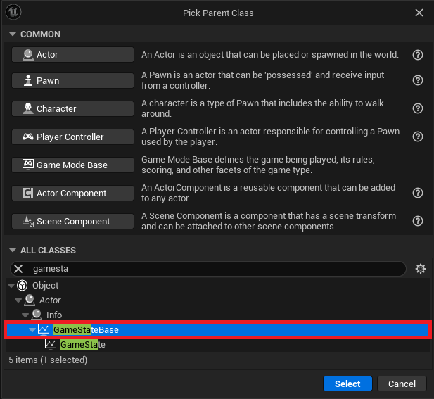

Open it and go into `ClassSettings` to add the `FOW_GetHandlerInstance_Interface` in the `ImplementedInterfaces` array.

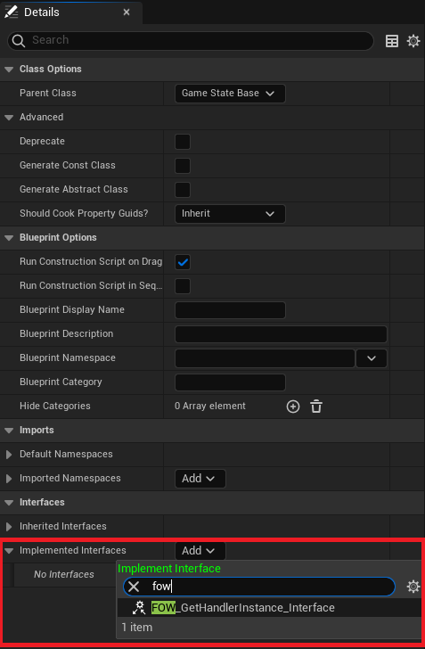

Now you have to provide the code to the `Find_Level_FOWHandler`.
* Add a `FOW_Handler` variable
* Get the variable and convert it to a `Validate` get, if valid return the variable.
* Else find all actors of class `FOW_Handler`
* If at least one is returned, set your `FOW_Handler` variable to the first element of the array
* Return the variable

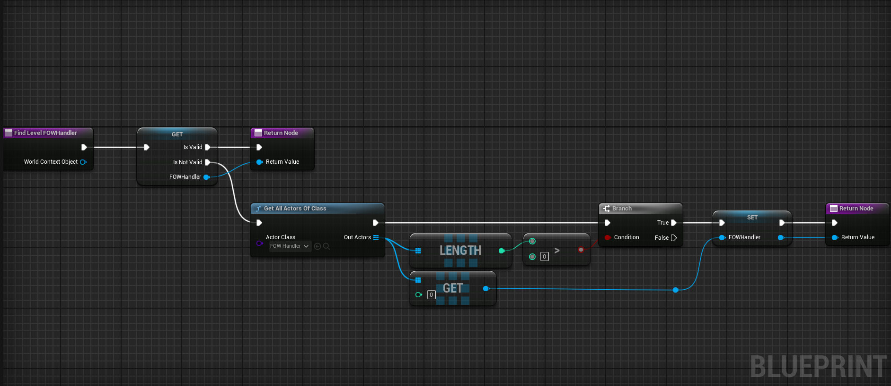

Now open the `BP_TutoralNetworking_GameMode` and replace the `GameState` with yours

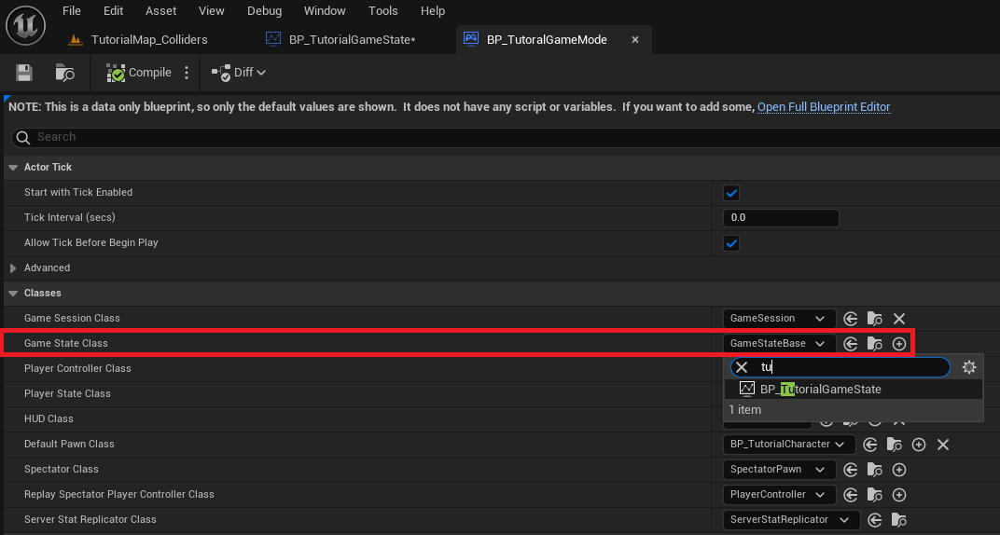

All set up!
> **Note that if you don't simulate the network in the editor, this whole setting isn't needed. As long as
every game instance is a separate process, you don't need to implement the interface.**

Now let's see how the FOW works with replication. First, create a new `BP_MyNetworkSettings` derived from `UFOW_NetworkSettings`.

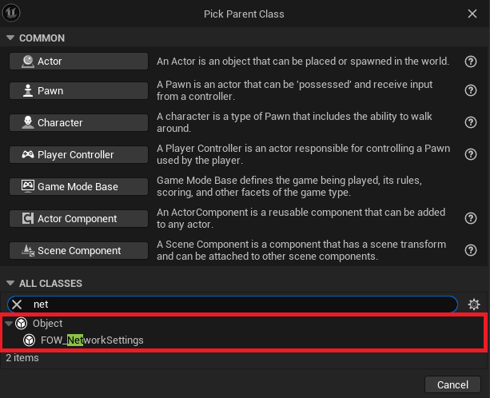

Open it and change the `NetworkGameMaxTeamNbr` value from the `Server` to 4. It means that the `FOW_Handler` will
be ready to handle 4 different teams drawing fog separately. (For a few reasons, 4 teams with two channels enabled
is the maximum). Also, if you pay attention, the client is set to only one team, which means that only the client
team fog will be updated. 
Under those settings, you will find checkboxes to allow or not replication and which channels are replicated. The
first channel isn't needed since it represents the fog of what drawers currently see.

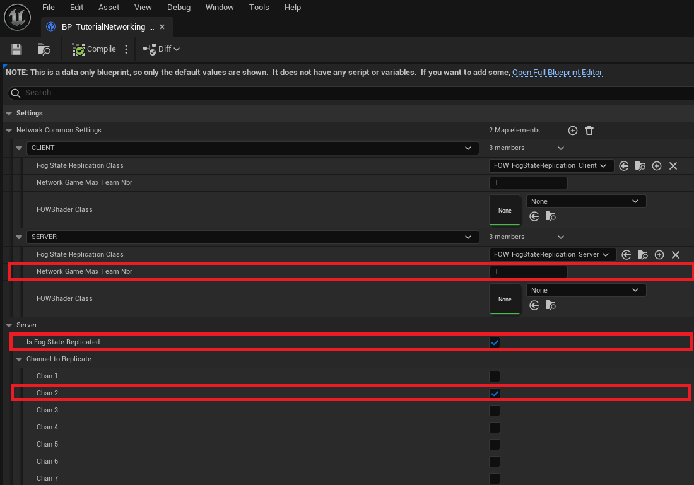

Select the `BP_FOW_Handler`, get into the details panel, and change the `NetworkSettingsClass` to your `BP_MyNetworkSettings`.

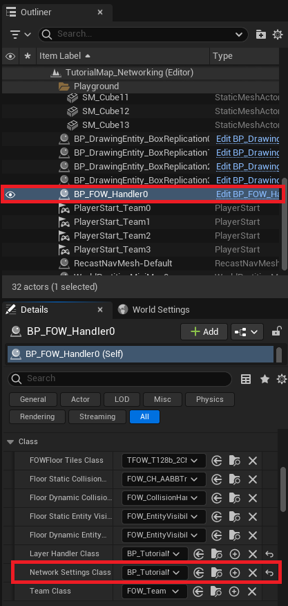

Before hitting the play button change the `PlaySettings`. Change the number of players to 4 and change `NetMode` to `PlayAsListenServer`.

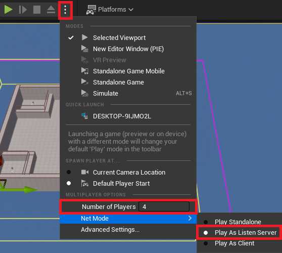

Now you can hit the play button and see the 4 windows open with your character connecting one by one. If you do not
understand what the fog replication changes, go back to your `BP_MyNetworkSettings` and uncheck `bIsFogStateReplicated`.

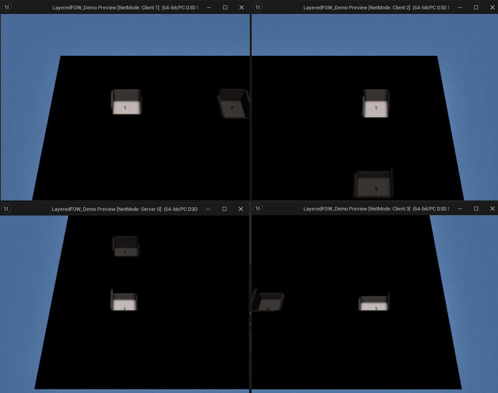

# Manage Player Team

The previous part was about setting up the network over the FOW. However, you couldn't do anything regarding which
client is associated with which team because of the default system distributing the players to each team.

Let's see how to do that. Create a `BP_MyFogStateReplication_Server` derived from `AFOW_FogStateReplication_Server`.

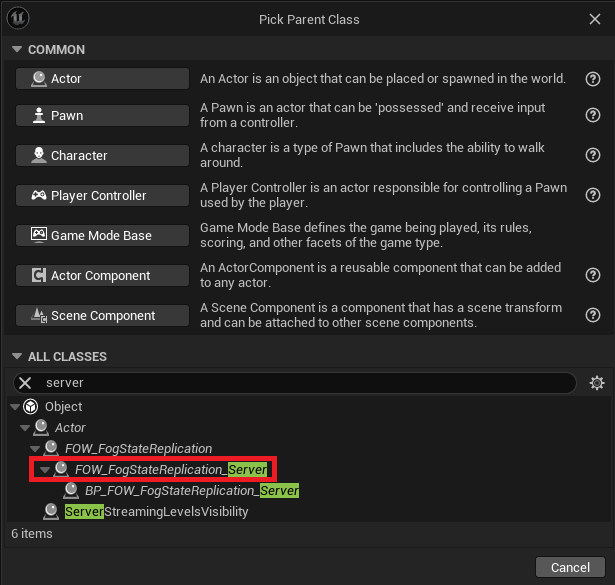

Open it and override the `GetClientTeamIndex` function.

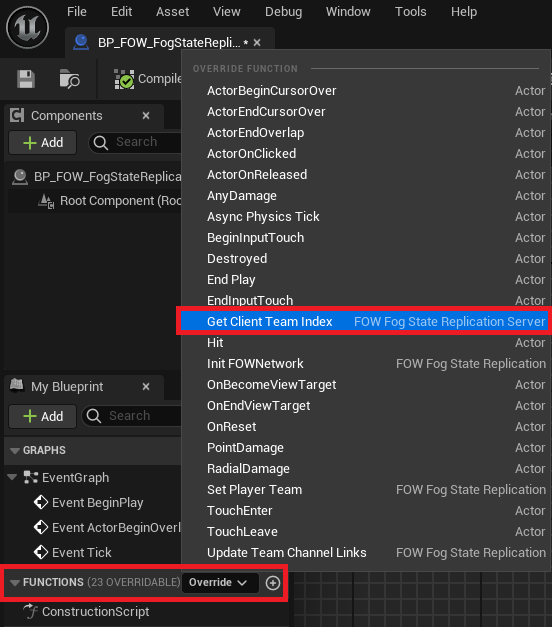

Open it. This is where you can manage the client team association. the `PlayerController` is provided, You should
be able to fetch necessary data from your game with it. For the example let's just do this:
* Get the `NetworkMaxTeamNbr` and subtract 1 from it
* Pin the result to a `Random Integer in Range`
* Pin the result to the return;

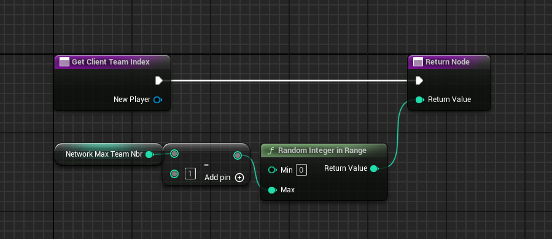

Now that the server is set up, open your `BP_MyNetworkSettings` and replace the `FogStateReplicationClass` by your `BP_MyFogStateReplication_Server`.

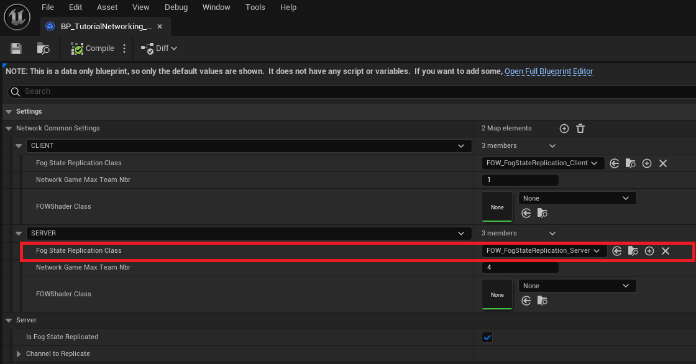

Hit the Play button and see the players being associated with a random team!

# Infinite Team

In case you want more than 4 teams with two channels, you can just uncheck `bIsFogStateReplicated`, Set the
`NetworkGameMaxTeamNbr` for both client and server to 1 and provide any team index you want in the `GetClientTeamIndex` override.

> **This replicated team number issue will be taken care of; it might not allow an infinite number but more than 4 for sure**

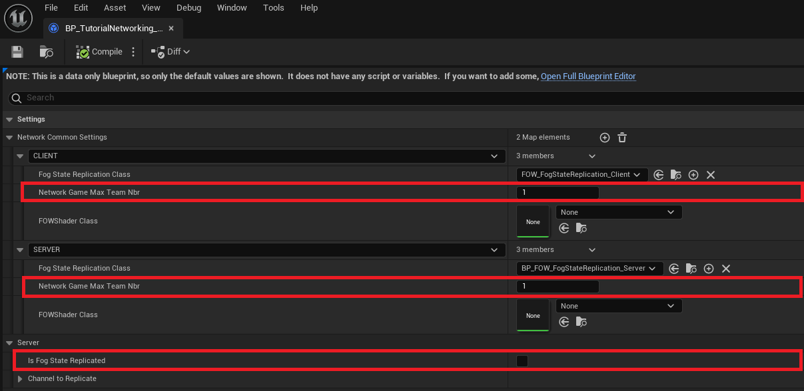

---
_Documentation built with [**`Unreal-Doc` v1.0.9**](https://github.com/PsichiX/unreal-doc) tool by [**`PsichiX`**](https://github.com/PsichiX)_