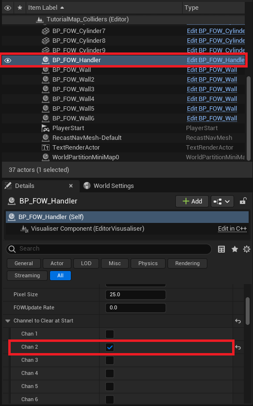
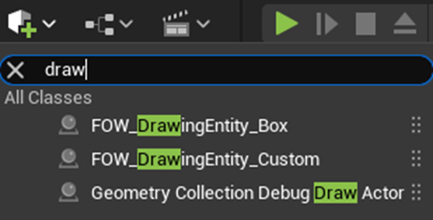
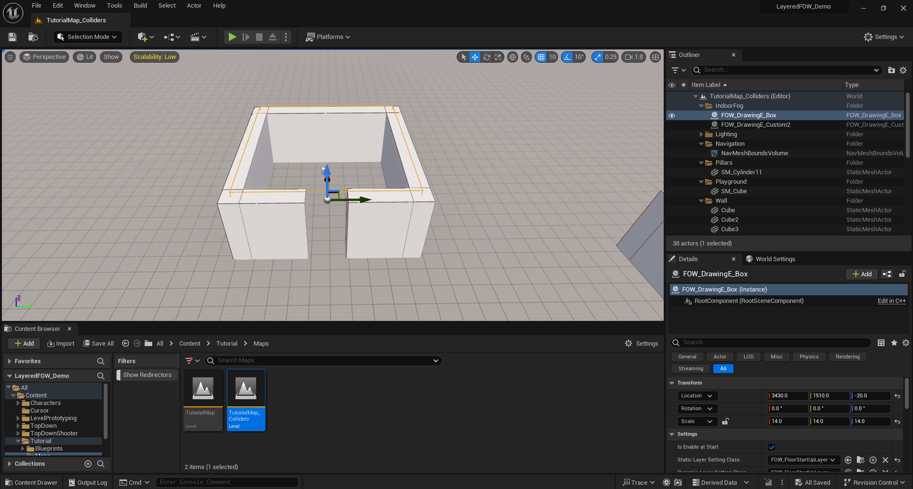
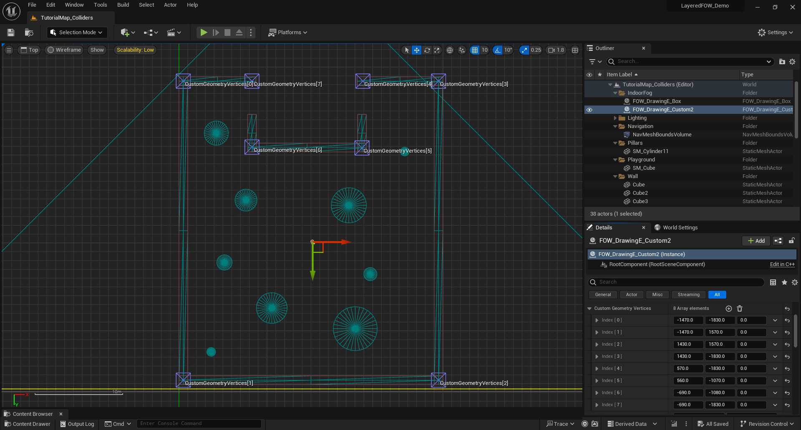
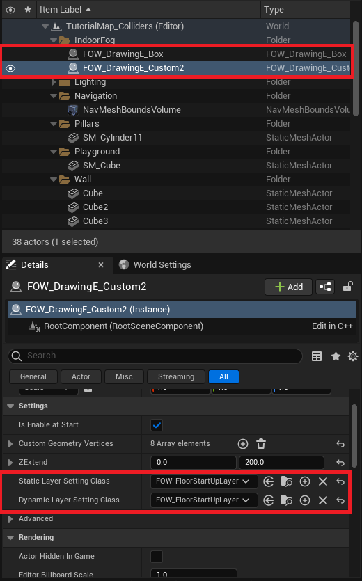

# Outdoor Indoor

Depending of the game you might need to dessociate the Indoor from the outdoor, such as
only the indoors are undiscoverred. From my experience it's easier to clear the whole FOW
and add fog to the indoor area. The next picture represent the result we will have step
by step:
* 1) FOW display without any setup
* 2) FOW display when revealing the whole fog
* 3) FOW display after adding the indoor fog

First get the `BP_FOW_Handler` and go to the detail panel. Find the `ChannelToClearAtStart`
and check the `chan2` box. It while set the default value of the second channel of every floor
to 1 to clear the black fog.

Now we're gonna draw back the fog in the 2 indoor area. There is two type of drawing entity
provided to do so:
* `FOW_DrawingEntity_Box`, drawing fog in a box
* `FOW_DrawingEntity_Custom`, drawing fog in the providen custom geometry

Drag and drop both of the drawing entity to your scene and let's set up the indoor fog.

First move the `FOW_DrawingEntity_Box` to the tiny room and scale it to be as big as the room

Second move the `FOW_DrawingEntity_Custom` to the bigger room and add 8 vertices int the 
`CustomGeometryVertices` in the details panel. Select the top view for the viewport and 
place the vertices arround the room.

Finally, By default Drawers will remove fog, however this time we need to add fog and only
when the game start. A specific `LayerSettings` is providden to do so. In both drawing
entities, in the details panel, replace the static and dynamic layer setting class by
`FOW_FloorStartUpLayer`.

---
_Documentation built with [**`Unreal-Doc` v1.0.9**](https://github.com/PsichiX/unreal-doc) tool by [**`PsichiX`**](https://github.com/PsichiX)_