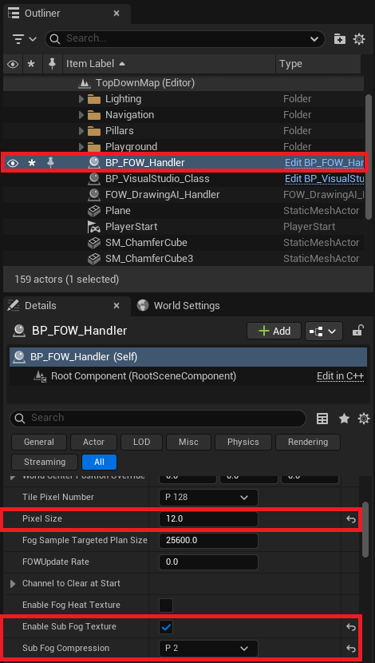
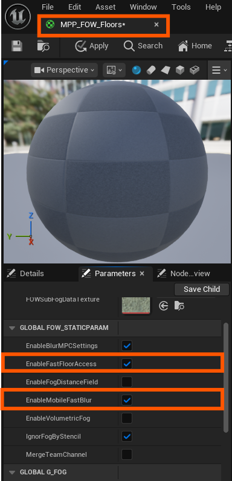
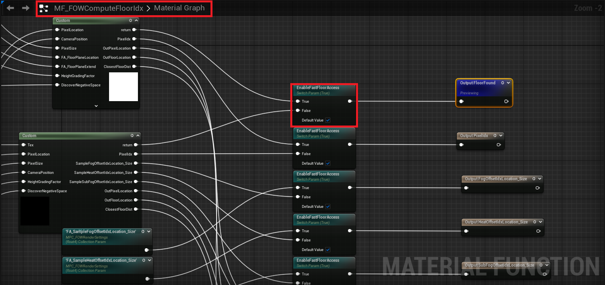
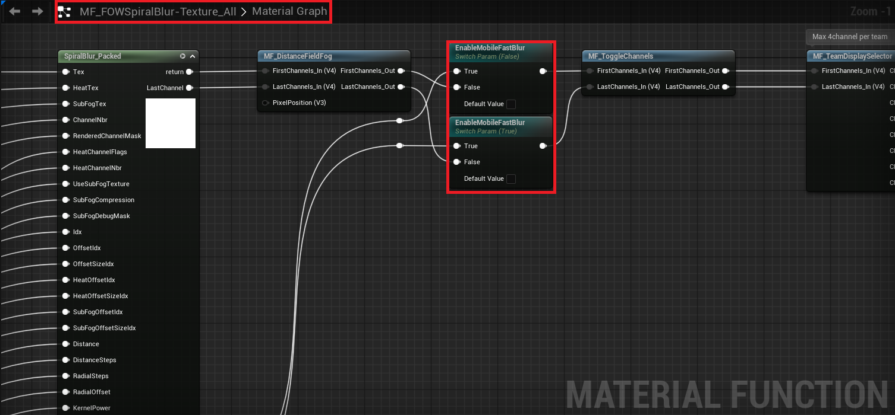
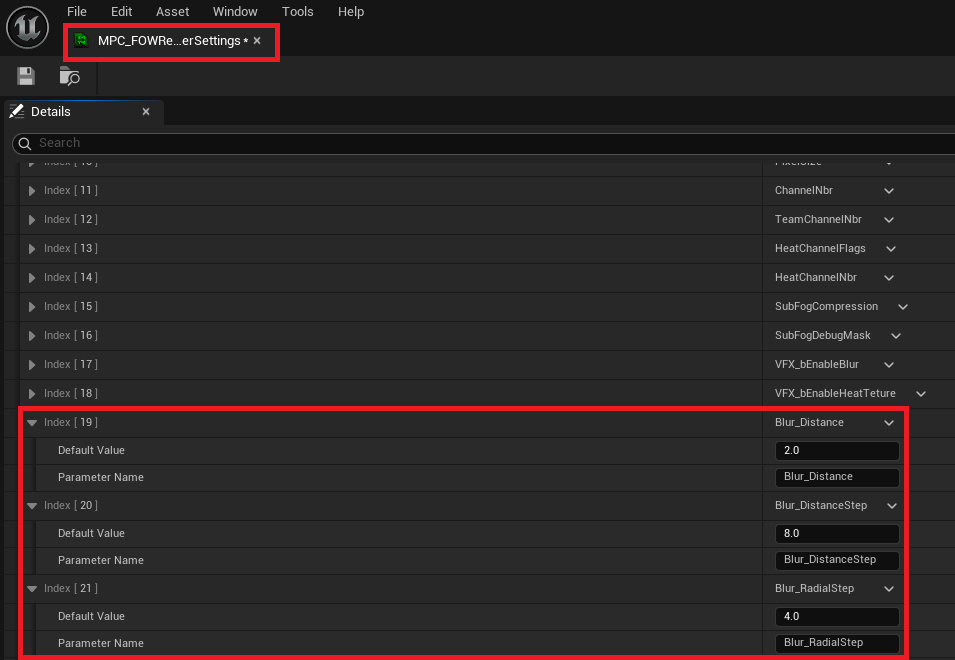
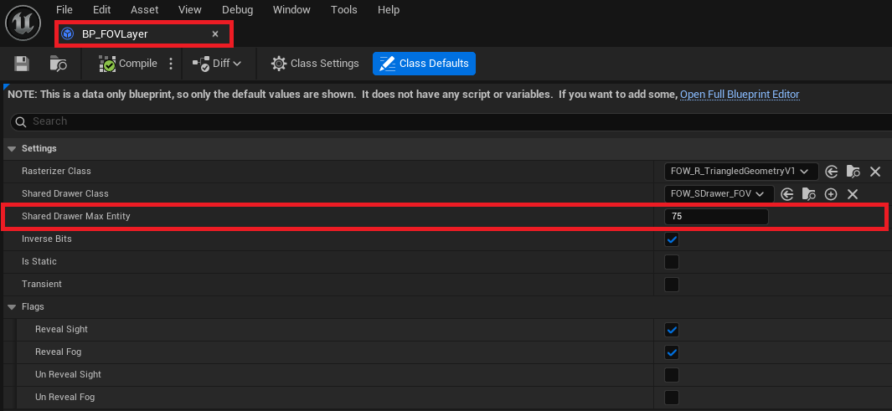
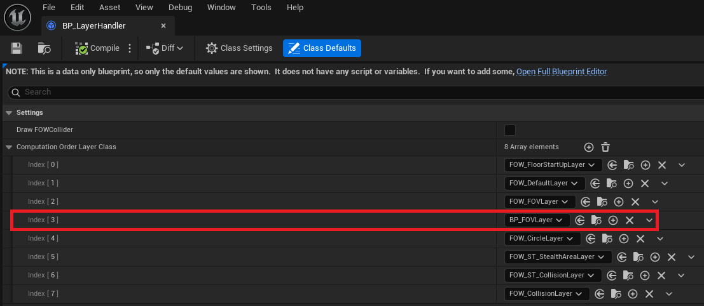
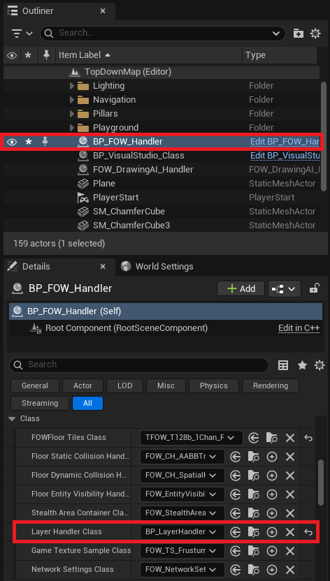
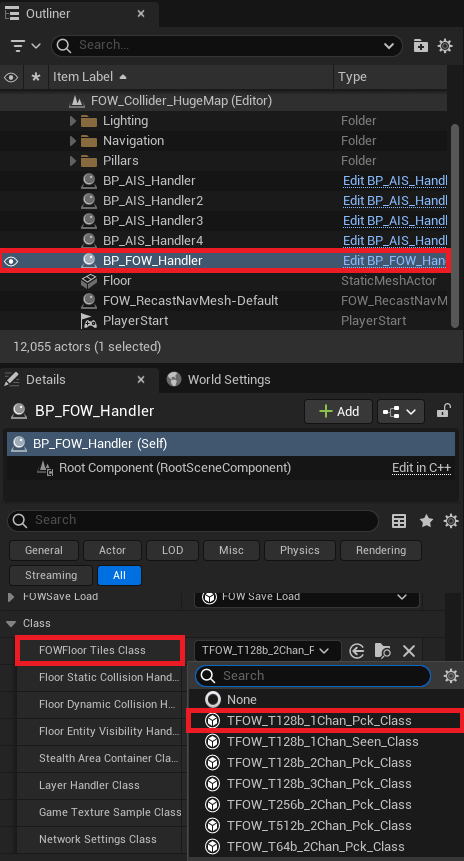

# Android

- [Unreal Engine Setup](#unreal-engine-setup)
- [Plugin Setup](#plugin-setup)
	- [Handler](#handler)
	- [Material](#material)
	- [Entities](#entities)
- [Single Channel](#single-channel)

This tutorial explains how to enable LFOW for an `Android` project. However, all the provided instructions can also apply to laptops or consoles.
It requires LFOW v1.5.0 and a complete Android setup (`Android Studio`, `SDK`, `NDK`, `JDK`, etc...).

Supporting Android is challenging, not because of the CPU, but due to the GPU load. Texture sampling and dynamic branching are too heavy for most mobile GPUs.
To reduce usage, certain features have been disabled for mobile. If you follow this tutorial, the following features will **not** be available:
- `Multifloor`: Previously used textures to pass data; this is replaced with `Material Parameter Collections`.
- `4 Channels`: Reduced to limit dynamic branches.
- `SubFog mandatory`: `Sub Fog Texture` must be enabled. Dynamic branching to toggle it has been removed.
- `Stylized Fog`: Disabled due to excessive texture sampling.
- `Debug Commands`: `FOW.r.SubFogDebugMask` no longer works with `Sub Fog Texture`.

> **Note: All suggested values are not final. They should be adjusted based on profiling results and performance tuning.**

## Unreal Engine Setup

I based my setup on this [video](https://www.youtube.com/watch?v=oSpcLNfsHec), and everything worked as expected.  
I also installed the [Android Game Development Extension](https://developer.android.com/games/agde), though USB debugging worked better in my case.
By following the video, you should have:
- Installed `Android Studio`
- Installed `SDK`, `NDK` & `Command Line Tools`
- Enabled `Android` support in `UE5`
- Verified your `Environment Variables`
- Run `SetupAndroid.bat` to configure your environment

## Plugin Setup

Now that everything is ready, let's adjust the plugin to reduce GPU load. The goal is to minimize the number of texture samples.
- Remove the `MultiFloor` feature and replace it with a fast-access `SingleFloor` system
- Use a simplified version of the `Blur` algorithm. `Sub Fog Texture` becomes mandatory, only `4 Channels` supported, and debug commands will no longer work
- Reduce blur complexity using the `MPC` variables, which affects visual quality but improves performance
- Lower `PixelSize` to increase pixel density and improve visual clarity

### Handler

Let's start with the FOWHandler settings:
- Ensure that `EnableSubFogTexture` is checked [doc](../Rendering/SubFogTexture.md)
- Set `SubFogCompression` to 2
- Reduce `PixelSize` to 12

Finding the right balance here is key. The `Sub Fog Texture` is a really powerful tool, the smaller the `SubFogCompression` and `PixelSize` values, the better
the performance. However,lowering `PixelSize` too much can strain the CPU.

### Material

Now let's modify the materials. There are two ways to enable GPU optimization:
- You can apply the modifications directly in each `Material` and `Material Instance` you're using
- Or you can apply them in the plugin's `Material Function`.  /!\ Be careful, these changes will be **reset** every time the plugin is updated /!\

 

Let's start with the first approach. Open `MPP_FOW_Floors` and in the parameter list, toggle:
- `EnableFastFloorAccess`: Floor data will now be sent via `MPC` vector parameters instead of through a texture
- `EnableMobileFastBlur`: The blur will include fewer features and fewer dynamic branches, which improves performance

If you want to change the default values in the `Material Function`, open `MF_FOWComputeFloorIdx` and set `EnableFastFloorAccess` to `true`.

Then open `MF_FOW_SpiralBlur-Texture_All` and set `EnableMobileFastBlur` to `true`.

Now that the materials are ready, let's reduce the blur complexity:
- `BlurDistance` must always be <= the `SubFogCompression` value set in the FOWHandler
- Set `Blur_DistanceStep` to 8
- Set `Blur_RadialStep` to 4

To get an idea of how expensive the blur is: multiply `Blur_DistanceStep` by `Blur_RadialStep`. That's the number of texture samples per pixel rendered on screen.

### Entities

Finally, if you want to support a large number of entities, it's a good idea to tweak the `Layer` system a bit.The goal is to 
reduce the number of entities processed in a single thread/task.

Create a new Blueprint child of `FOW_FOVLayer` and call it `BP_FOVLayer`. Once opened, set `SharedDrawerMaxEntities` to `75`.

Next, create a new Blueprint child of `FOW_LayerHandler`, unless you already have one for your game. Call it `BP_LayerHandler`. 
Once opened, add a row to `ComputationLayerOrderClass` and assign your new `BP_FOVLayer`. Don't forget to reorder it to fit the screen layout or your game logic.

Finally, change the `LayerHandler_Class` used by the `FOW_Handler`.

You should now be able to build your application with the plugin enabled and get good performance!

## Single Channel

Another good way to reduce GPU usage is to design your game to use a `Single Channel` like a typical MOBA style Fog of War. 
To enable this setup, change the `FOWFloor Tiles Class` in the `FOW_Handler` to `TFOW_T128b_1Chan_PCK_Class`.

---
_Documentation built with [**`Unreal-Doc` v1.0.9**](https://github.com/PsichiX/unreal-doc) tool by [**`PsichiX`**](https://github.com/PsichiX)_