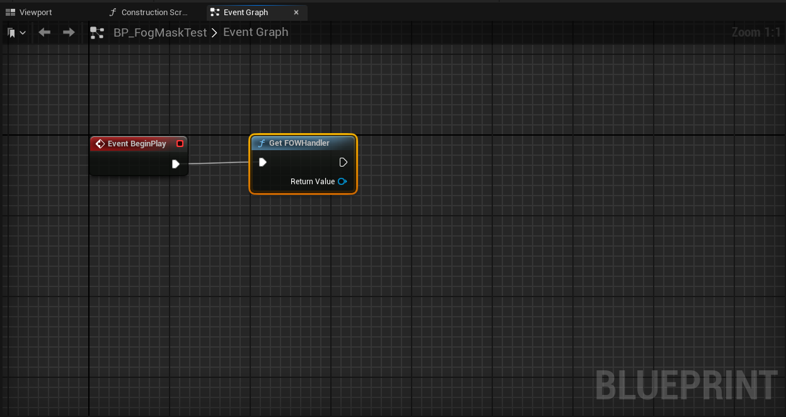
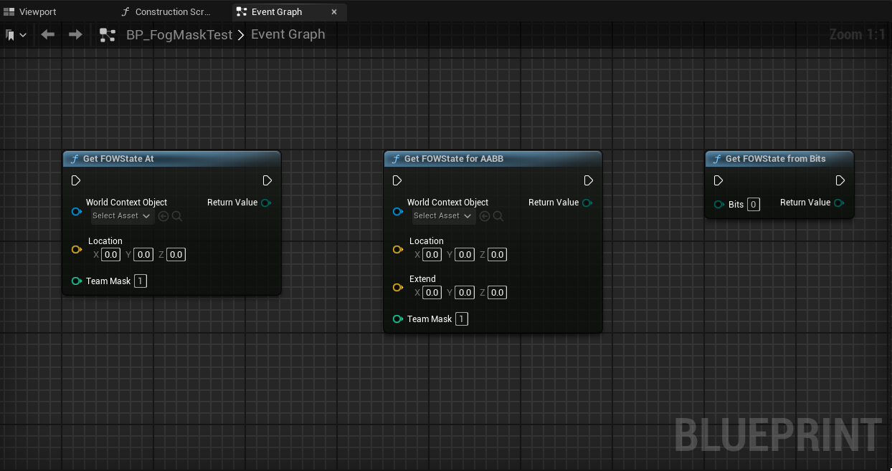

# PluginAPI

- [Get FOW handler](#get-fow-handler)  
- [Get FOW state](#get-fow-state)

This tutorial demonstrates various useful functions from the plugin that you will need to use in your game.

## Get FOW handler

The `FOWHandler` is the core of the plugin, as it registers everything. You might need to query it to access different functionalities
such as Save/Load, floors, collision, and drawer queries. You can access it by calling `GetFOWHandler` in both C++ and Blueprints.
Be sure to implement the interface from the [](/book/Tutorials/)[Network Architecture](Networking.md) tutorial if you're making an online game.

BP



CPP

```cpp
#include "FOW_Handler.h"

if (AFOW_Handler* FOWHandler = AFOW_Handler::GetFOWHandler(this))
{
	FOWHandler->...
}
```

## Get FOW state

You can query the FOW state anywhere by using the `GetFOWStateAt` function and its variations:

- `GetFOWStateAt`: Retrieves the fog state at a specific location.  
- `GetFOWStateForAABB`: Retrieves the fog state in an AABB. It returns visible if any part of the AABB is visible; no averaging is performed.  
- `GetFOWStateFromBits`: Converts a `uint8` returned by the plugin into the corresponding fog state enum.

BP



CPP

```cpp
#include "Tools/FunctionLibrairy/FOWFunctionLibrary.h"

//Get fog state at location
FVector Location;
EnumFOWState state = UFOWFunctionLibrary::GetFOWStateAt(GetWorld(), Location);

//Get fog state in AABB
FVector Location;
FVector Extend;
EnumFOWState state UFOWFunctionLibrary::GetFOWStateForAABB(GetWorld(), Location, Extend);

//Get fog state from bits
uint8 bitsValue;
EnumFOWState state = UFOWFunctionLibrary::GetFOWStateFromBits(bits);
```
---
_Documentation built with [**`Unreal-Doc` v1.0.9**](https://github.com/PsichiX/unreal-doc) tool by [**`PsichiX`**](https://github.com/PsichiX)_