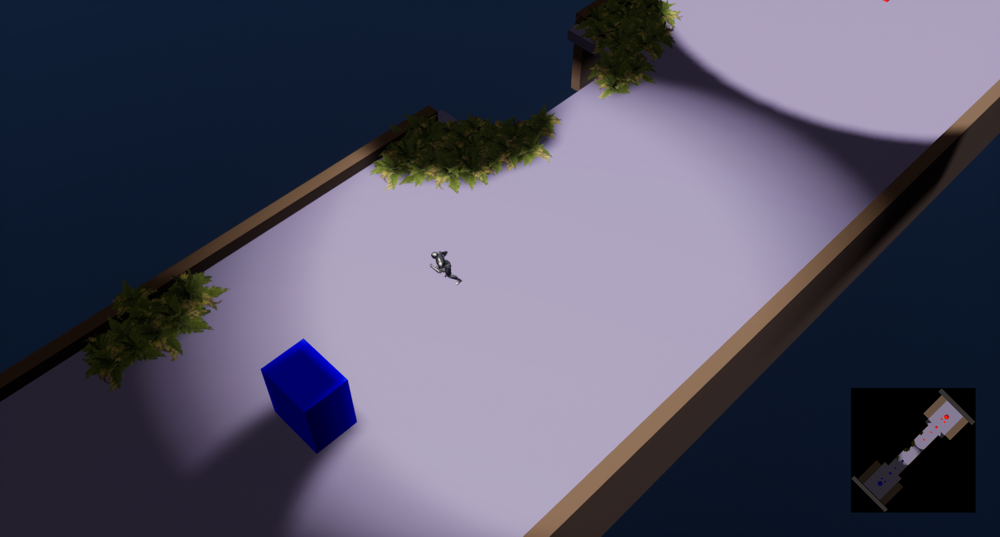
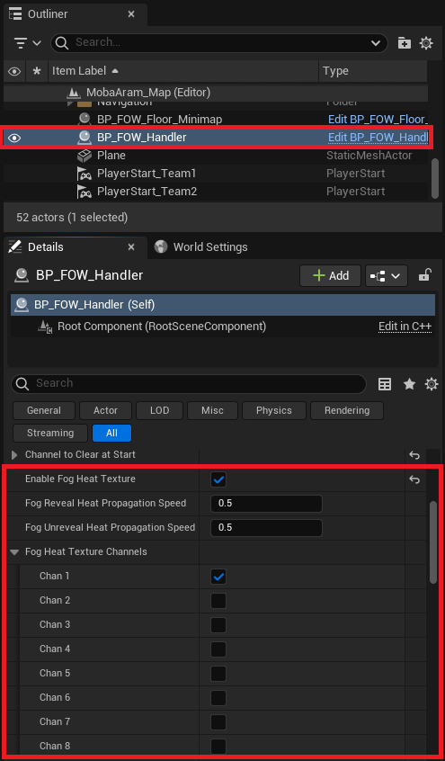
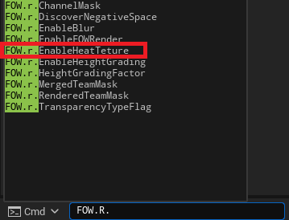

# Heat Texture

- [Enable Heat Texture](#enable-heat-texture)

This tutorial is about enabling heat texture. No prerequisites are needed; you can use any map that you want.

## Enable Heat Texture

The FOW uses binary textures to store the `Fog State`. It's super fast to generate and update; however, there is a loss
of granularity. it's either visible or notvisible, but there is no in between of those two states. To overcome this issue, a `Heat Texture`
can be computed during the `Tile Merging`. To generate this texture, each bit will be converted to a float and multiplied by
an increasing or decreasing value to create a lerp between two states. The fog render will be smoother when the units are moving.

The `Heat Texture` is really simple to enable. You just have to toggle on `EnableFogHeatTexture` in the FOW Handler. Once enabled,
you will find a few parameters for the texture update:
- `FogRevealHeatPropagationSpeed`: the transition speed when the fog is being revealed.
- `FogUnrevealHeatPropagationSpeed`: the transition speed when the fog is being unrevealed.
- `FogHeatTextureChannels`: choose which channel will use the `HeatTexture`.

> **/!\ The `Heat Texture` provides a smoother render but is heavier to update. It's recommended to enable this only for the channels
that change their state often.  **

Once the `Heat Texture` is enabled, you have the option to toggle it on and off by using the console command `FOW.r.EnableHeatTexture`.

---
_Documentation built with [**`Unreal-Doc` v1.0.9**](https://github.com/PsichiX/unreal-doc) tool by [**`PsichiX`**](https://github.com/PsichiX)_