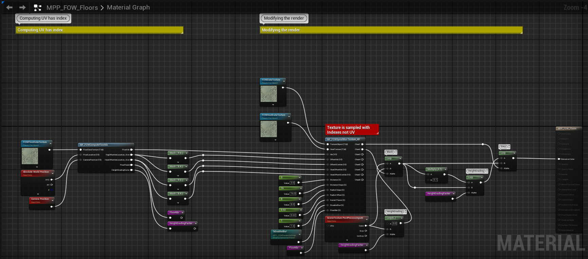
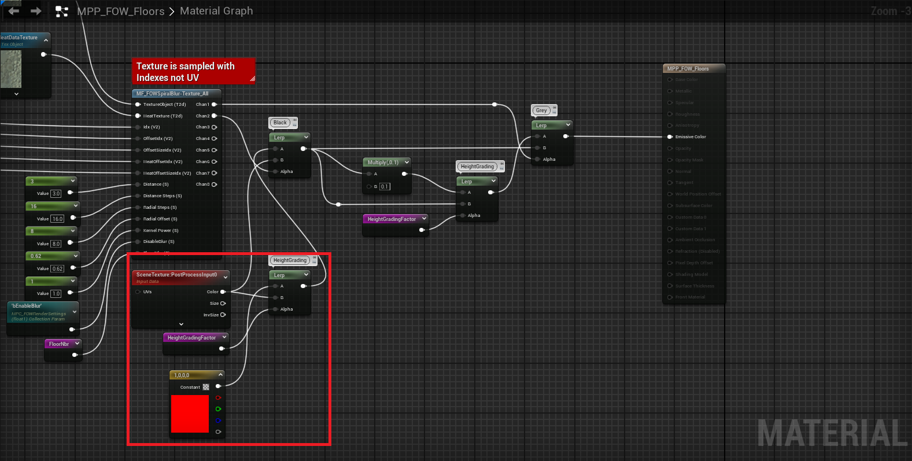
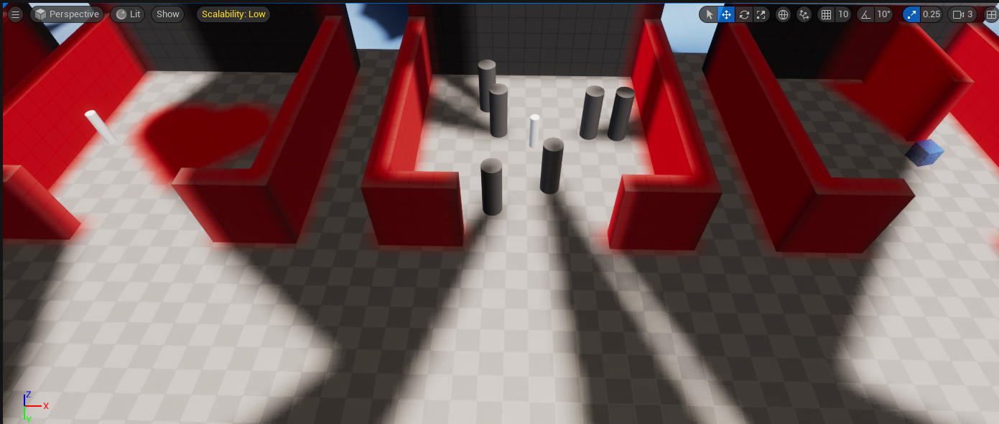
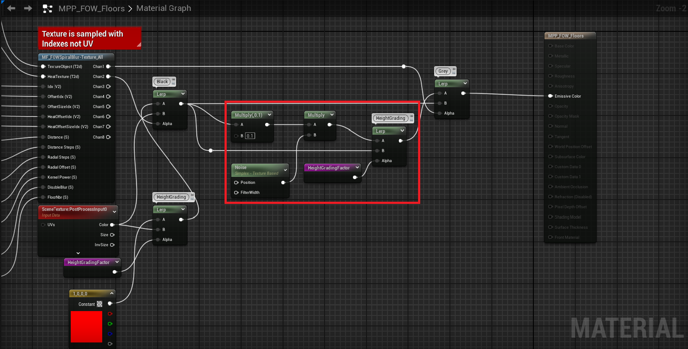
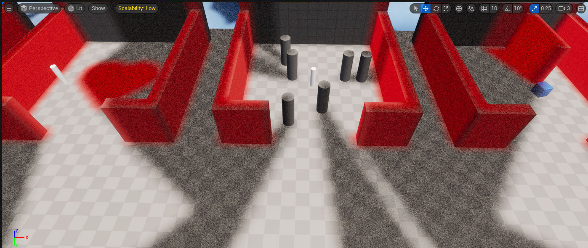
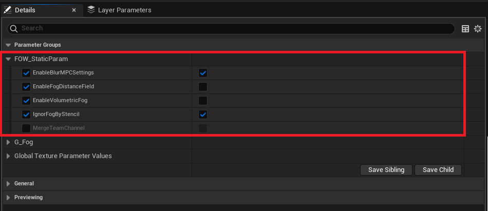
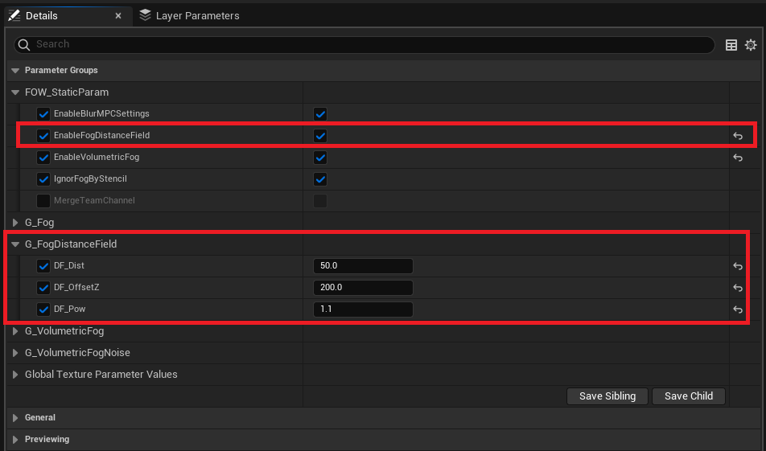
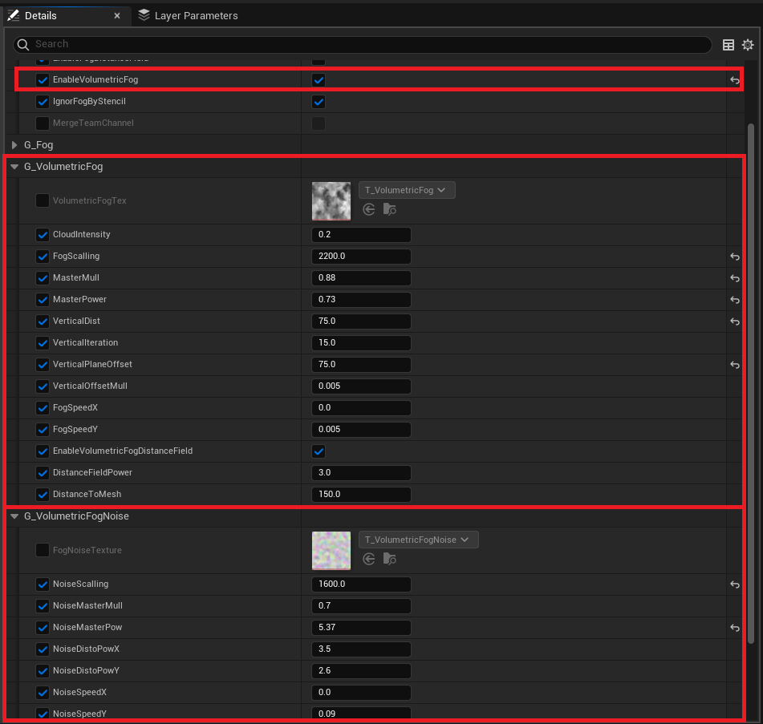

# Post Process

- [Change fog render](#change-fog-render)
- [Material Instance](#material-instance)
	- [Enable Distance Field](#enable-distance-field)
	- [Enable Stylized Fog](#enable-stylized-fog)

This tutorial is about changing the fog render. You can use any map that you want.

## Change fog render

A FOW is a heavy piece of code, but the rendering is managed by a single material. All the information is sent via textures, with three currently in use:
- `Floor data`: Holds position, extent, and texture offsets.
- `Floor fog state`: Holds the visibility state of the fog.
- `Floor fog heat state`: Allows fog lerp between two frame states (only used if enabled).

The material is designed to hide the more complex parts within material functions to make it less overwhelming. However, you are welcome to read and modify anything you want (though it might be a challenging task). 
The rest of the material should be straightforward and will let you tweak the fog rendering for your projects!

> **/!\ The `MPP_FOW_Floors` is used as default for the tutorial, but you might be using the `MPP_FOW_FloorsTransparency` if you are implementing a game with verticality. **

Let's try to change the render of the black fog at first. Open the `MPP_FOW_Floors`; it should look like this:

Add a `Constant4Vector` and plug it into the `Lerp` with a value of 0. Change the constant value of the R channel to 1.

Press the play button and see the undiscovered area being rendered in red.

Now let's see how to bring texture to the grey fog:
- Create `Noise` and `Multiply` nodes.
- Bind the noise to the `Multiply` node, and pin the output from the `Lerp` to the new `Multiply`.
- Finally, pin the result of the `Multiply` to entry A of the `Lerp`.
You may need to increase the 0.1 value from the previous `Multiply` to 0.5 to correctly see the noisy render.

Press the play button and see areas in sight being rendered in a noisy grey.

## Material Instance

The plugin has instances of both `MPP_FOW_Floors` and `MPP_FOW_FloorsTransparency`, which will let you toggle on/off predefined systems. When enabled, a whole batch of settings will appear, letting you tweak the system. Both materials have access to the same systems. Toggles will be present under `FOW_StaticParam`.

### Enable Distance Field

The distance field can be enabled when using `HeatTexture`. It will alter the fog propagation depending on the distance to the assets in your level. The edges will become dark faster than the rest, giving a breathing feeling to the fog. 

To enable it, open the material instance and turn on `EnableFogDistanceField`. Three parameters will then be displayed to tweak the render:
- `DF_Offset`: The distance used to change the render depending on the distance to the assets.
- `DF_OffsetZ`: The vertical offset of each pixel's world position.
- `DF_Pow`: A power multiplier to increase the effect.

### Enable Stylized Fog

The stylized fog will add a cloudy effect over the fog. It works by sampling a texture many times with the UV resulting from the `Camera` to `Pixel` line intersecting a plane facing the `UP Vector`. The UV will then be distorted by scale, speed, etc., and the color result will be modified by a noise texture.

You can enable the `Stylized fog` in the PostProcess instance by turning on `EnableVolumetricFog`. Two new sections will be displayed: `G_VolumetricFog`:
- `Volumetric Fog Tex`: The texture used for the cloud.
- `Cloud Intensity`: Determines how white the clouds are.
- `Fog Scalling`: Changes the scale of the texture.
- `Master Mull`: A multiplier applied at the end; test it.
- `Master Power`: A power applied at the end; test it.
- `Vertical Dist`: The thickness of the fog.
- `Vertical Iteration`: The number of plane intersections computed in the `VerticalDist`.
- `Vertical Plane Offset`: The vertical offset from the `Floor` Z position.
- `Vertical Offset Mul`: Not really useful; might be deleted.
- `Fog Speed`: Provides a direction to the fog.
- `Enable Volumetric Fog Distance Field`: Removes the fog when near an obstacle.
- `Distance Field Power`: Power to increase the fog mask effect.
- `Distance To Mesh`: The distance used to hide the fog when too close to an asset.

And the noise parameters `G_VolumetricFogNoise`:
- `Fog Noise Texture`: The texture used for the noise (each channel has a different noise).
- `Noise Scalling`: Changes the scale of the noise texture.
- `Noise Master Mull`: A multiplier applied at the end; test it.
- `Noise Master Power`: A power applied at the end; test it.
- `Noise Disto Power`: A power used to distort the UV used to sample the noise texture.
- `Noise Speed`: The speed of the noise moving through the clouds.

---
_Documentation built with [**`Unreal-Doc` v1.0.9**](https://github.com/PsichiX/unreal-doc) tool by [**`PsichiX`**](https://github.com/PsichiX)_