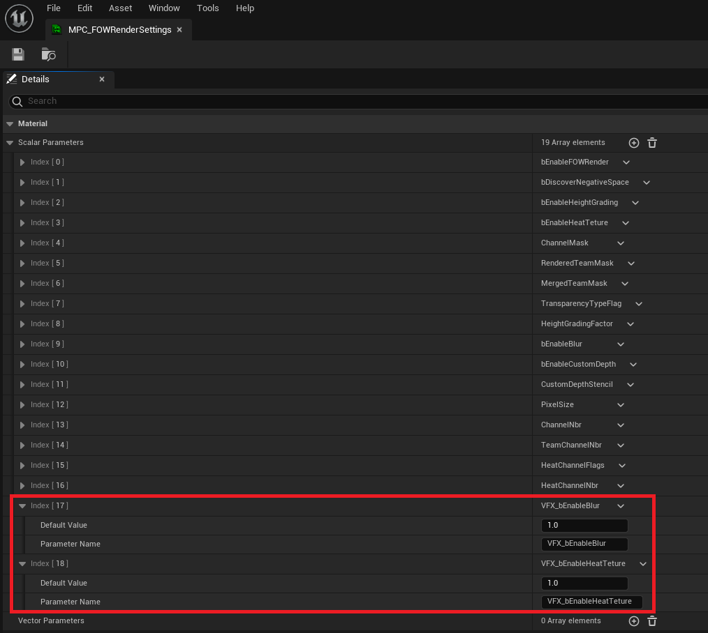

# Material Opacity

- [VFX Materials](#vfx-materials)
- [VFX Materials settings](#vfx-materials-settings)

This tutorial has been created in the `Tutorial/Maps/TutorialMap_VFX` map provided in the [Demo Project](https://github.com/gandoulf/LayeredFOW_Demo).
It covers how to change the materials opacity depending on the fog.

> **/!\ `Texture Assets` prevent the fog to correcly work when the game is packed. This issue will be take care of as soon as possible  **

> **/!\ This setup will work only in `Standalone` or for the `Server` in the `Editor`. Once the game is packed, the client will correctly apply the `Opacity Mask`. (waiting for fix)  **

## VFX Materials

The fog post-process and visibility component might not be enough to simulate the unit's vision accurately within your game. You might want a pixel-perfect
`Opacity Mask` based on the fog state for VFX or other materials. By using `Texture Assets`, it's possible to share the FOW globally across all materials
without creating dynamic instances. This setup makes implementing the opacity mask straightforward.

The tutorial demonstrates spawning particles that are hidden by the fog when they are out of sight. The firework VFX, however, does not include the opacity
mask modification.

In the `FOWHandler`, go to `Settings` and look for `UseTextureAssets`. Enable it, and three texture variables should appear, each pre-set with values. These
`Texture Assets` are shared across the materials. You'll notice they are 4k textures with specific settings, like grayscale. They are this large because
texture assets cannot be resized in C++, and a worst-case scenario must be used to ensure the `FOW` performs well in most games.

You can now examine the premade `FVX_Tutorial_FOW` provided and verify that the `SpriteRenderer` is correctly set with an `M_FOW_Default...` material. There's
no need for additional setup; only a custom material needs to be specified (the provided materials are copies of the one in the engine).

Next, open the `Tutorial/VFX/Material` folder and access `M_FOW_DefaultRibbon` and `M_FOW_DefaultSprite`. While the materials are slightly different, they follow
the same FOW logic to alter the opacity mask.

The material code is already present and just needs to be connected to the multiply node. Understanding it fully isn't necessary; the node setup grants access to
the FOW channel output, with the first channel representing `Sight` and the second representing what has been `Seen`, ranging from 0 to 1. With these values, it's
easy to create a mask or other effects as desired. You can simply copy and paste the nodes inside the comment for your custom material :)

After reconnecting the nodes, test the tutorial to confirm that VFX inside the bush remains hidden. Particles are only rendered when exiting the area.

## VFX Materials settings

By default, the provided nodes for the `Opacity Mask` are configured to soften the fog data using a `Blur` algorithm and to apply the `HeatTexture` if it's enabled
in the `FOWHandler`. These two settings may increase rendering costs. To adjust this, disable them in the `MPC_FOW_VFXRenderSettings` by changing the values of
`bEnableHeatTexture` and `bEnableBlur`.

You can also modify these values at runtime with console commands:
- `fow.r.EnableHeatTexture` lets you toggle the Heat Texture on or off.
- `fow.r.EnableBlur` lets you toggle the Blur on or off.

---
_Documentation built with [**`Unreal-Doc` v1.0.9**](https://github.com/PsichiX/unreal-doc) tool by [**`PsichiX`**](https://github.com/PsichiX)_