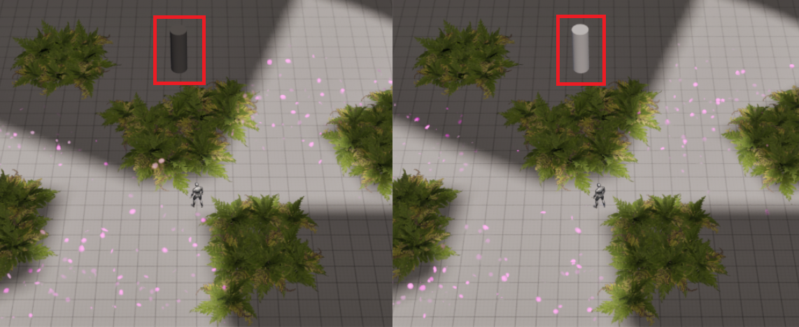
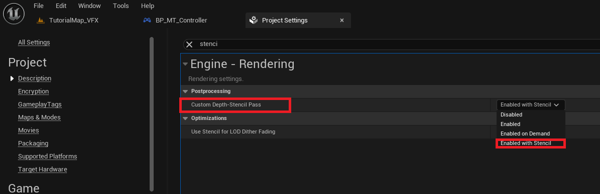
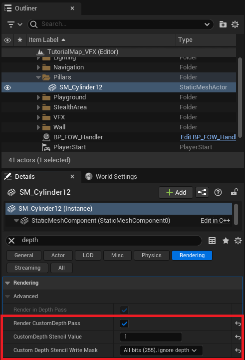
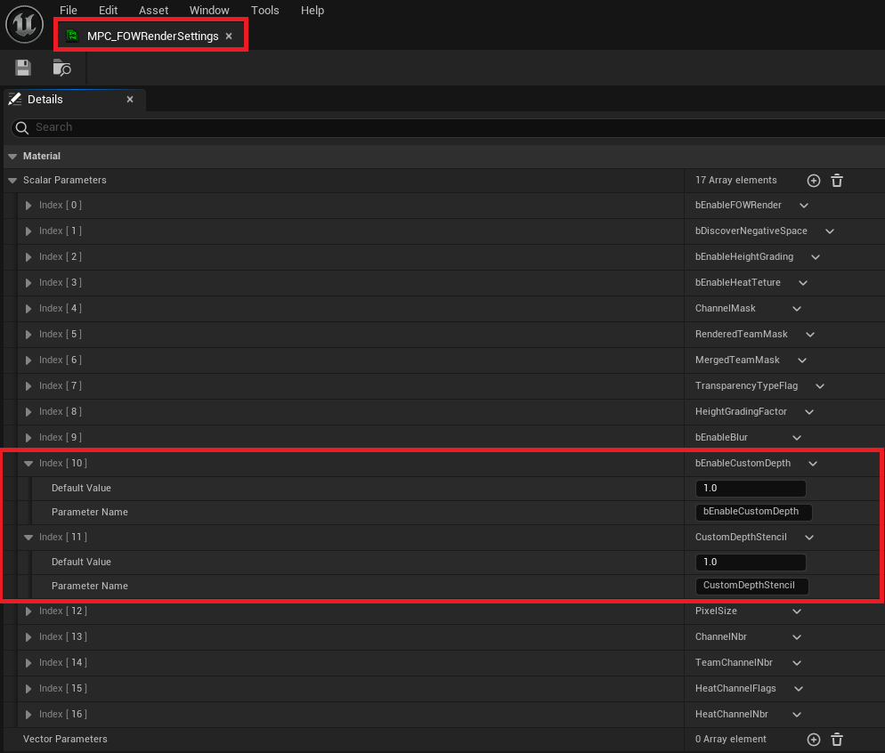

# Stencil

- [Custom depth render](#custom-depth-render)
- [Custom depth Settings](#custom-depth-settings)

This tutorial has been created in the `Tutorial/Maps/TutorialMap_VFX` map provided in the [Demo Project](https://github.com/gandoulf/LayeredFOW_Demo).
It covers how to ignore the fog post-process effect on objects rendered with a custom stencil.

## Custom depth render

While developing your game, you might want certain objects to retain their appearance and ignore the FOW pass. By default, varying this effect by object
is challenging, but custom depth allows it! By modifying a few settings, the GPU will access a new data set, enabling logic per `Stencil ID`.

The material logic is already configured, so only asset settings need adjustment.

First, ensure that the stencil is correctly enabled in your `Project Settings`. Change the `Custom Depth-Stencil Pass` to `Enable with Stencil`.

Now select your assets and search for depth. You'll find 3 variables to change:
- `Render CustomDepth Pass`: Enable this to let the stencil render update with the asset's primitive.
- `CustomDepth Stencil Value`: Set this to the stencil value the asset will use.
- `Custom Depth Stencil Write Mask`: Set to All bits (255).

Hit play, and you'll see that the cylinder is unaffected by the grey fog!

## Custom depth settings

By default, the FOW is set to ignore fog for assets with a `Stencil ID` of `1`. To change this, open `MPC_FOWRenderSettings` and adjust `CustomDepthStencil`.
Note: you can disable the stencil logic entirely by setting `bEnableCustomDepth` to `0`.

You can also modify these values at runtime with console commands:
- `fow.r.EnableCustomDepth` lets you turn the stencil logic On/Off.
- `fow.r.CustomDepthStencil` lets you change the stencil ID used by the post-process.

---
_Documentation built with [**`Unreal-Doc` v1.0.9**](https://github.com/PsichiX/unreal-doc) tool by [**`PsichiX`**](https://github.com/PsichiX)_