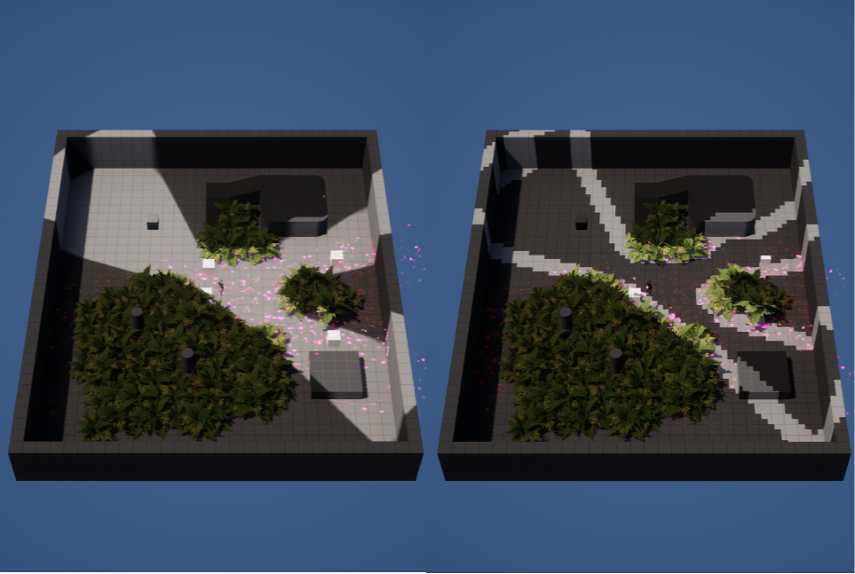
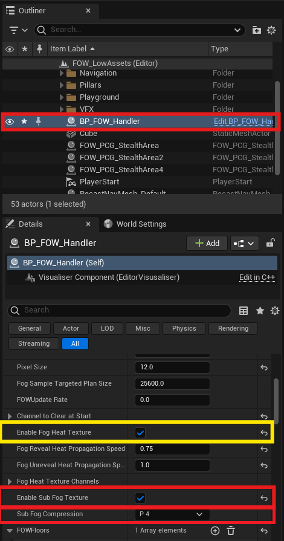
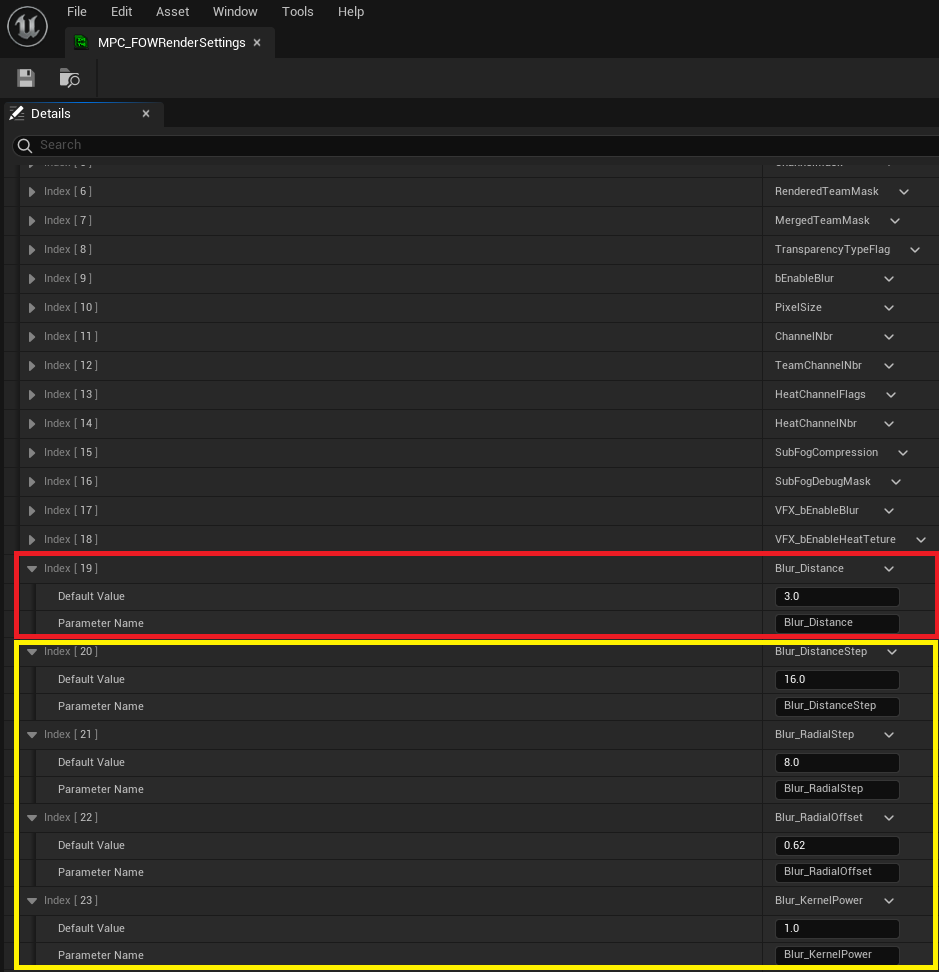
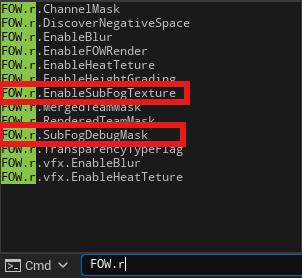

# Sub Fog Texture

- [Enable Sub Fog Texture](#enable-sub-fog-texture)

This tutorial is about enabling heat texture. No prerequisites are needed; you can use any map that you want.

## Enable Sub Fog Texture

The FOW is a system using textures to transfer data and give a state to the world. Unfortunately, the precision of those textures is limited,
and the pixels would be visible if no blur sampling method were used. The issue with them is that they are heavy to process. The `SubFog` has
been designed to limit its use by ensuring that only specific areas need to be blurred. 
This system will be updated at every frame, increasing the fog process time on the CPU slightly. It will compress the Fog result of every channel
by a number of pixels and be packed by the `TextureSampler` to be sent to the GPU. 
When the SubFog Texture visualizer is enabled, you will see the pixels on the screen requesting a blur (bright area) and the ones sampling the
fog state only once (darker area).

To enable the `Sub Fog Texture`, select the `FOWHandler` and switch on `EnableSubFogTexture`. By doing so, the whole system will be enabled, and
a new parameter will be displayed: `SubFogCompression`. This parameter is linked to the blur system used by the GPU when sampling the fog texture.
It will ensure that there are at least four pixels all around with the same state. If not, the blur takes place.

> **The `Heat Texture` is compatible with this feature; it doesn't matter if you activate it. However, fog update time on the CPU will increase. **

The blur system used by materials has its properties defined in the `MPC_FOWRenderSettings`. When the SubFog Texture is enabled, it is essential
that `Blur_Distance` <= `SubFogCompression`. Otherwise, some hard limits will be displayed on the screen. 
Other parameters can be tweaked to change the blurring aspect without constraints.

Finally, when the system is enabled, you can dynamically disable it or display the debug by calling these console commands:
- `fow.r.EnableSubFogTexture 0/1` enables or disables the SubFog texture to check GPU performance.
- `fow.r.SubFogDebugMask 00000001` enables the SubFog debug display for the first channel.

---
_Documentation built with [**`Unreal-Doc` v1.0.9**](https://github.com/PsichiX/unreal-doc) tool by [**`PsichiX`**](https://github.com/PsichiX)_