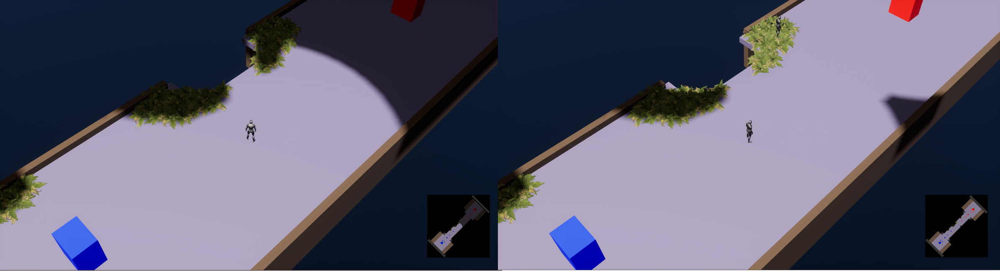
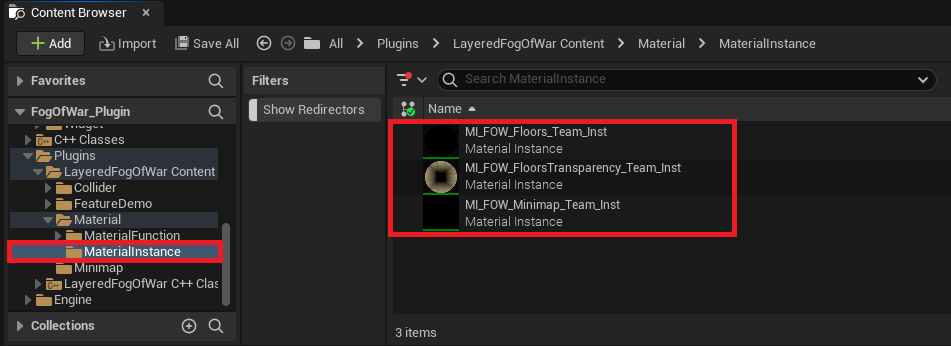
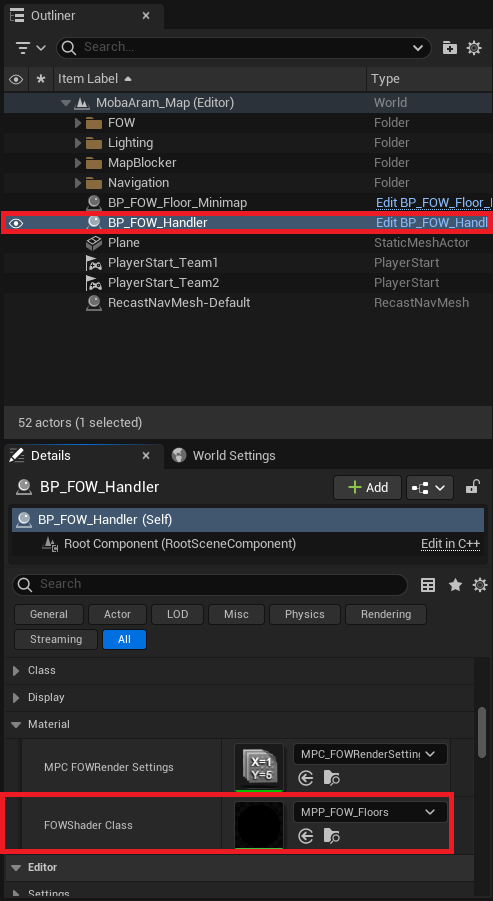
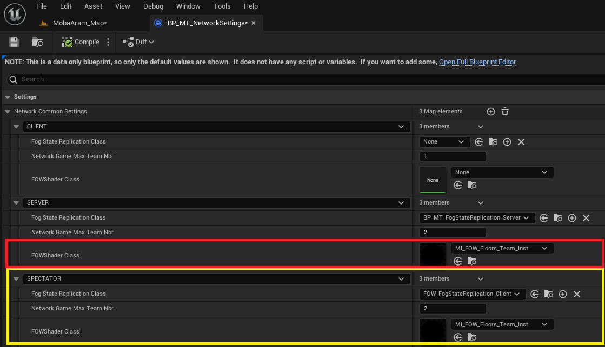
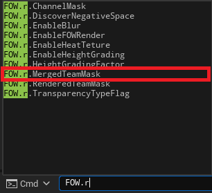

# Teams

- [Change Material](#change-material)
- [Toggle Teams Render](#toggle-teams-render)

This tutorial explains how to enable teams. No prerequisites are needed; you can use any map that you want.

When creating competitive games, the `LFOW` duplicates the number of channels by the number of teams. Each client will only compute its team's fog, but
the server will have to compute everything in case a client needs to be re-synchronized. It might be useful for debugging to see what the server has computed
for the other team. For that purpose, you can merge the team fog using a `Material` and by calling a `Console Command`. 
Another benefit of the team rendering system is that you could create games where players form alliances. It's also possible to imagine a spectator's client
that will be able to select which fog is displayed and analyze the game.

# Change Material

To enable `Teams`, you will need to change the material used by your `FOW_Handler`, Minimap, or anything drawing fog. In the Plugin content, you will find
three material instances:
- `MI_FOW_Floors_Teams_Inst`: In-game default fog material.
- `MI_FOW_FloorsTransparency_Teams_Inst`: In-game fog material for vertical games.
- `MI_FOW_Minimap_Teams_Inst`: Minimap default fog material.

You can quickly change the material in the `FOW_Handler` settings by changing the `FOWShaderClass`. If you are not using verticality, use the `MI_FOW_Floors_Teams_Inst`.

Another way to change the material used in-game when making an online game is by changing the `FOWShaderClass` in the `FOW_NetworkSetting`. If the material is
set, it will replace what was set by default. Games can have different rendering rights; maybe only the `Server` can debug teams, or maybe the game will be watchable
by `Spectators`, and they will be able to choose at runtime which team they want to follow.

# Toggle Teams Render

Once the team materials are set, you can change the displayed team at runtime by calling `fow.r.MergeTeamMask`. The command uses a binary mask composed of 0s and 1s
to display or not display fog from a team:
- `fow.r.MergeTeamMask 00000010`: Will display the fog of the second team.
- `fow.r.MergeTeamMask 00000011`: Will display the fog of the first two teams.

> Note that you can shorten the mask by omitting the `0`s on the left; those will be automatically filled. `fow.r.MergeTeamMask 10` works perfectly.

---
_Documentation built with [**`Unreal-Doc` v1.0.9**](https://github.com/PsichiX/unreal-doc) tool by [**`PsichiX`**](https://github.com/PsichiX)_