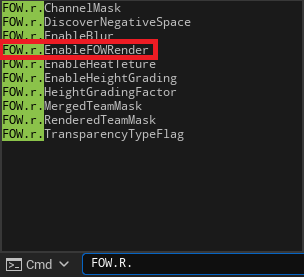
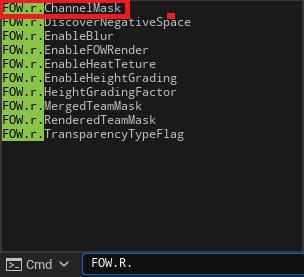

# Toggle Render

- [Toggle Fog Render](#toggle-fog-render)
- [Toggle Fog Channels](#toggle-fog-channels)

This tutorial explains how to use console commands. No prerequisites are needed; you can use any map that you want.

The plugin is provided with `Console Commands` to tweak the render of the fog at runtime. This tutorial will explain how to enable and disable the render of the FOW.

# Toggle Fog Render

You can toggle the render of the FOW on or off by using:
- `fow.r.EnableFOWRender 1` to enable the render
- `fow.r.EnableFOWRender 0` to disable the render

The toggle also affects the visible entity, allowing you to debug the objects moving in the fog at runtime.

# Toggle Fog Channels

The FOW works with different channels, and for some debugging, it might be more useful to disable only one channel rather than the entire fog. Since the plugin can have
up to 8 channels, the command uses a binary mask composed of 0s and 1s to enable or disable the channels:
- `fow.r.ChannelMask 00000011` enables the `Seen` and `Sight` channels
- `fow.r.ChannelMask 00000001` disables `Seen` and enables `Sight` channels
- `fow.r.ChannelMask 00000010` enables `Seen` and disables `Sight` channels
- `fow.r.ChannelMask 00000000` disables the `Seen` and `Sight` channels

> Note that you can shorten the mask by omitting the `0`s on the left; those will be automatically filled. `fow.r.ChannelMask 10` works perfectly.

---
_Documentation built with [**`Unreal-Doc` v1.0.9**](https://github.com/PsichiX/unreal-doc) tool by [**`PsichiX`**](https://github.com/PsichiX)_