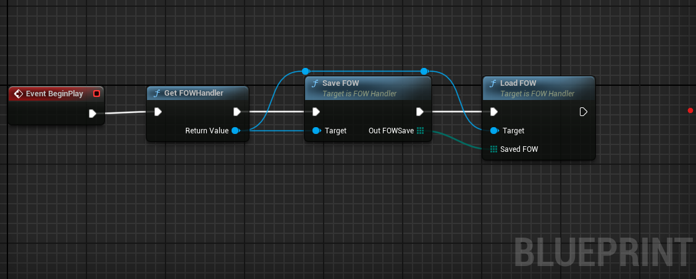
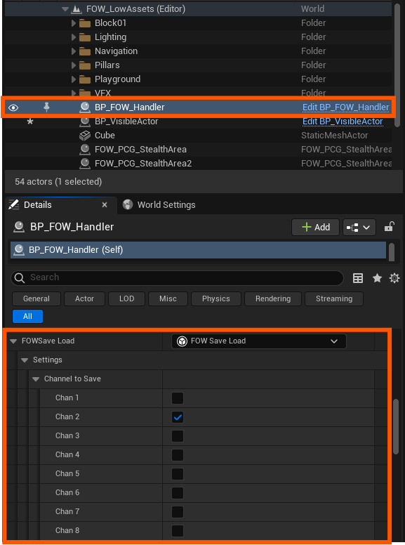

# Save Load

- [Save Load Setup](#save-load-setup)

The `Layered FOW` plugin comes with a save functionality that you can integrate into your project's `save & load` system.
No specific skills are required to use it. The system will return an array of data that needs to be stored and then passed back to be loaded.

## Save Load Setup

The system comes with two main functions callable from both `Blueprint` and `CPP` via the `FOWHandler`:
- `SaveFOW`: Takes a `TArray<uint8>` reference, clears it, and fills it with fog data.
- `LoadFOW`: Takes a `const TArray<uint8>` reference to load the fog data into the system.

BP


CPP
```cpp
...
if (AFOW_Handler* FOWHandler = AFOW_Handler::GetFOWHandler(this))
{
	TArray<uint8> SaveData;
	FOWHandler->SaveFOW(SaveData);
	FOWHandler->LoadFOW(SaveData)
}
```

In the `FOWHandler` you can find a `FOWSaveLoad` variable in the setting. If you unroll it you will have access to the channel saved by the system.


---
_Documentation built with [**`Unreal-Doc` v1.0.9**](https://github.com/PsichiX/unreal-doc) tool by [**`PsichiX`**](https://github.com/PsichiX)_