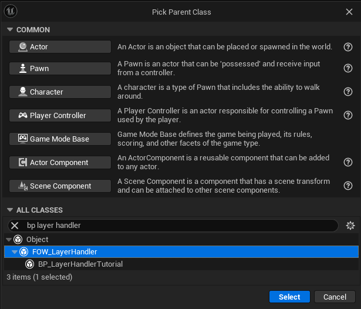
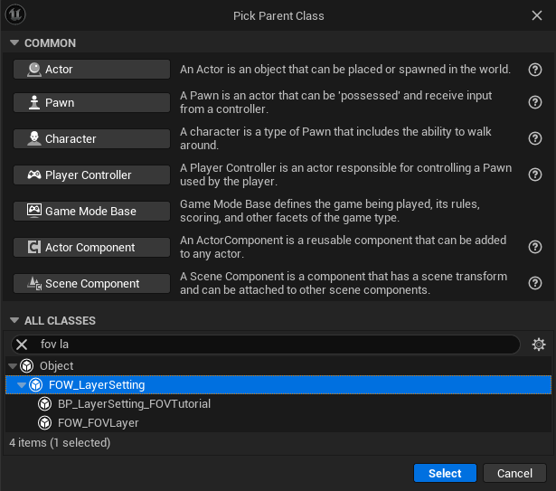
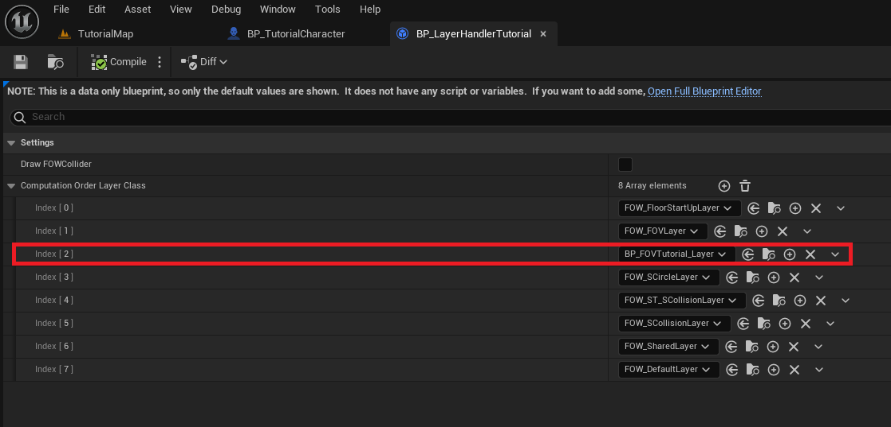
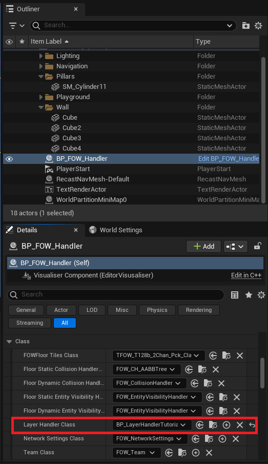
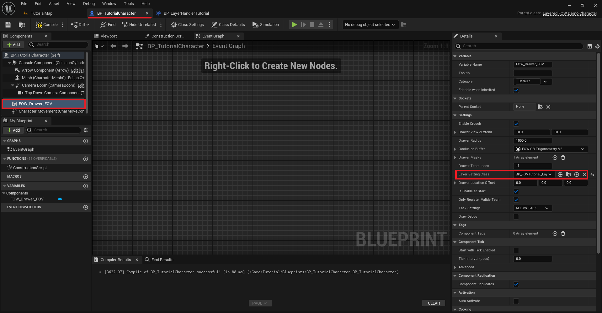
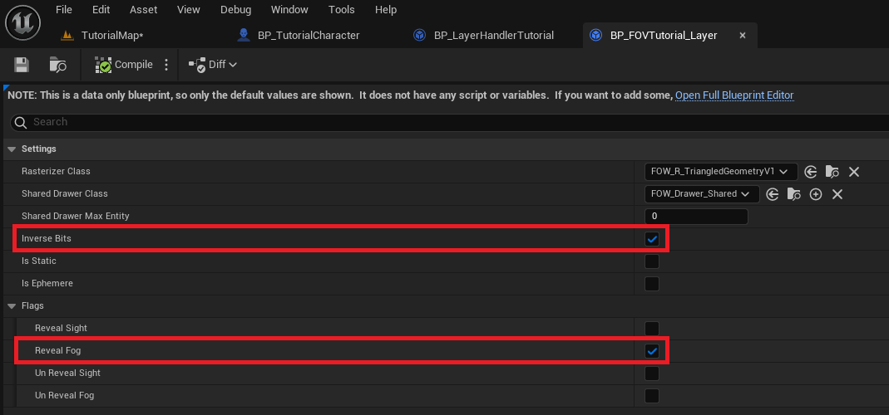
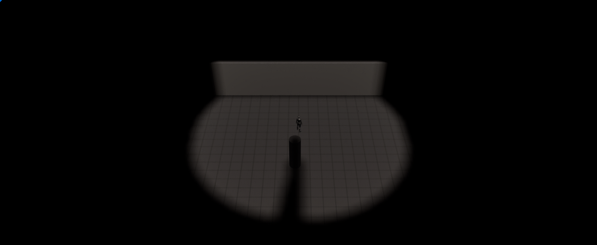

# Set up layers

- [Basic](#basic)
- [Advanced](#advanced)

## Basic

This part will show explain you how `LayerSettings` works and how you can create new ones for your games.
First you have to know that they are dissociated to provide different information to the FOW but also to
profide a computation order during the fog fragment merging. It can be compered to a rendering pipeline.
To register a new layer you will have to create a `LayerHandler`.  

Let's try to change the behavior of the drawer on you character. We want him to reveal only the black fog
but not to give him sight.  

Create a new BP_MyLayerHandler derived from `FOW_LayerHandler`

Create a new BP_MyFOVLayer derived from `FOW_LayerSettings`

Open your layer handler and add the new layer you've juste created. Add id just under the `FOW_FOVLayer`

Now we need to tell the `FOW_Handler` that we are using a new layer pipeline. Select the `BP_FOW_Handler`
and change in the detail panel, in the class section, the value of the `LayerHandlerClass` to the one you've
created

Open the blueprint holding the `FOVDrawer`, select it and go to the detail panel. scroll to the `LayerSettingClass`
and replace it with the one you've created

Now that every thing is correctly set, we can change the behavior of the `LayerSetting`. Open the blueprint,
turn the `InverseBits` to true (I'm gonna ask you to trust me on that, every FOV Layers will need this to be true)
and set the `RevealSight` to false and `RevealFog` to true. Doing so will prevent the player to have sight on
`VisibilityEntity` however the layout will be revealed

 Enjoy your new layer setting ! Check out the [Visibility Entity page](Visibility_entity.md) to really understand the difference
between `RevealSight` and `RevealFog`.

## Advanced

Let's talk about other settings and let's try to implement different `Drawers` and `Entity` to your game !

To continue ...
---
_Documentation built with [**`Unreal-Doc` v1.0.9**](https://github.com/PsichiX/unreal-doc) tool by [**`PsichiX`**](https://github.com/PsichiX)_