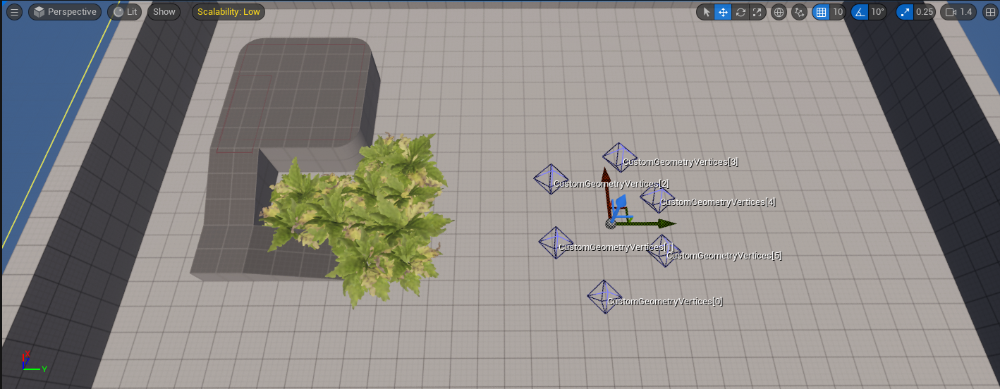
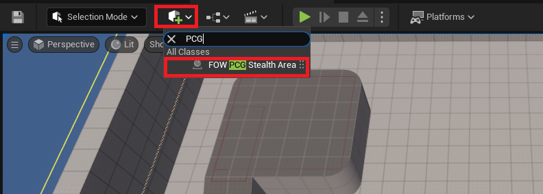
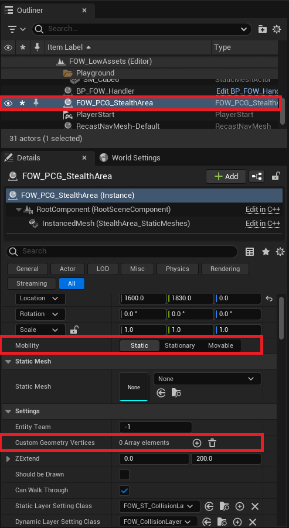
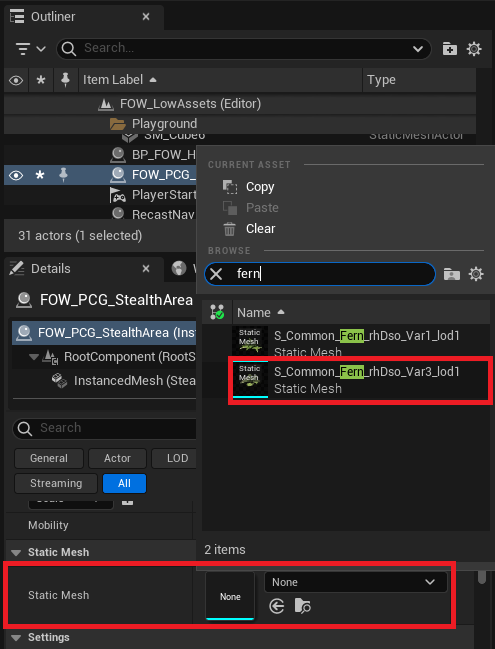
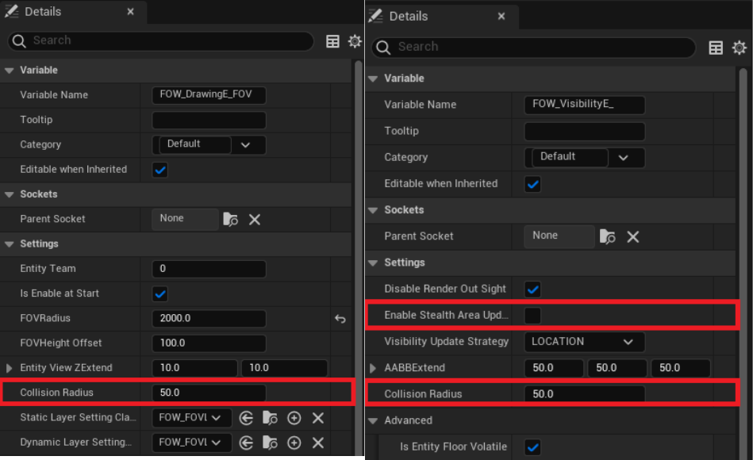
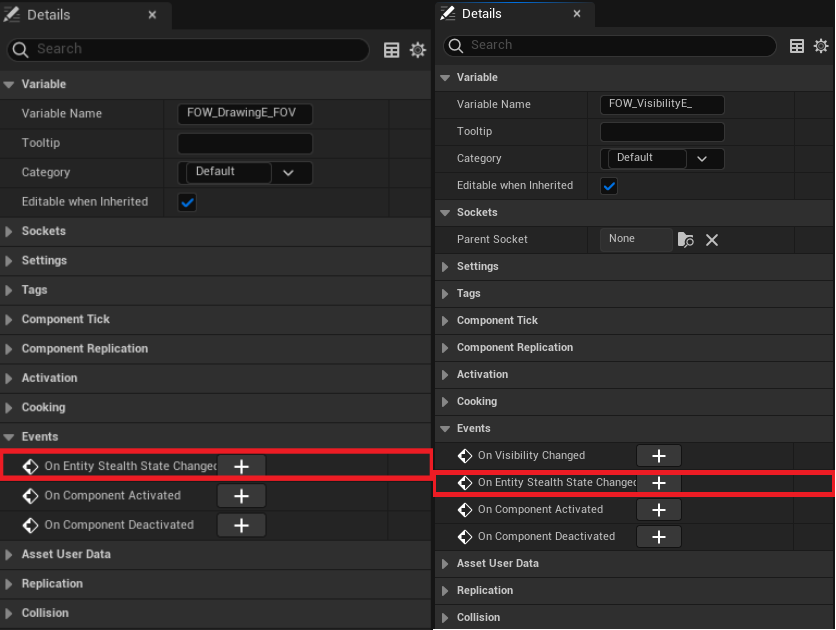
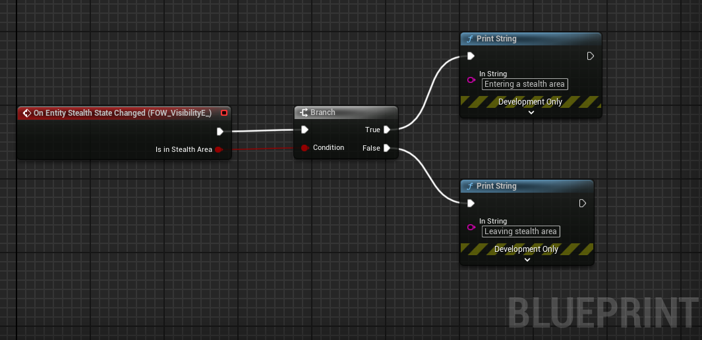
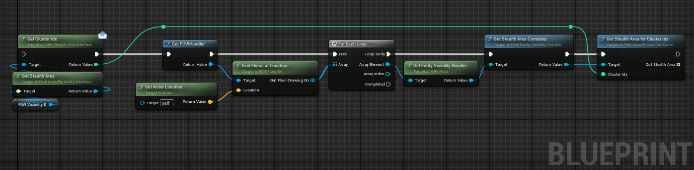

# Stealth Area

- [Add Stealth Area](#add-stealth-area)
- [Entities settings](#entities-settings)
	- [Collision](#collision)
	- [Delegates](#delegates)
- [Going deeper](#going-deeper)

This tutorial is about adding Stealth Area. No prerequisites are needed; you can use any map that you want.

## Add Stealth Area

The `Stealth Area` feature simulates the bush system found in MOBA games. The system acts as a collider and projects shadows if the
area is near an `FOVEntity`. Once the entity gets too close or inside, the collider will be ignored, and the fog will be revealed.
The system is fully dynamic, just like the collision system, and it will automatically generate `Clusters` of `Stealth Areas`. All
areas in contact will be added to a cluster, allowing the `FOVEntity` to reveal the fog from the whole cluster.

There are two different objects to generate a `Stealth Area`:
- `UFOW_StealthAreaComponent`: You can attach it to any actor.
- `AFOW_PCG_StealthArea`: A predefined actor that generates a `Stealth Area` which can be filled procedurally with a `StaticMesh`.

Both of these objects inherit from `IFOW_StealthArea_Interface`, allowing you to create your custom tool. 

Let's set it up by dropping an `AFOW_PCG_StealthArea` into your scene.

As with `CustomCollision`, mobility is important for optimization, and you will need to manually place the vertices of the geometry
defining the area.

Add vertices to the `Custom Geometry Vertices` and create the shape you want. All vertices need to have the same height; however, the
shape isn't limited.

For the `AFOW_PCG_StealthArea`, you can provide a `StaticMesh`, and the system will fill the area geometry with instances of the provided mesh.

You can tweak the generation with the following variables:
- `Seed`: The seed used for randomness. -1 will use a different number for each generation.
- `Space Between`: The space separating each mesh.
- `Random Offset`: A random offset allowed for each instance to prevent alignment.
- `Rotation Min/Max`: The rotation range to apply to the mesh.
- `Scale Range`: The scale range to apply to the mesh.

## Entities Settings

Aside from the `Stealth Area` itself, a few settings can be changed for the `Entities`.

### Collision

To discover the `Stealth Area` fog, the entities need to be in collision with them. This is computed with a `Circle-Geometry` intersection,
allowing users to define how large their units are and at what distance the units will be considered inside the `Stealth Area`. You will find
a `Collision Radius` variable in both `FOW_DrawingEntity_FOV_Component` and `FOW_VisibilityEntity_Component` to change the collision distance. 
For the `Visible Entities`, you will need to enable the `StealthAreaUpdate` by toggling on the variable. By design, it is set to false because
the collision chack can be expensive.

### Delegates

To associate gameplay with the `Stealth Area`, you can bind the `Entity` owner to the `OnEntityStealthStateChanged`.

The delegate is simple and provides a boolean indicating whether the `Entity` has entered or left the `Stealth Area`.

## Going Deeper

You might want to create gameplay that requires accessing the area actor within the `Stealth Area`. You can access the colliding area by calling
`GetStealthArea`. You can also query the other areas in the cluster with a chain of nodes:
- From the visibility entity, get the `StealthArea` and the `ClusterIdx` from it.
- Get the `FOWHandler` and find the `Floors` at the entity's location.
- Iterate over the floors and get the `EntityVisibilityHandler`.
- Get the `StealthAreaContainer`.
- Finally, call `GetStealthAreaForClusterIdx`, which will return an array of stealth area interfaces that you can cast.

---
_Documentation built with [**`Unreal-Doc` v1.0.9**](https://github.com/PsichiX/unreal-doc) tool by [**`PsichiX`**](https://github.com/PsichiX)_