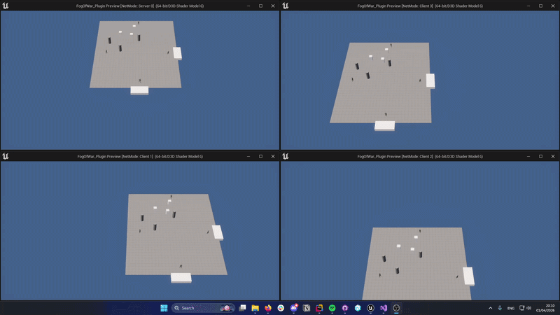
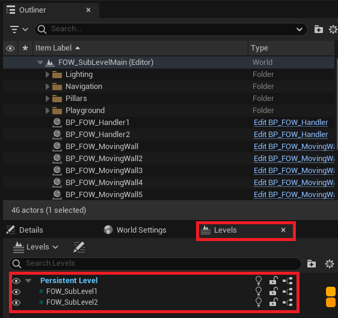
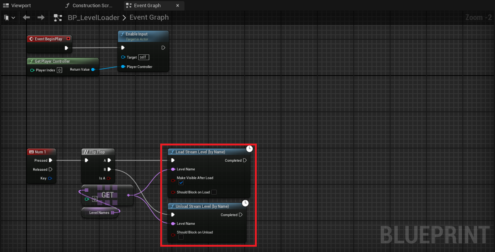
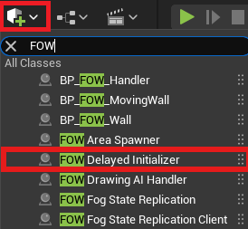
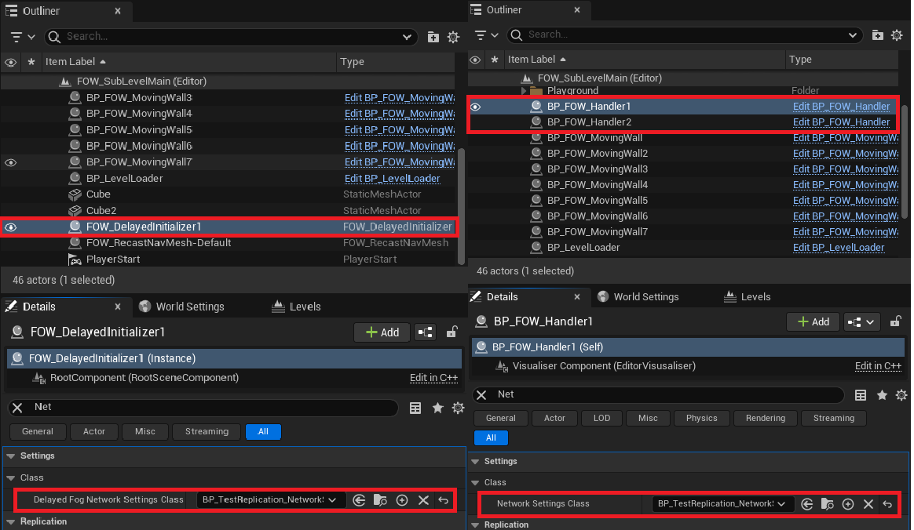

# Sub Level

- [Seamless Loading](#seamless-loading)
- [Delayed Initialization](#delayed-initialization)

The LFOW allows level loading and unloading without any specific setup. However, it is forbidden to have 2 `FOWHandler` instances at the same time.
It is, however, possible to unload a level with a handler and then load another level with a new handler. The system works for both online and local games.

# Seamless Loading

As explained above, nothing specific has to be done, just use the Unreal level loading system.
Seamless loading is done through the usage of `SubLevel` that you can see in the `Level` panel.

You can then load the `SubLevel` by code with the map name and by calling:
- `Load Stream Level`
- `Unload Stream Level`

# Delayed Initialization

For online games, you might need a `FOWHandler` initialized later on by instancing it or by loading a map. The network has to be initialized at the
very beginning by reading a `NetworkSetting` object. To delay the spawning of the FOWHandler, you have to add a `AFOW_DelayedInitializer` to your
main level (leave it always spawned) and provide the same network setting.

Once added to your map, ensure that all the `FOWHandler` and the `AFOW_DelayedInitializer` share exactly the same `NetworkSetting` class.

---
_Documentation built with [**`Unreal-Doc` v1.0.9**](https://github.com/PsichiX/unreal-doc) tool by [**`PsichiX`**](https://github.com/PsichiX)_