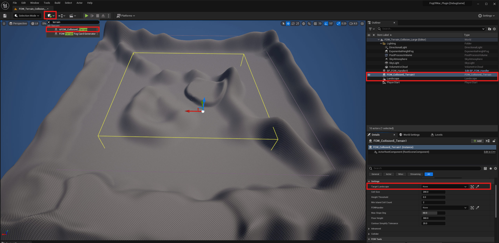
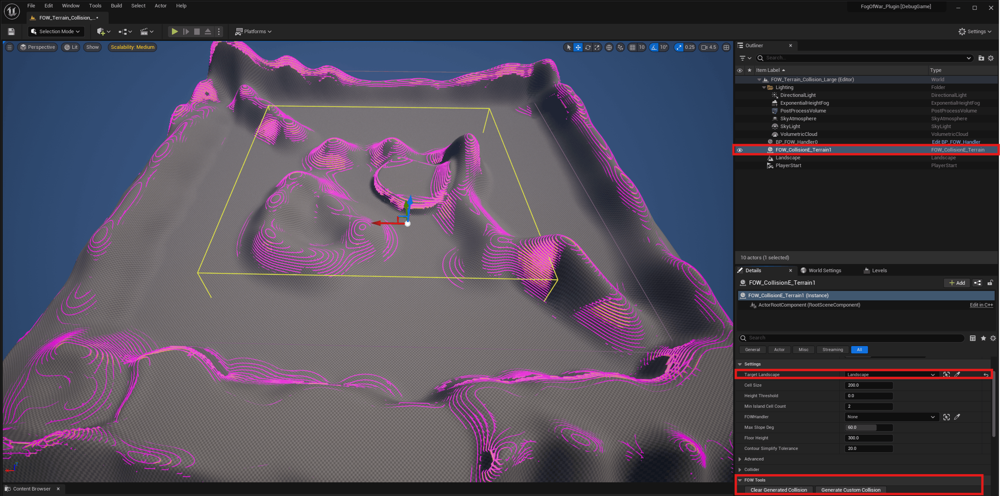
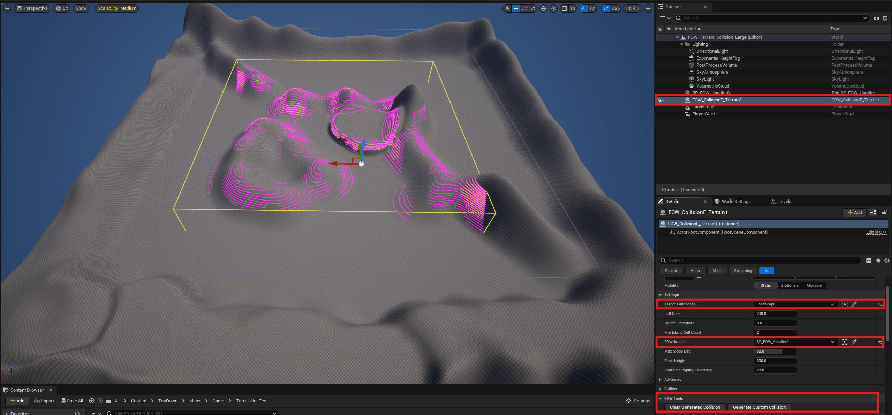

# Collision Terrain Entity

- [Generate the Collision](#generate-the-collision)
- [Limiting Generation to the FOWHandler](#limiting-generation-to-the-fowhandler)
- [Settings](#settings)
- [Display FOW Collision](#display-fow-collision)

Real-world terrains are rarely flat, and hand-placing `CollisionEntity` geometry under a `Landscape` to block
sight correctly quickly becomes tedious. `AFOW_CollisionE_Terrain` is an editor tool that samples a
`Landscape`'s heightfield and fills the volume under the terrain for you, wherever it rises above a height
threshold, spawning `UFOW_CollisionE_CustomComponent` geometry that follows the terrain's actual silhouette.

<video controls autoplay loop muted playsinline src="../../../assets/Tutorial/Entities/Collision/Terrain_Presentation.mp4"></video>

It's a one-shot generator (`CallInEditor` buttons), not a runtime component: you bake the collision once in
editor, and it ships as regular `FOW_CollisionE_CustomComponent` children.

<!-- IMAGE: Dropping AFOW_CollisionE_Terrain into the level and assigning TargetLandscape in the Details panel -->

## Generate the Collision

The tool voxelizes the terrain into horizontal Z-slices ("floors") of `Floor Height` thickness, stacked from the
landscape's lowest point upward. For each floor, the filled footprint is extracted as a simplified polygon
(marching squares, then Douglas-Peucker simplification) and spawned as a `UFOW_CollisionE_CustomComponent` - so
a diagonal cliff edge stays diagonal instead of turning into a staircase of square cells.

- Drop a `AFOW_CollisionE_Terrain` actor into your level.
- Assign `Target Landscape`.

You can now generate the terrain 
- Click `Generate Custom Collision`.
- Click `Clear Generated Collision` to remove everything it spawned and start over.

## Limiting Generation to the FOWHandler

On maps where the landscape extends well past the playable/fogged area, most of the generated collision has
nothing to shadow: floors are what fog is computed against, so collision generated outside every FOW floor is
wasted work and wasted `Collision Entities`. Linking `FOWHandler` to a `AFOW_Handler` in the level lets the
generator skip that work automatically:
- Any chunk whose XY footprint doesn't overlap **any** of the Handler's FOW floor AABBs is skipped entirely -
  no height sampling at all for that chunk.
- Within a chunk that is kept, a floor-band whose Z range doesn't overlap any floor there is skipped too.

Left unset (the default), generation covers the whole landscape as before - `FOWHandler` is purely an
optimization, not a requirement.

## Settings

- `Target Landscape`: the `Landscape` to sample.
- `Cell Size`: sampling grid resolution (cm), also the marching-squares resolution. Smaller = more precise
  contour, more raw vertices before simplification.
- `Height Threshold`: world-Z above which the terrain is considered "ground" to fill under.
- `Min Island Cell Count`: contours whose bounding box spans fewer cells than this on both axes are discarded as
  noise.
- `FOWHandler`: optional, see [Limiting Generation to the FOWHandler](#limiting-generation-to-the-fowhandler).
- `Max Slope Deg`: cells climbing/dropping faster than this towards a neighbour are excluded from every floor's
  contour. Cliffs are thin in XY but tall in Z, so excluding them is the single biggest collision-count saving
  available.
- `Floor Height`: thickness of each Z-slice used to voxelize the fill. Smaller hugs the terrain tighter, at the
  cost of more floors/collision pieces.
- `Contour Simplify Tolerance`: Douglas-Peucker tolerance (cm) applied to each extracted contour. Higher = fewer
  vertices, less faithful to the sampled terrain edge.
- `Max Floor Count` (Advanced): safety cap on how many floors are stacked per chunk, in case `Floor Height` is
  too fine for the chunk's height range.
- `Chunk Size` (Advanced): world-space size (cm) of the square chunks the landscape is processed in. See
  [Generate the Collision](#generate-the-collision).
- `Should Be Drawn` (Collider): forwarded to every spawned component's `ShouldBeDrawn`. Off by default -
  generated collision is meant to shadow fog, not to be seen.

## Display FOW Collision

Every collider (Box, Custom, or terrain-generated) can show an editor-only wireframe of the volume it actually
blocks - useful to check placement without guessing from the component's regular gizmo. Toggle it from the
viewport's `Show` menu, under `Fog Of War Colliders`. The same flag also shows `Stealth Area` colliders.

This is purely an editor visualization: it's stripped from cooked/packaged builds and costs nothing at runtime.
Each collider exposes `Volume Color`, `Split Color`, and `Line Thickness` if you want to override the default
magenta/orange look for specific colliders.

<video controls autoplay loop muted playsinline src="../../../assets/Tutorial/Entities/Collision/ShowFOWCollision.mp4"></video>

---
_Documentation built with [**`Unreal-Doc` v1.0.9**](https://github.com/PsichiX/unreal-doc) tool by [**`PsichiX`**](https://github.com/PsichiX)_