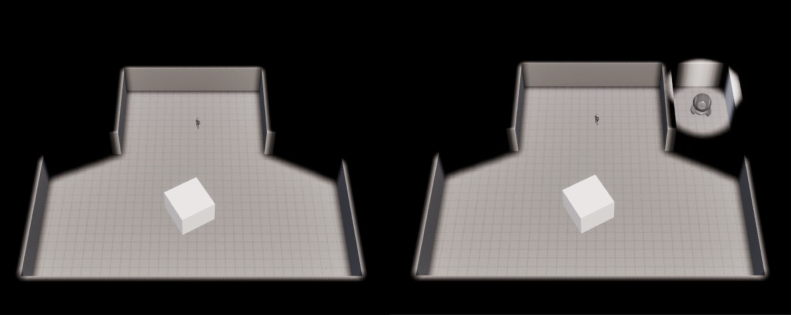
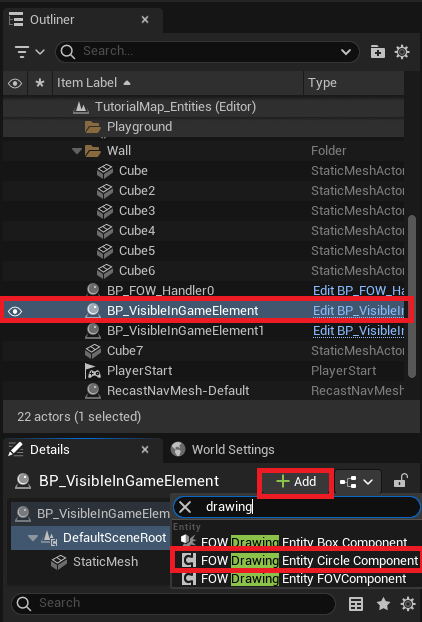
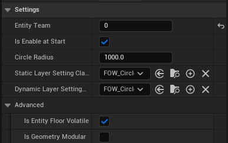
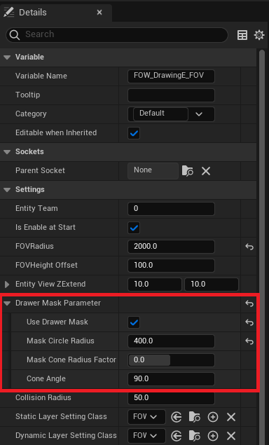
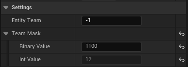

# Drawing entity

- [Drawing Entity Components](#drawing-entity-components)
	- [Add Entity](#add-entity)
	- [Setup Fov Entity](#setup-fov-entity)
	- [Team Mask](#team-mask)
- [Drawing Entity Cpp implementation](#drawing-entity-cpp-implementation)

This tutorial has been realized in the `Tutorial/Maps/TutorialMap_Entities` map provided in the [Demo Project](https://github.com/gandoulf/LayeredFOW_Demo).

> **/!\ Entities are designed for optimization. The system behind them will batch updates and improve game performance. It is highly advised to replace drawers with entities.  **

## Drawing Entity Components

There are multiple `DrawingEntity` components implementing the `IFOW_DrawingEntity_Interface`. Three different kinds of them exist for now:
* `Geometry drawers`: They will pierce fog by rasterizing a given geometry. Used by `FOW_DrawingEntity_BoxComponent`.
* `Circle drawers`: They will pierce fog with a specific rasterizer only able to trace circles. Used by `FOW_DrawingEntity_CircleComponent`.
* `FOV drawers`: They will pierce fog by collecting the colliders to create shadow geometries. Used by `FOW_DrawingEntity_FOVComponent`.

All `DrawingEntity` work the same; they hold data and the given `UFOW_LayerSetting` will define how this data will be used to pierce the Fog.

### Add Entity

To use them, add a `FOW_DrawingEntity_CircleComponent` / `FOW_DrawingEntity_BoxComponent` / `FOW_DrawingEntity_FOVComponent` to an instanced
actor or to your existing `Blueprint`. The default settings of those components are made to pierce the fog.

All drawers will have barely the same settings:
* `IsEnableAtStart`: Define if the entity starts drawing from the BeginPlay or if it will be enabled later by calling `EnableEntity()`.
* `EntityTeam`: Define for which team the entity will be drawing. The team can be changed at runtime by calling `SetEntityTeam()`.
* `Static/DynamicLayerSettingClass`: Define how the drawer will bring modification to the fog. Those can't be changed at runtime.
* The advanced section is only necessary for multiple `FOW_Floor` games. Their behavior will be explained later.

### Setup Fov Entity

FOV entities are used to simulate the sight of a unit in a top-down game. The `FirstSetUp` tutorial shows how to add an `FOV Drawer` and warns about
the performance issues they can cause when too many are used. The `FOVEntities` provide a solution with the same features as the drawers but run way faster.

In addition to casting shadows, `FOVEntities` can also have a vision cone. The cone is composed of a circle and a cone, with each entity having customizable settings.

To enable the vision cone, navigate to the `FOW_DrawingEntity_FOVComponent` properties and turn on `UseDrawerMask`. New settings will appear, allowing
you to tweak the shape of the cone:
- `MaskCircleRadius`: Changes the size of the circle at the origin of the cone.
- `MaskConeRadiusFactor`: Offsets the cone from the center of the circle. Clamped between -1 and 1.
- `ConeAngle`: Adjusts the field of view (FOV) of the entity.

### Team Mask

You will find a hidden property if you set the `EntityTeam` to -1. The `TeamMask` is a struct composed of an editable string to provide a
mask in binary, and by an int showing the conversion value. Setting the `EntityTeam` to -1 will update the fog for every team. The binary mask
is here to provide some flexibility if you don't need to update every team. 
For example, if you need to update the fog only for team 3 and 4, the `TeamMask` will be `1100`.

## Drawing Entity cpp implementation

You can make your own drawing component or directly turn your `UObject` to entities and give them the possibility to alter the state of the fog. To be done...

---
_Documentation built with [**`Unreal-Doc` v1.0.9**](https://github.com/PsichiX/unreal-doc) tool by [**`PsichiX`**](https://github.com/PsichiX)_