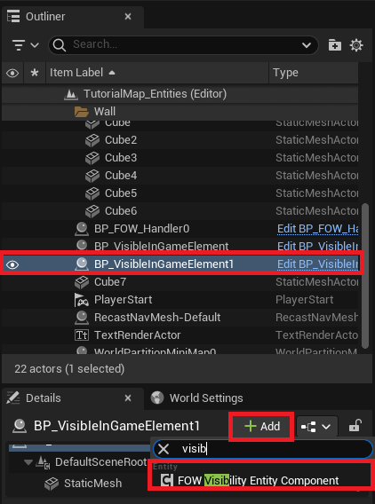
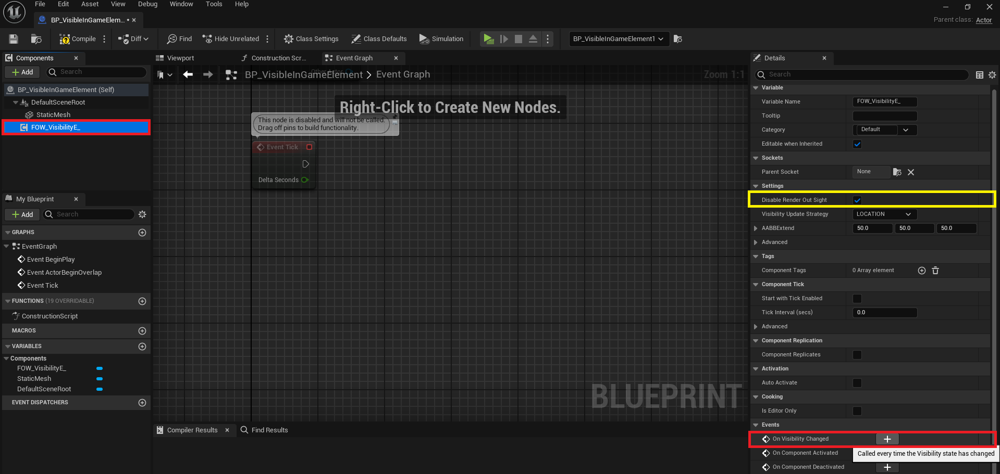
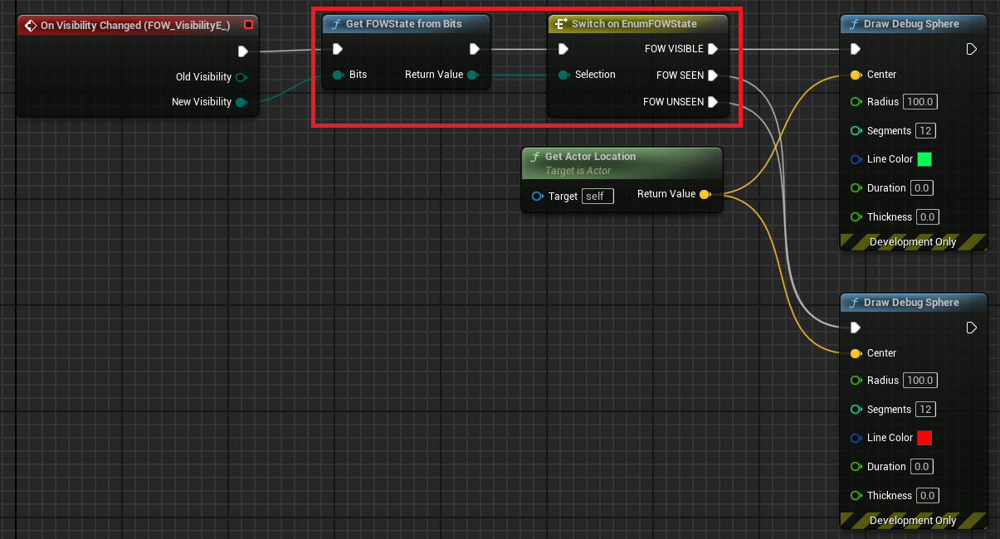
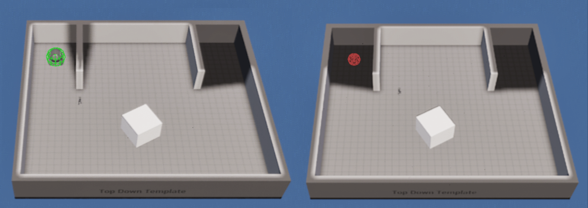
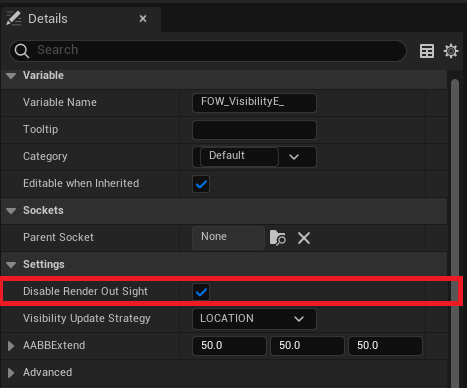

# Visibility Entity

- [Visibility Entity Components](#drawing-entity-components)
- [Visibility Entity cpp implementation](#visibility-entity-cpp-implementation)

This tutorial has been realized in the `Tutorial/Maps/TutorialMap_Entities` map provided in the [Demo Project](https://github.com/gandoulf/LayeredFOW_Demo).

## Visibility Entity Components

This component implements `IFOW_VisibilityEntity_Interface` and allows your game to change the visibility
of your actors depending on the fog state.

To use it, add a `FOW_VisibilityEntity_Component` to an instanced actor or to your existing Blueprint.
The component will by default hide the actor if it is not in sight.

To go a bit further, if you want to apply custom code when the visibility state changes, you can implement
the `OnVisibilityChanged` event from the component in your Blueprint.

By default, the FOW state is returned as a uint8, which doesn't mean much for you, but it is a mask
representing the 8 channels. You can transform it to a more readable enum by calling `GetFOWStateFromBits`.
Now just switch on the returned enum to apply your custom code. For example, I'm just drawing a debug sphere.

And here you go, a green sphere appears when the actor is revealed, and a red one appears when the player
loses sight of it.

If the popping render displeases you, you can turn it off by unchecking `DisableRenderOutSight`. If you
do so, nothing will happen anymore, and you will have to do the magic by yourself, perhaps a material
translucency transition or an explosion?

## Visibility Entity cpp implementation

You can make your own visibility component or directly turn your `UObject` into entities and give them
the possibility to react to the Fog state. To be done ...

---
_Documentation built with [**`Unreal-Doc` v1.0.9**](https://github.com/PsichiX/unreal-doc) tool by [**`PsichiX`**](https://github.com/PsichiX)_