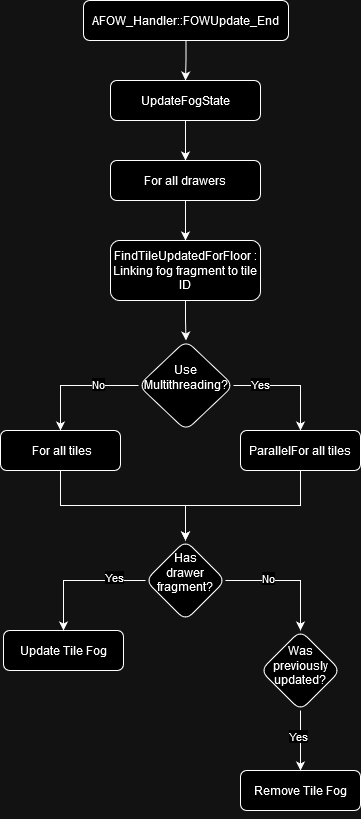

# Floor

## Table of Contents

- [Explanation](#explanation)
    - [Settings](#settings)
    - [Fog Update](#fog-update)

## Explanation

The `AFOW_Floor` class represents 3D boxes held by the [Handler](/book/architecture/Handler.md), where the fog is applied. The fog is stored in a "bit array"
that is updated and sampled every frame. The update is facilitated by the `TFOW_Tile_Base` class, which shares the bit array pointer to
allow multithreading and prevent unnecessary updates if no Drawer fragment has updated the tile area. Floors contain all the entities
within them, registered in:

* `UFOW_Drawer_Shared` for `UFOW_DrawingEntity_Interface`, with the base class defined in `FOW_LayerSetting`
* `UFOW_CollisionHandler` (static/dynamic) for `UFOW_CollisionEntity_Interface`, with the base class defined in `AFOW_Handler`
* `UFOW_EntityVisibilityHandler` (static/dynamic) for `UFOW_VisibilityEntity_Interface`, with the base class defined in `AFOW_Handler`

### Settings

You'll find a few settings to configure the floors in your environment:

* `FloorLocation`: defines the center of the floor.
* `FloorExtend`: defines the 2D extent of the floor.
* `FloorZExtend`: Represents the height of the fog. X represents the fog under the floor center, and Y represents the fog above the floor center.
* `bOverrideChannelToClearAtStart`: Allows you to override the `FOW_Handler` setting of the fog state at start.
* `bSnapFloorExtendToGrid`: Snaps the floor extent to the tile grid.

### Fog Update

Every update is called by the handler, with four main updates:

* `UpdateCollision`: done during `FOWUpdate_Begin` by the `UFOW_CollisionHandler`
* `UpdateFogState`: done during `FOWUpdate_End`
* `UpdateVisibleEntityState`: done during `FOWUpdate_End` by the `UFOW_EntityVisibilityHandler`
* `UpdateFogTextureSample` or `GetFogTextureSampleRegions`: done during `UpdateTexture`. This update is special and cannot be changed; it's
bound to `FWorldDelegates::OnWorldTickEnd` to ensure the position of every game camera.

The fog state is a heavy update which merges fog fragments of every Drawer. To achieve this, both the fragment and the floor's bits
arrays are sliced into tiles. Tiles are instantiated and stored in floors, they all derive from `TFOW_Tile_Base`. It facilitates the
transformation of Drawer data into a readable texture from the GPU. Each tile receives arrays of pointers linked to Drawer fog fragments;
if the array is empty, the tile is skipped and reset if updated during the previous frame. The fog state generated depends on the
`UFOW_LayerSetting` bound to the Drawer and by the `UFOW_LayerHandler`, which provides the update order. The LayerSettings are non-instantiated
classes that convert all their Settings into a flag. They are read by the Tiles and interpreted as the code writer intends. Every modification
regarding channel behavior or computation will require another Tile class.

#### Visual Representation of the Updates Pipeline

---
_Documentation built with [**`Unreal-Doc` v1.0.9**](https://github.com/PsichiX/unreal-doc) tool by [**`PsichiX`**](https://github.com/PsichiX)_