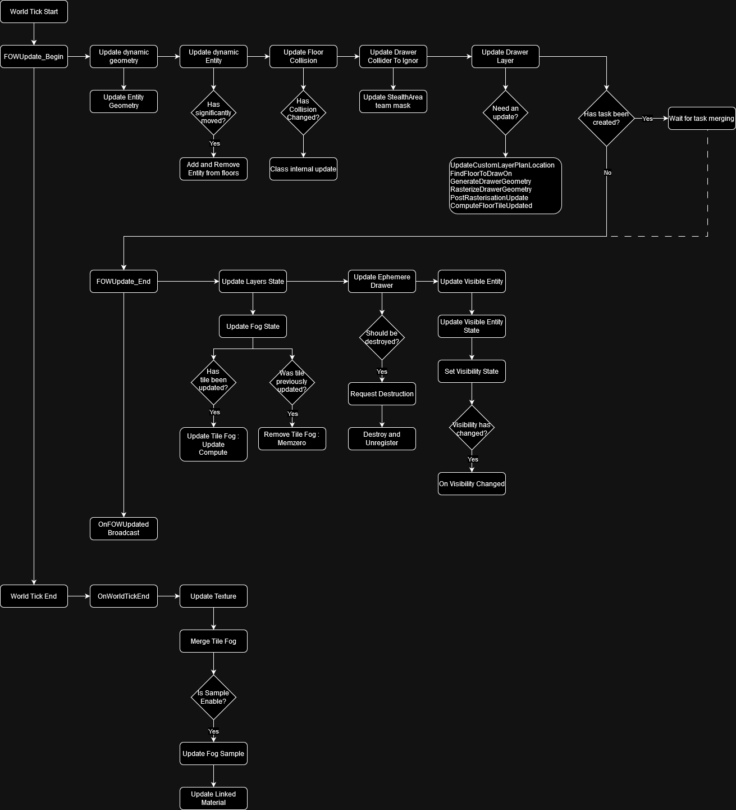

# Handler

## Table of contents

- [Explanation](#explanation)
    - [Settings](#settings)
        - [Editor debug setting](#editor-debug-setting)
        - [Fog setting](#fog-setting)
        - [Update settings](#update-settings)
        - [Module settings](#module-settings)
        - [Rendering settings](#rendering-settings)
    - [Initialisation](#initialisation)
    - [Updates](#updates)

## Explanation

The `AFOW_Handler` class is a singleton used to store [Floors](/book/architecture/Floor.md) and manage Fog settings such as Pixel size, Encoding,
and Collision system. It defines the initialization and update loop. All initialization happens during the begin play unless
for the floor generation that is instantiated straight into the editor.

### Settings

#### Editor debug setting
* `ShowGrid`: display the grid delimited by the tile. Floors are snapped to this grid.
* `ShowFloors`: display the 3D box representing the floors. The pink square is the real position of the floor, it will
* be aligned to the grid. The yellow square is the 3D Fog representation.

#### Fog setting
* `PixelSize`: lets you adapt the fog precision, the value is expressed in centimeters.
* `FOWFloors`: lets you create new game areas with fog.
* `TilePixelNumber`: lets you change the tile dimension by modifying their pixel number. Changing tile size might become
interesting for high fog precision, it will reduce the number of tile merging and will allow the usage of bigger registers for the merging.
* `ChannelToClearAtStart`: lets you choose the default fog status at start. Useful if you have a map with hidden area
and the rest visible. Use `AFOW_DrawingE_Custom` with `UFOW_FloorStartUpLayer` to add fog where it's needed. Fog will
be cleared and redrawn during the initialization and the very first frame.
* `LayerHandler_Class`: lets the possibility to the user to organize the layer merging.
* `FOWFloorTiles_Class`: lets you choose the number of channels used by the game. It is also designed to select the computation method
of tile merging. Warning register used cannot be bigger than `TilePixelNumber`.

#### Update settings
* `FOWComputeSetting`: Change the right of the FOW to use or not multithreading/Task/ComputeShader (compute shader not done yet).
* `FOWUpdateRate`: Change the update rate of the FOW. However I do not recommend to use it, render will be impacted and become less
smooth. I recommend to enable task and let the FOW do discrete updates.

#### Module settings
Modules that can be changed in the handler are stored under the `Settings|Class` section. There is a differentiation between static
and dynamic because some modules can be more or less optimized depending on those two parameters (The AABBCollisionHandler has an
update time super long for dynamic objects).

#### Rendering settings
* `FOWShader_Class`: change the render system of the FOW. 3 different materials are provided with the plugin:
    * `MPP_FOW_Floors`: for flat game
    * `MPP_FOW_FloorsTransparency`: for games with verticality
    * `MUI_FOW_Minimap`: for the minimap

### Initialisation

The initialization of the FOW happens in the begin play and can be delayed if your pipeline needs it. Initialization is split into
many sections:

* `InitNetwork` will create a **Replicated** environment only if the game isn't standalone and if the layer setting class is
correctly set. Set network setting as the right to override many values from the Handler to provide the accessibility to different
clients. Thus it has to be executed first.
* `InitTeams` isn't used and will be deleted.
* `InitFOWFloorsTiles`: Allocates the memory used by the floor. The FOW cannot do anything without it. The tiles must be
initialized before the game shader.
* `InitGameShader`: Generates `FOWTextureSample` that will be linked to the instantiated `FOWShader_Class`. You can override this to
generate more material if needed. However, you have the possibility to create and register texture sample at any time; don't force
yourself to do everything in this method.
* `InitFOWUpdate` is the most interesting method. If you have pipeline trouble, I recommend to let every other initialization call
and to delay only this one. Until this call is made, no update from the fog but even from this entity or the collision system will
happen. **Please be very cautious to call `FinalizeInitialization` just after the call of this method.**

#### Visual representation of the initialisation pipeline

### Updates

By default, the update happens during the actor tick. Every component of the FOW will be updated during this sequence unless for
the `FOWTextureSample`. The update will be done at once if no asynchronous tasks are requested and will be managed by two methods:

* `FOWUpdate_Begin` manages every update that needs to happen to let drawers generate fog fragment. It'll update the dynamic Entities
first and then the collision. It will also be responsible for multithreading initialization.
* `FOWUpdate_End` is called after that the drawers have generated their fog fragment. Depending on the usage of task or compute shader,
it'll be called right after the begin update or later in the frame. Fog fragment will be sorted and distributed to floors to update the
fog state. Once updated transient drawer will be deleted and all "visibleEntity" will update their state to turn on/off their render.

The `FOWTextureSample` has a special place to be updated because of the engine camera update time. To generate fog sample the sample
has to be aware of the position of the camera; however, Unreal updates their position at the end of the tick. To prevent sample from
sending wrong texture information, their updates happen at the very end of the world tick. There is a second reason of why their update
is separated and independent. In case of long update, the FOW can skip an update frame if using asynchronous update. It doesn't impact
the render to not change the fog state, however, fog data on the GPU has to be perfectly synchronized with game or artifacts might show up.

#### Visual representation of the Updates pipeline

---
_Documentation built with [**`Unreal-Doc` v1.0.9**](https://github.com/PsichiX/unreal-doc) tool by [**`PsichiX`**](https://github.com/PsichiX)_