# Layers

## Table of Contents

- [Explanation](#explanation)
    - [Layer Settings](#layer-settings)
        - [Rasterizer](#rasterizer)
        - [Shared drawer](#shared-drawer)
        - [Shared drawer max entities](#shared-drawer-max-entities)
        - [Inverse bits](#inverse-bits)
        - [Static drawer](#static-drawer)
        - [Transient](#transient)
    - [Layer Handler](#layer-handler)
        - [Collision drawing](#collision-drawing)
        - [Computation order layer class](#computation-order-layer-class)

## Explanation

Layers are the representation of a rendering pipeline. they define how a fog fragment impact the fog state
and are applied in a given order. The `UFOW_LayerSetting` will be the class used by every drawer tp define
their behavior. The `UFOW_LayerHandler` is held by the `FOW_Handler` and will be the pipeline reference for
every fog state update.

### Layer Settings

There isn't any logic, except converting settings to a flag mask, in the `LayerSettings`. They have been
made to simplify the pipeline understanding, to help when custom configurations are needed and to enable
or disable optimization.

About the generated settings flags, you have to understand that they mean nothing without a `TFOW_Tile_Base`
able to read it. The flag mask is an `int32` with only 4 bits used. This means that you have the possibility
to create other settings to provide to the `Tiles` if you want to create new channels or if other conditions
are needed for your fog to be computed.

#### Rasterizer

The `Rasterizer Class` lets you choose which rasterizer will be used by the `Drawer` for the fog fragment
generation. Depending on the situation, a specialized rasterizer can be a real gain and improve the performance.
As an example, two rasterizers are provided in the plugin:

- `UFOW_R_TriangledGeometryV1`: used to rasterize convex geometry with the vertices correctly sorted.
- `UFOW_R_CircleV1`: used to rasterize circles only. It will read geometries one vertex by one and use them as a `2D position` and a `Radius`.

Rasterizers define how geometry will need to be provided. You can create others to fit specific cases or to
optimize the rasterization process.

#### Shared drawer

The `Shared Drawer Class` allows you to choose which drawer class will be used for the update of Entities.
The Drawer will then be instantiated and contained by a `Floor`. Every Entity contained in the floor will be
provided to this drawer, which will ensure the generation of the fog fragment. There are 3 kinds of shared drawers:

- `UFOW_Drawer_Shared`: will query geometry from entities and rasterize it on the fog fragment. Use `UFOW_R_TriangledGeometryV1` as Rasterizer.
- `UFOW_SDrawer_Circle`: will query geometry from entities, however, it's designed to receive a single vertex per entity to draw a circle. Use `UFOW_R_CircleV1` as Rasterizer.
- `UFOW_SDrawer_FOV`: will query position from the entities to compute shadow geometries from the `CollisionHandler`. Then, every shadow is rasterized. Use `UFOW_R_TriangledGeometryV1` as Rasterizer.

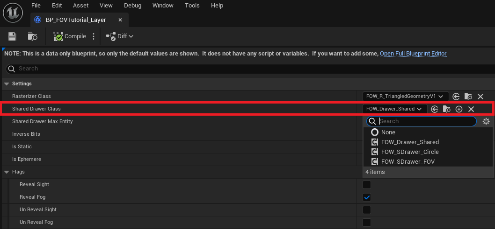

`Shared drawer` is responsible for querying data from geometries and to provide it to the rasterizer. They will
also be responsible for choosing how the fog fragment will be computed:

- Game thread
- Game thread with parallel for
- Task
- Compute shader (Not provided yet)

You are free to create others to improve or make them fit to your game pipeline.

#### Shared drawer max entities

> **This setting only makes sense if multithreading or compute shader are enabled.**

The `Shared drawer max entities` value is an optimization variable. It is used to limit the numbers of entity
per `Shared Drawers`. The meaning behind this isn't that your game will have a limited number of entities but
that another drawer will be instantiated if one is full. This will allow the system to create many tasks instead
of only one if you have lots of entities sharing the same `LayerSettings`.

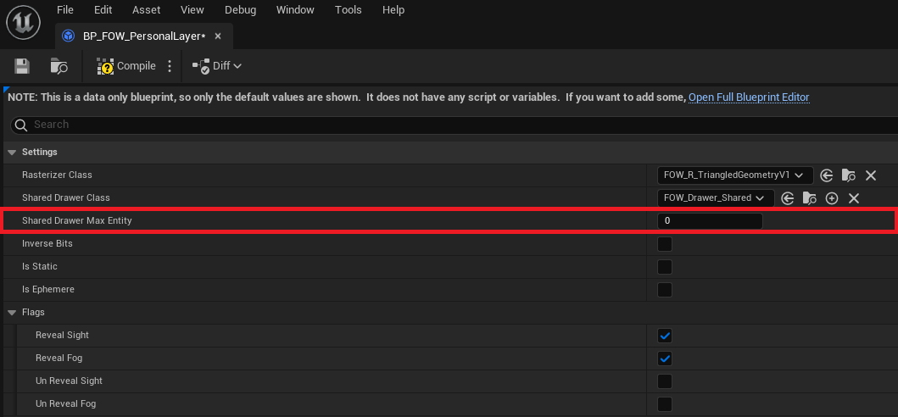

If you let the variable be 0 or less, `Shared Drawers` won't have entities limit and will be updated like so:
- The red square represents 2400 drawers computed in 1 thread.
- The green square represents the start of the fog fragments generation.
- The blue square represents the end of the fog fragments generation.

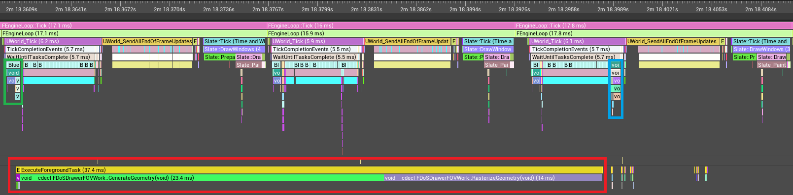

If you increase the limits (500 was used for the example), multiple `Shared Drawers` will be instantiated
and your computer will take benefit of the other cores in the processor:
- The red square represents 2400 drawers computed in 5 threads.
- The green square represents the start of the fog fragments generation.
- The blue square represents the end of the fog fragments generation.

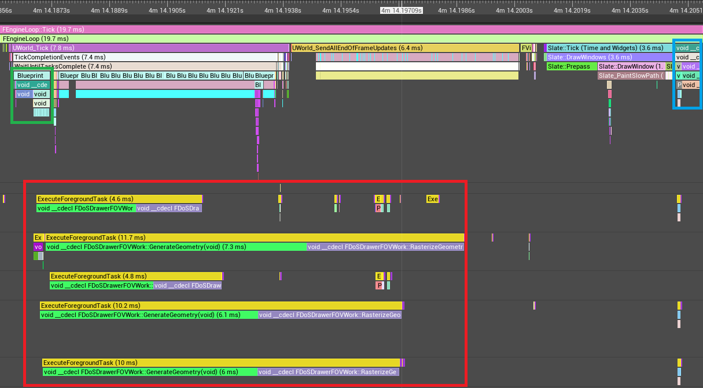

> **Caution, update task might become too present to let the Engine start its own. It might be more interesting
to accept lots of entity per drawer which might reduce the fog state refresh rate instead of the whole game frame
rate.**

#### Inverse bits

The `Inverse bits` is a parameter for the rasterizer. This will tell the rasterizer to draw the geometry with 0
instead of 1. It is only used when geometry shadows need to be represented. Those drawers will entirely reveal
their fog fragment and hide parts with collision geometry. There's no need to understand what it really does,
just turn it on if the drawer will cast shadows.

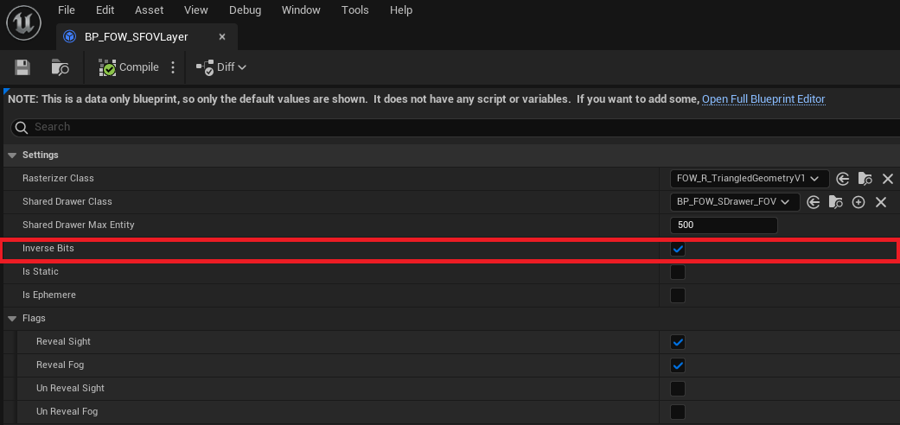

#### Static drawer

The `Static drawer` value is an optimization variable. By setting it to true, you tell the system that all entities
provided won't move. This means that the entities will generate their fog fragment only once until one of them moves
or if an Entity is added or removed. This parameter is mostly used by the collider to reduce the number of triangles
rasterized to represent their shadows.

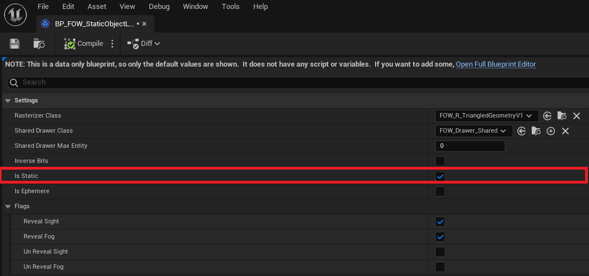

#### Transient

It simplifies the implementation of one or a few frame drawing drawers. It's often heavy to write delegate and bind
to the system to ensure at least one update. With this enabled, the system will try to destroy the associated drawer
every frame.

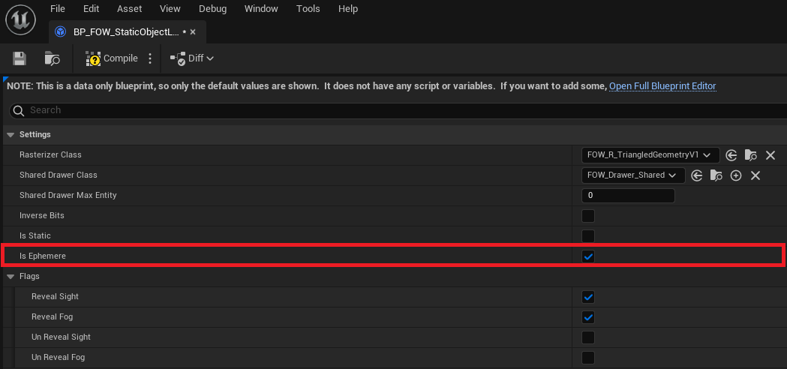

You might not want to draw for only one frame, in that case, you can override `RequestDestruction` in CPP and BP to
add a timer or verify a condition before calling `DestroyAndUnregister`.

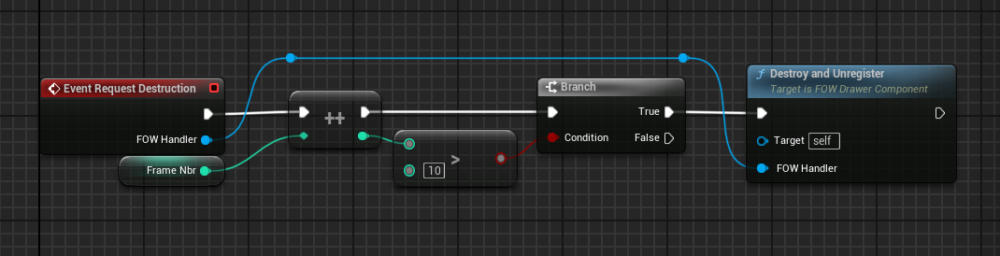

### Layer Handler

Layer Handler is a class made for global settings regarding the update pipeline of the fog state.

#### Collision drawing

The `Collision drawing` is an optimization variable. It's disabled by default because of the issues it can bring to
the render. If enabled, all colliders will have the possibility to draw their collision geometry to a `Shared Drawer`,
only if `ShouldBeDrawn` is set to true in your `CollisionEntity`.

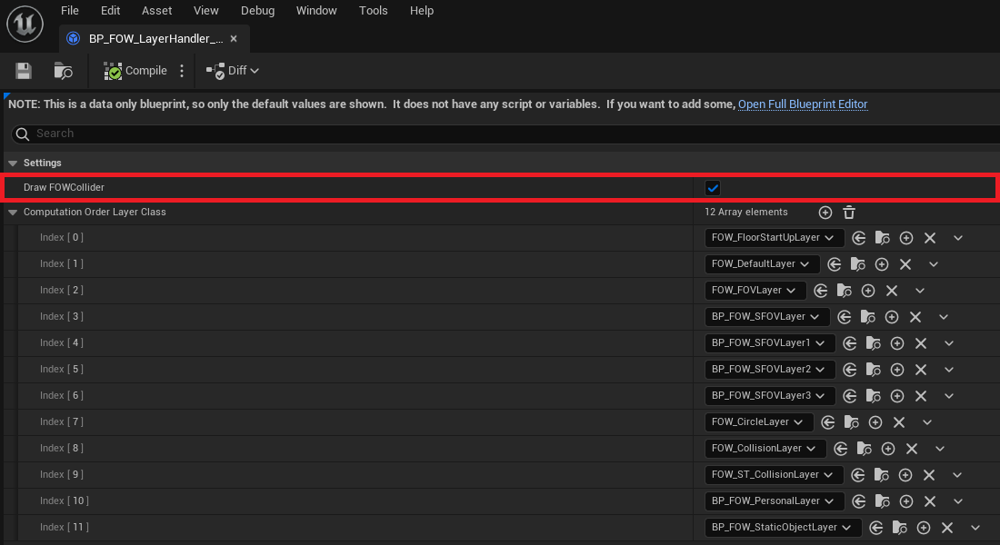

The problem behind this optimization is that the collider will always display their shadow even if you are over them.
It'll be mostly annoying for games with verticality.

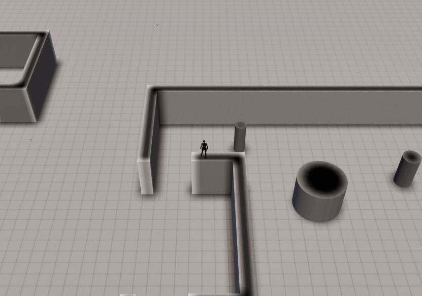

To resume, if your game doesn't use fog verticality, you're advised to enable it.

#### Computation order layer class

The `Computation order layer class` array will define the update order of the fog fragment. All of them are bound to
a `LayerSettings` and need to be merged to update the fog state. This array lets you modify the merging order. All of
the `LayerSettings` used in your game have to appear in this list or you will trigger an ensure. Be careful when re-ordering
it, you might create unwanted results if you don't pay attention between layers removing fog and layers adding fog.

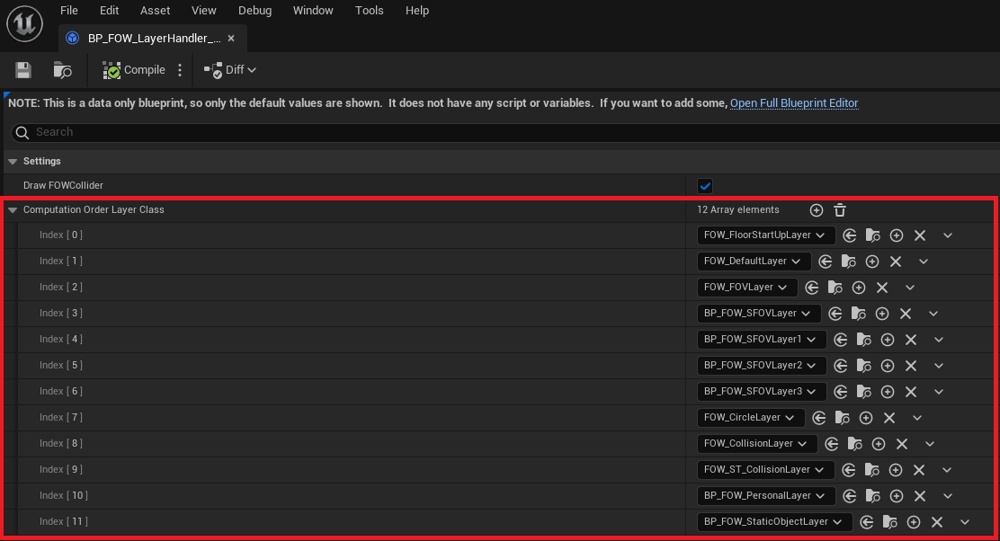
---
_Documentation built with [**`Unreal-Doc` v1.0.9**](https://github.com/PsichiX/unreal-doc) tool by [**`PsichiX`**](https://github.com/PsichiX)_