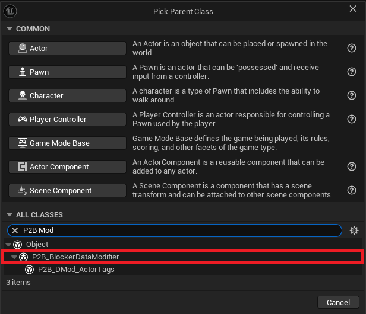
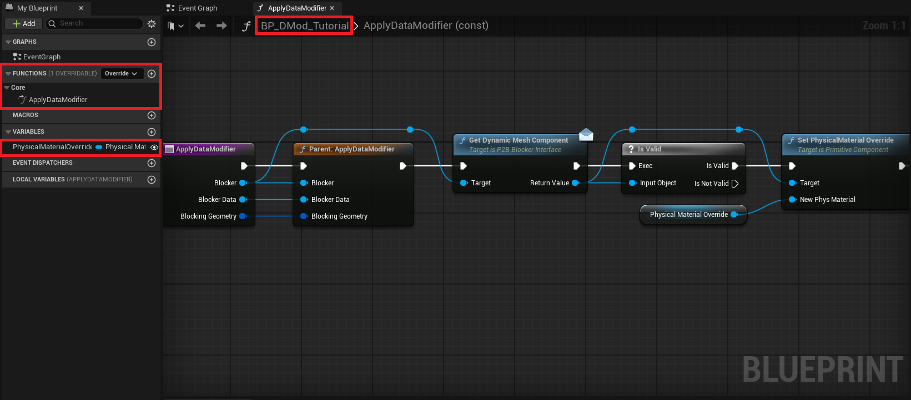
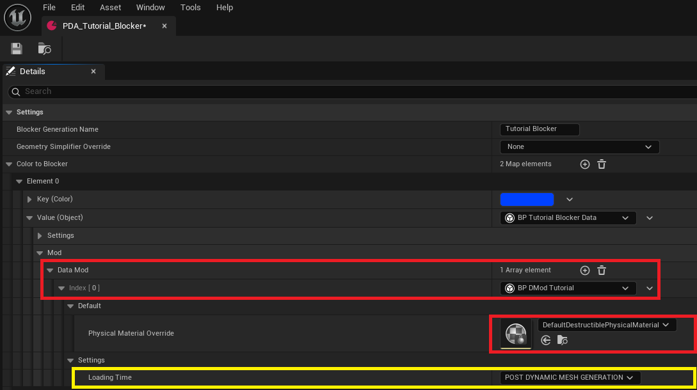
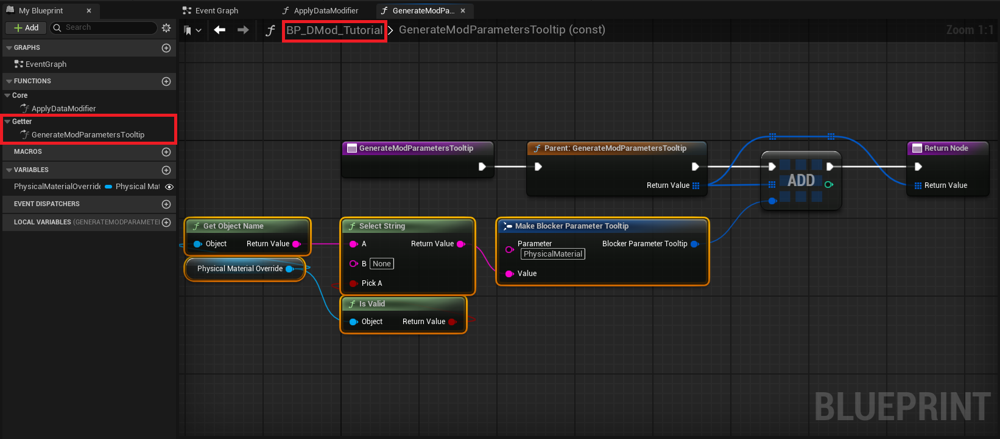
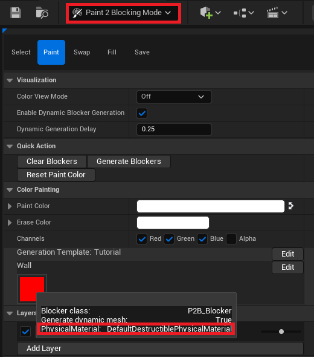

# Blocker Data Modifier

- [Create Blocker Data Modifier](#create-blocker)
  - [Custom Tooltip](#custom-tooltip)

`Blocker Data Modifier` can be created in both `C++` and `Blueprint`. This tutorial will describe only the Blueprint implementation. 
Once you understand Blueprint, implementing it in C++ should be straightforward.  

## Create Blocker Data Modifier

The `Blocker Data Modifier` is here to soften the custom blocker process and allow generic code for multiple `Blocker`. It'll be applied 
during the construction and work with an actor. The modifier will then be able to cast, get components, and call interfaces to change the 
instantiated `Blocker`.  

To begin with, let's create a `P2B_BlockerDataModifier` blueprint. Let's call it `BP_DMod_Tutorial`. 

 

Open the blueprint and override the `ApplyDataModifier` function. It'll be called during the generation depending on the `LoadingTime` value. 
Before adding any nodes, create a new variable `PhysicalMaterialOverride` of type `PhysicalMaterial`. 
Then, you can add these nodes: 
- Call the parent 
- `GetDynamicMeshComponent` from the blocker (it's an interface call) 
- Check if it's a valid object 
- Call `SetPhysicalMaterialOverride` 

 

Now that the `Modifier` is ready, you can add it to any `blocker Data Asset` in the `Mod` section. You will see the variable you created and 
another one called `Loading Time` that will define when the `Modifier` will be applied to the blocker. Three different times exist: 
- `PreDynamicMeshGeneration` The modifier will be applied before generating the `DynamicMesh`. 
- `PostDynamicMeshGeneration` The modifier will be applied after generating the `DynamicMesh`. 
- `OnSpawnFinished` The modifier will be applied when the actor has finished its `DeferredSpawn`. 

 

### Custom Tooltip  

As with the `Blocker Data`, the `Modifiers` can add custom `Tooltips` to the `Paint2BlockingMode`. To do so, open the `BP_DMod_Tutorial` and override 
the `GenerateModParametersTooltip`, then add the following nodes: 
- Call the parent 
- Add a new element 
- Create a `BlockerParameterTooltip` struct and fill it with your values 
- Return the `Tooltip` array 

 

You can now open the `Paint2BlockingMode` and see that the blockers implementing the `BP_DMod_Tutorial` have a tooltip displaying the information you 
provided. 

  

---
_Documentation built with [**`Unreal-Doc` v1.0.9**](https://github.com/PsichiX/unreal-doc) tool by [**`PsichiX`**](https://github.com/PsichiX)_