# Blockers

- [Create Blocker](#create-blocker)
  - [Use Case](#use-case)
  - [Custom Tooltip](#custom-tooltip)
- [Blocker Interface](#blocker-interface)

`Blocker` and `Blocker Data` can be created in both `C++` and `Blueprint`. This tutorial will describe only the Blueprint implementation.
Once you understand Blueprint, implementing it in C++ should be straightforward.

## Create Blocker

First, you will need to create two Blueprints inheriting from:
- `P2B_Blocker` Call it `BP_TutorialBlocker`. This will be the object spawned by the generator when associated with a color.
- `P2B_BlockerData` Call it `BP_TutorialBlockerData`. This will hold any custom data you preset in the `DataAsset`, which will then be sent to the associated `Blocker`.

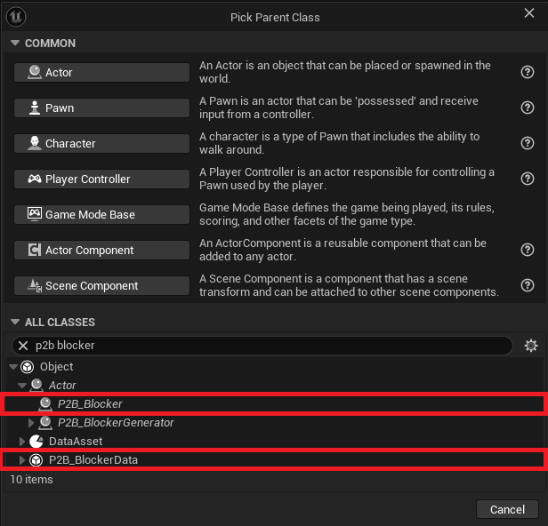

If you open `BP_TutorialBlocker`, you will have access to several overrideable functions that are called during `Blocker` generation.
The blocker is spawned in a deferred state to allow modifications before the construction script:
- `PreDynamicMeshGeneration` Called before `Finish Spawn` and before the `DynamicMesh` is generated.
- `PostDynamicMeshGeneration` Called before `Finish Spawn` and after the `DynamicMesh` is generated.
- `OnBlockerSpawnFinished` Called after `Finish Spawn`, when the construction script has been executed.

These functions provide access to the `Blocker Data` class that generated the `Blocker`. You can cast it to any type, and if the cast is valid, use the data it holds.
These functions are the core of customization, where you will add all your logic.

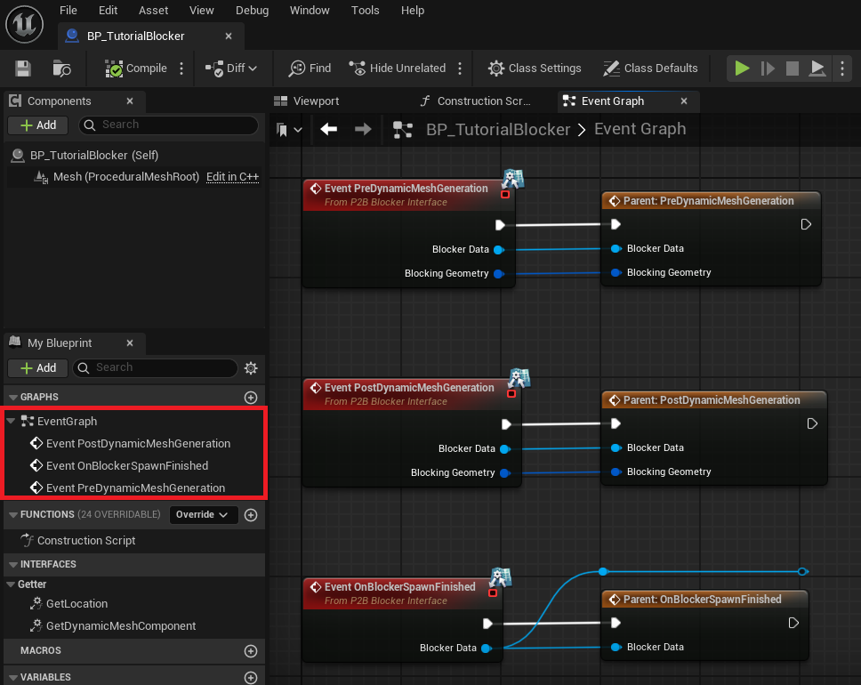

Next, open the `Template Data Asset` used by your `Blocker Generator`. This tutorial uses `PDA_Default_Generation`. Modify the following:
- Set `Default Blocker` to the new data class `BP_TutorialBlockerData`.
- Update `Blocker Soft Class` in the settings to `BP_TutorialBlocker`.

If you hit generate, all blockers will now be of the type you've just created.

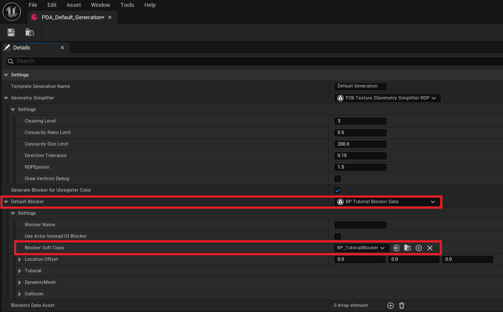

If you want only a specific color to generate this new blocker, simply create a new `Blocker DataAsset`, let's call it `PDA_Tutorial_Blocker` and add it to the list.

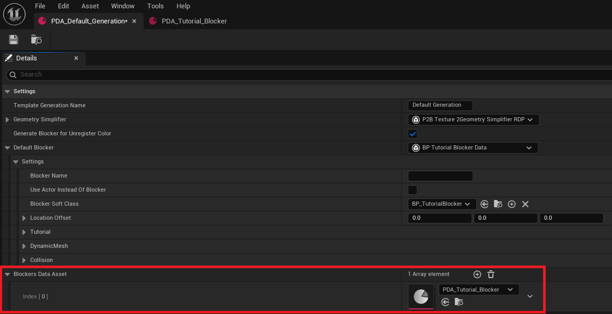

Open it and add two rows to the `Color to Blocker` section. This allows you to spawn two types of `Tutorial_Blocker` with different settings.

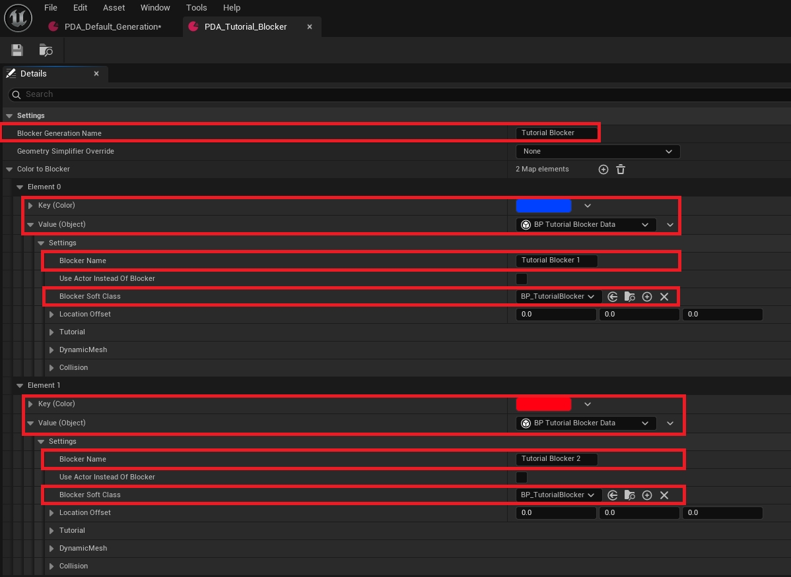

Finally, if you open `Paint 2 Blocking Mode`, you will see that the new blocker colors are available for drawing.

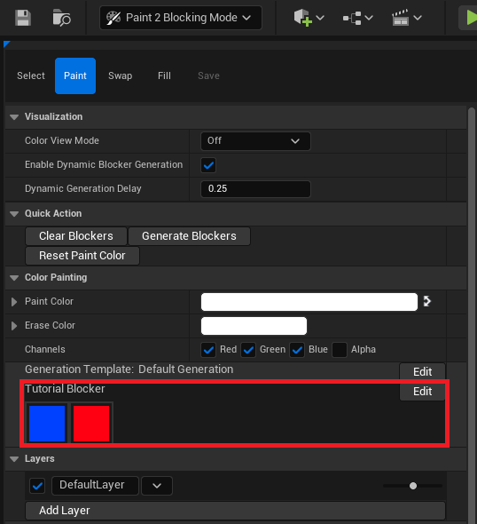

### Use Case

Now that the custom `Blocker` is set up, let's see how to use it properly. The goal of the plugin is to generate blockers and iterate on game design quickly.
For this reason, a `Blocker` isn't just a 3D mesh with a collider, it can also have logic and play a role in gameplay. 
For example, blockers can define cover areas, loot spawn zones, destructible barricades, etc.

Let's simulate a life system as an example. First, create a new component call it `BP_LifeHandler_Component`.

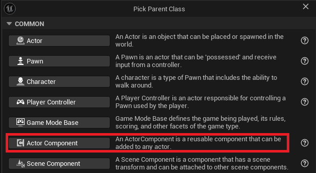

Open it and add a new variable: `CurrentLife`. I recommend assigning it a proper `Category`, such as `Settings|Life`.

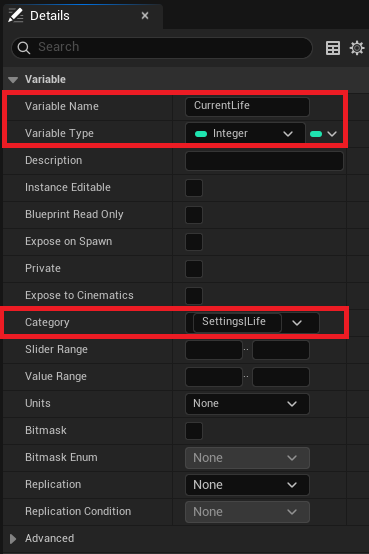

Next, open `BP_TutorialBlockerData` and do the same, add a new variable called `BlockerLife`, and set its `Category` to `Settings|Life`. 
If you check the `Class Default` values, they should look like this:

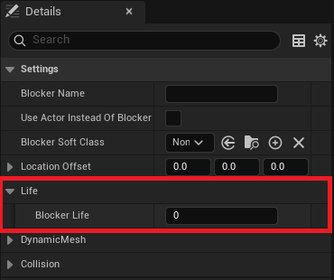

Now, open `BP_TutorialBlocker`, add the `BP_LifeHandler_Component`, and override `PostDynamicMeshGeneration` or `OnBlockerSpawnFinished`. 
Don't forget to call the parent function.

Now, follow these steps:
- Cast `BlockerData` to `BP_TutorialBlockerData`.
- If the cast is valid:
- Get the `BlockerLife` value from the data.
- Set `CurrentLife` in `BP_LifeHandler_Component`.

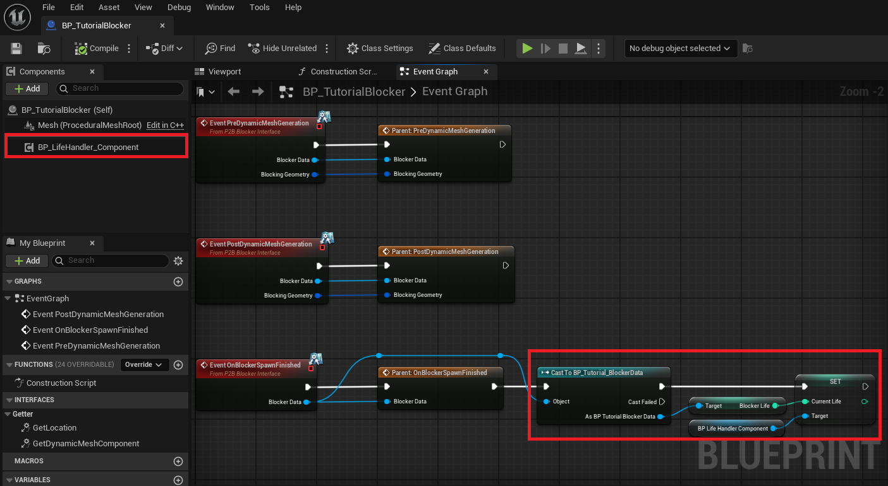

Finally, open `PDA_Default_Generation` or `PDA_Tutorial_Blocker` and set the blocker life values as needed.

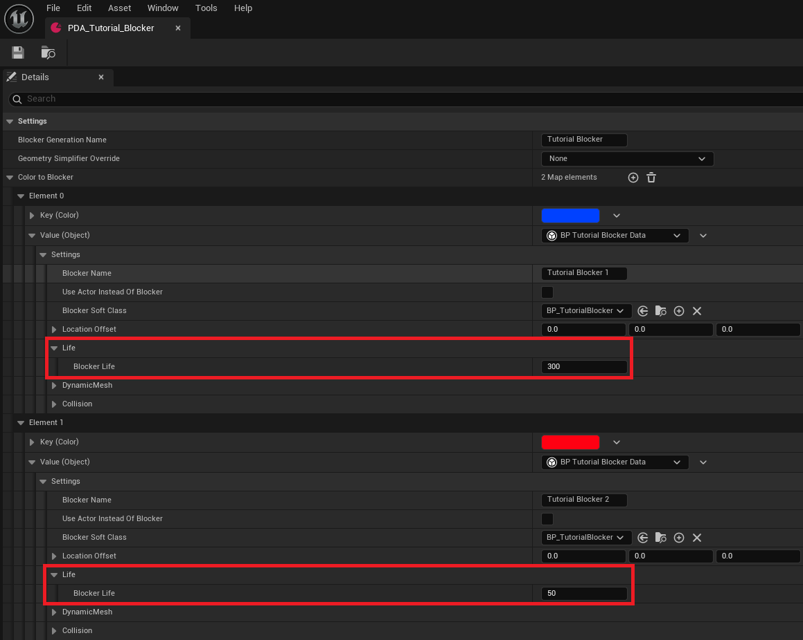

Now, when you paint different blockers, they will have different life values. This example is simplified and lacks logic for gameplay,
but it's easy to imagine a real system with targets and health mechanics.

### Custom Tooltip

`Blocker Data` is directly linked to `Paint 2 Blocker Mode`, meaning you can pass information between them. 
When this mode is open, hovering over a `Color Preset` will display a tooltip. You can add custom information to this tooltip
by overriding `GenerateParametersTooltip` in the `BlockerData` class.

For example, to display the `BlockerLife` parameter in the tooltip:
- Override `GenerateParametersTooltip` and call the parent function.
- Create a local array variable and name it `Tooltip`.
- Add an element to the array with `ParameterName` and the value of `CurrentLife`.
- Return the `Tooltip` variable.

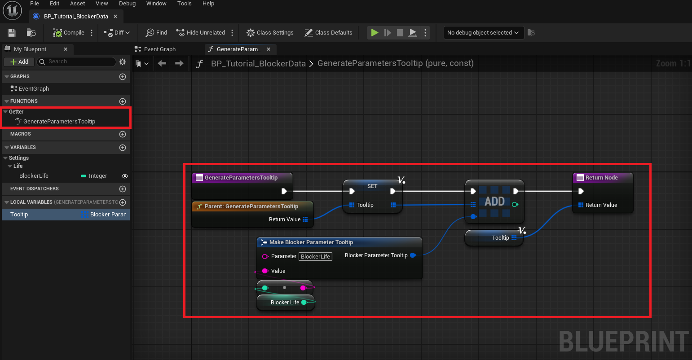

Open `Paint 2 Blocker Mode` and hover over a color. The tooltip should now display the `BlockerLife`.

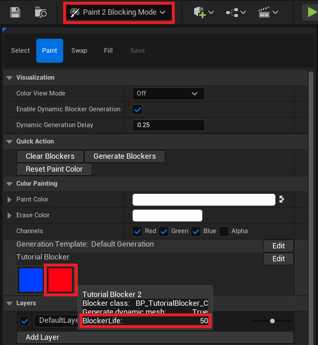

## Blocker Interface

The generation system isn't limited to the `P2B_Blocker` class, it is also possible to turn any actor to a `Blocker` thanks to the 
`IP2B_Blocker_Interface` interface. The following instruction takes into account that you've followed the previous step. The `P2B_BlockerData` 
will be omited as it work the same.  

The setup is really similar create two Blueprints inheriting from:  
- `AActor`, and call it `BP_TutorialActorBlocker`. It'll implemente the interface  
- `P2B_BlockerData` Call it `BP_TutorialActorBlockerData`. This will hold any custom data you preset in the `DataAsset`.  

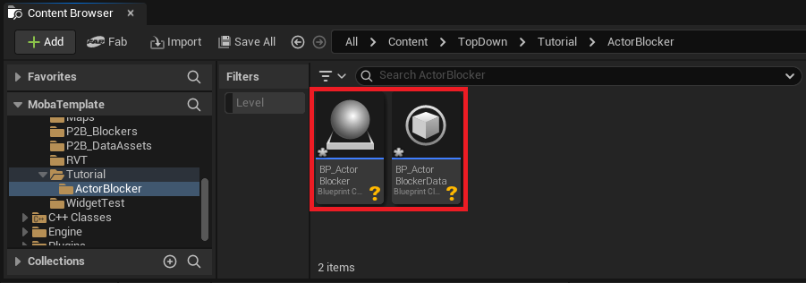  

In the `ClassSettings` of the `BP_TutorialActorBlocker` implement the `P2B_Blocker_Interface`.  

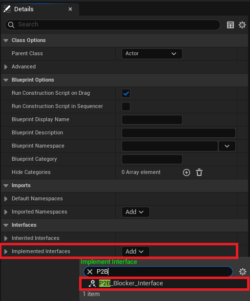  

The Actor will now have 4 new function that you can override. The 3 first have already been explained and are used during the `Blocker` generation.
The `Blockers` are by default meant to generate 3D objects, so a `DynamicMeshComponent` is present in the base class. For `Actors`, it might be different, 
and depending on the usage, you might need or not need the generation.  

To enable the generation, you will have to override `GetDynmicMeshComponent` and return a valid `DynamicMeshComponent`. 

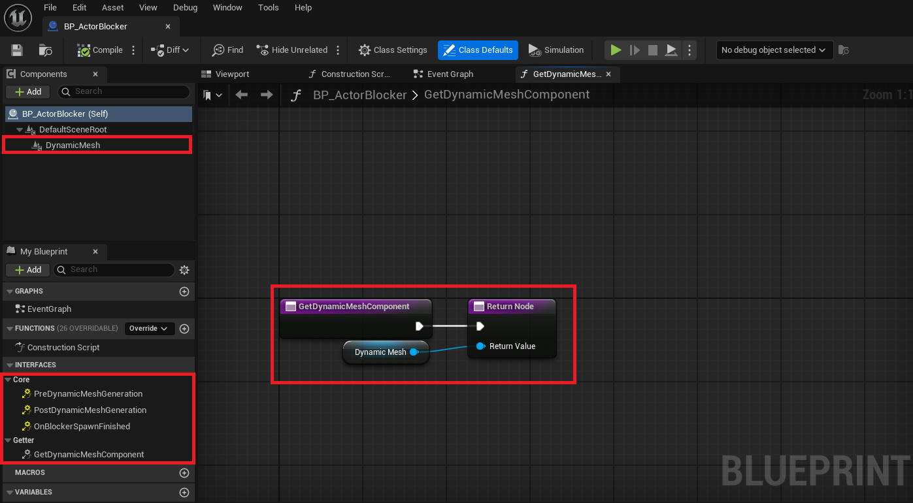  

Now that the Actor Blocker is set up, you can add it to any `Blocker Data Asset`:
- Select the correct `BlockerData` 
- Toggle `UseActorInsteadOfBlocker` 
- Select `BP_TutorialActorBlocker` in the `ActorSoftClass` parameter 

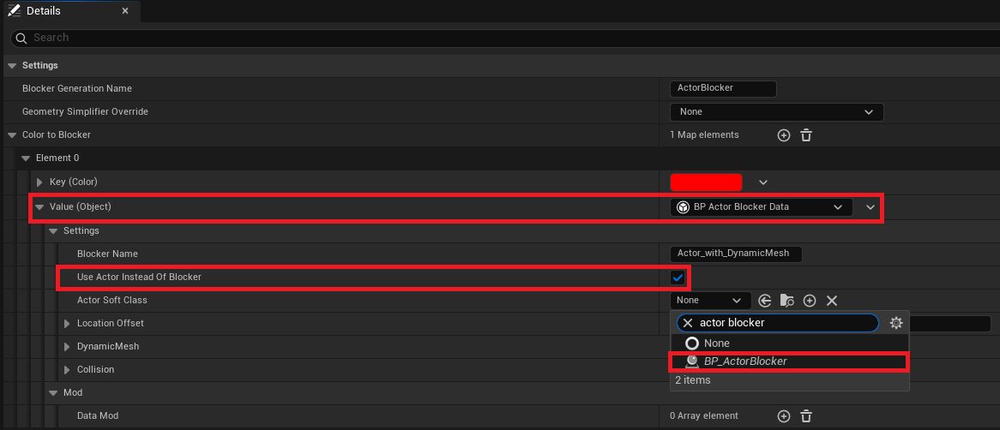  

For example, the `FOW_P2B_Bridge` uses a `Player Start` as a blocker but doesn't need a 3D mesh to be generated. By doing this, it becomes possible to 
change the starting point of the player with the `Paint2BlockingMode`.  

---
_Documentation built with [**`Unreal-Doc` v1.0.9**](https://github.com/PsichiX/unreal-doc) tool by [**`PsichiX`**](https://github.com/PsichiX)_