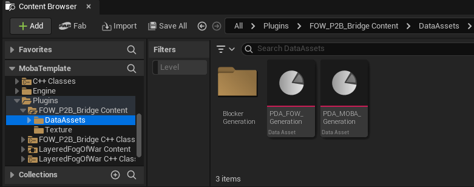
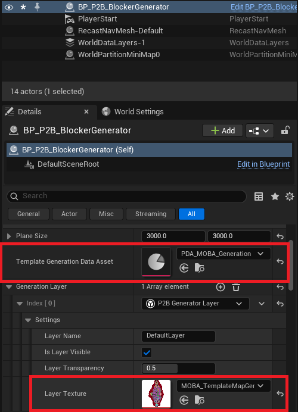

# FOW P2B Bridge

Temporary documentation

The `Bridge` comes with a few `Blocker` classes, allowing the `Blocker Generator` to spawn assets related to the `LFOW`. You can try them
by using the premade template and texture present in the plugin `Content` folder.

In your `Blocker Generator`, change the:
- `Template Generation Data Asset` to the `PDA_MOBA_Generation` template
- `Layer Texture` to the `MOBA_TemplateMapGeneration` texture

You can now hit the generate button or start painting ! :)

---
_Documentation built with [**`Unreal-Doc` v1.0.9**](https://github.com/PsichiX/unreal-doc) tool by [**`PsichiX`**](https://github.com/PsichiX)_