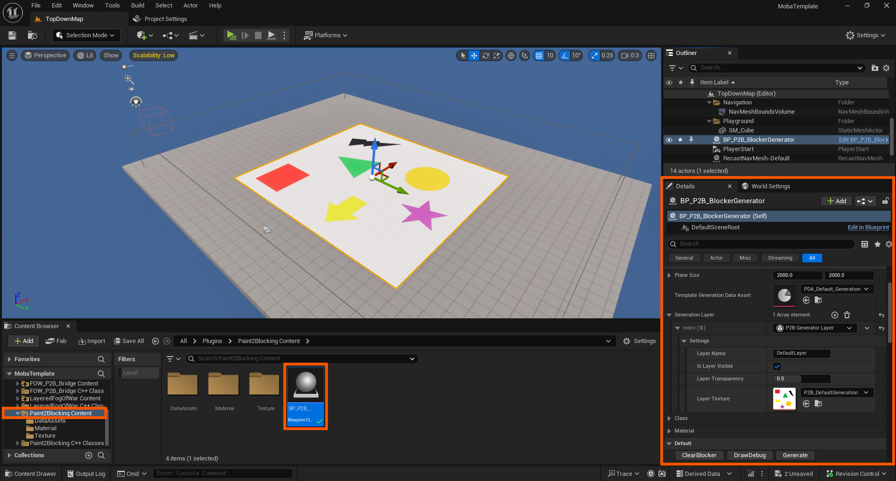
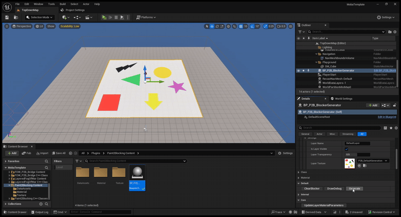
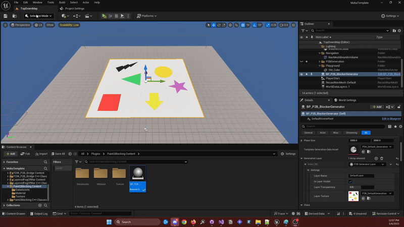
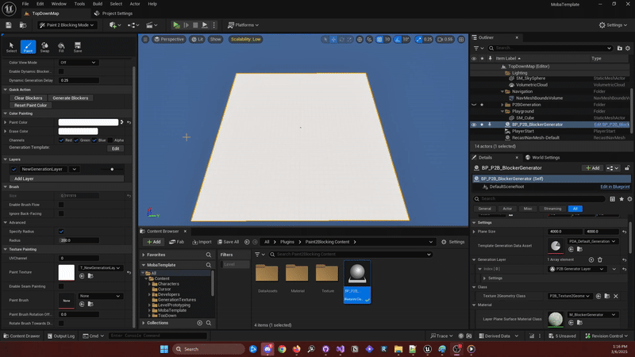
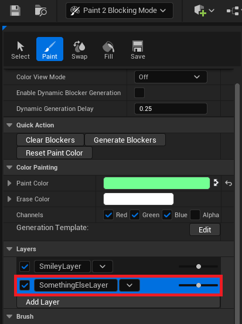
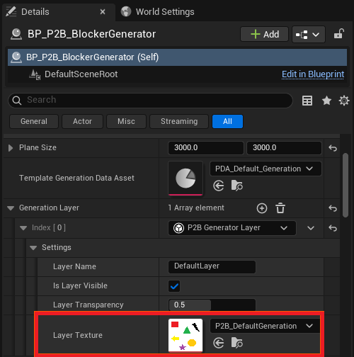
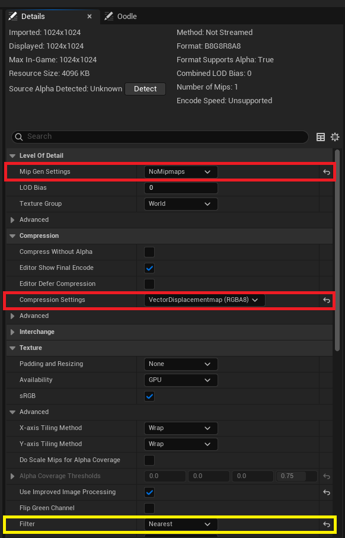

# First set up

## Table of Contents

- [Installation](#installation)
- [Set up and Usage](#set-up-and-usage)
- [Going further](#going-further)
- [Setup issues](#set-up-issues)

## Installation

The plugin has to be installed in the `UE_5.5\Engine\Plugins\Marketplace` folder in your engine or in the `Plugins` folder in your project.
This is a standalone plugin, but if you are using the `Layered Fog of War` plugin, I recommend also installing the `FOW_P2B_Bridge` in the same folder.
You can then start up your project and enable the `Plugins` from the editor, or you can edit the `YourProject.uproject` file directly.

```cpp
"Plugins": [
	{
		"Name": "FogOfWar",
		"Enabled" : true,
	},
	{
		"Name": "Paint2Blocking",
		"Enabled" : true,
	},
	{
		"Name": "FOW_P2B_Bridge",
		"Enabled" : true,
	}
]
```

## Set up and Usage

Let's get straight to the first `Blockers` generation. For that, you will have to drag and drop the `BP_P2B_BlockerGenerator` from the plugin content into
your scene. The default generator is set up with a default texture and a `Template` data asset that will generate `Blockers` from any color. You can see
in the details panel a few settings values and three buttons used for the editor actions. You can change the size of the generation plane by tweaking the 
`Plane Size` value from the Details panel.



Once the Generator is in your scene, you can now generate the `Blockers` by hitting the `Generate` button! You can also delete everything by hitting the
`Clear blockers` button. The `Draw Debug` will draw small debug spheres where the geometry vertices are.



Now that the generation is working, let's paint and create some custom shapes!
- First, open up the `Paint2Blocking Mode`
- Select the `Blocker Generator`
- Go to the `Painting` tool
- In the layers, click on the dropdown arrow and delete it
- Then add a new layer, give it a name, and create it

You will have a new texture asset created in a new folder: `Content/GenerationTextures`. During the texture creation, you can modify the creation folder if it
doesn't suit you.



Now that the new layer is set up, you can change its size if needed in the `BP_P2B_BlockerGenerator` details panel and then start drawing.
- Select a color
- Draw any shape
- Hit the generate blockers button

> **Note that you can automatically generate drawers by turning on `Enable Dynamic Blocker Generation`! <br />**



And that will be all for the default setup. Generated blockers will have default collision presets and will update the pathfinding if one is set up.
You can add any number of `Layers`, but you will have to select it before painting; otherwise, the first one will be used.



## Going further

You might want to use a custom texture coming from Photoshop or Paint. To do that, you will need to import a PNG into the engine (There are some issues with
the painting mode, and source file conditions are strict). Now, you can select the `BlockerGenerator`, and in the `GenerationLayers`, change the texture in use
to the new one you've imported.



Before being able to generate any `Blockers` out of it, you will have to change a few settings.
- Change `MipGenSettings` to `NoMipmaps`
- Change the `Compression Settings` to `VectorDisplacementMap` (this mode is used because there are 4 channels of 1 byte)
- Change the `Filter` to `Nearest` (not necessary, but advised)



You can now generate the `Blockers` out of the texture, but be careful with the density of different colors. The current `Template` data asset will
try to generate a `Blocker` out of every shape of any color it finds (except white). To change this behavior, go to the `Blocker DataAsset Tutorial`.

---
_Documentation built with [**`Unreal-Doc` v1.0.9**](https://github.com/PsichiX/unreal-doc) tool by [**`PsichiX`**](https://github.com/PsichiX)_