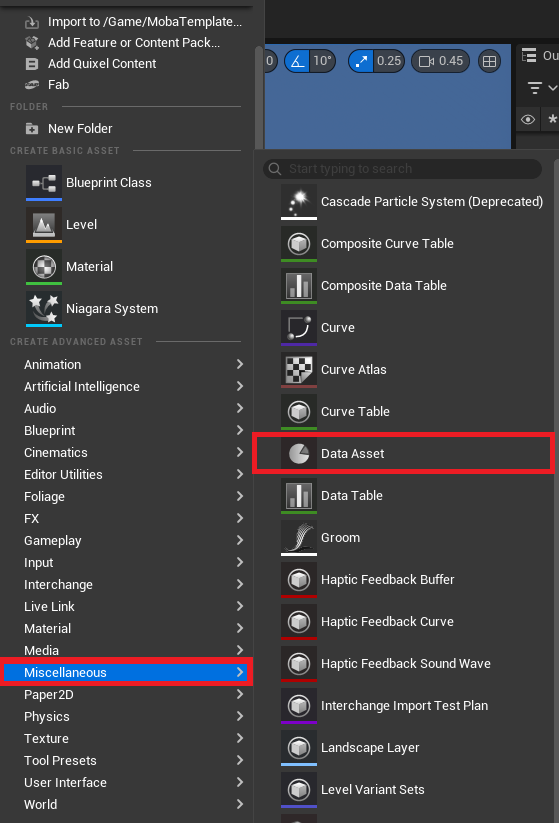
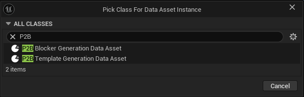
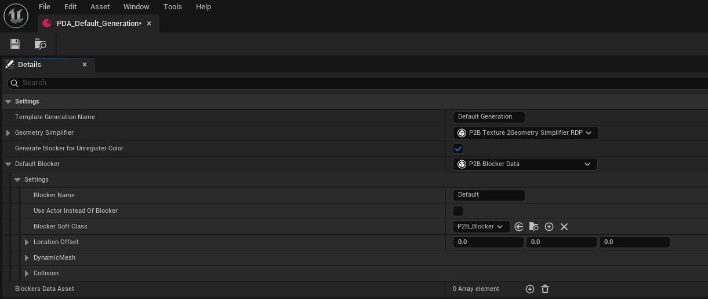
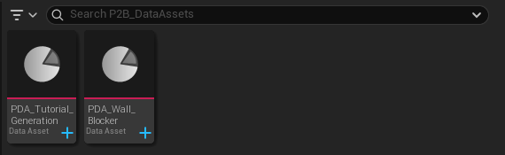
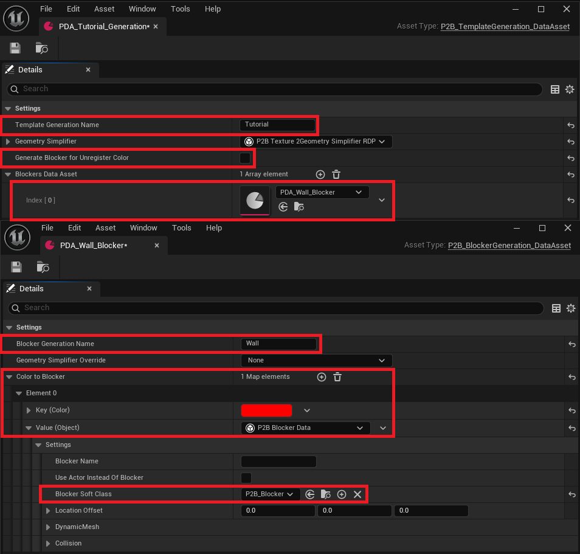
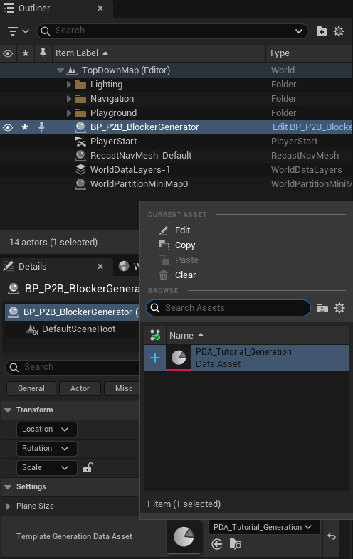
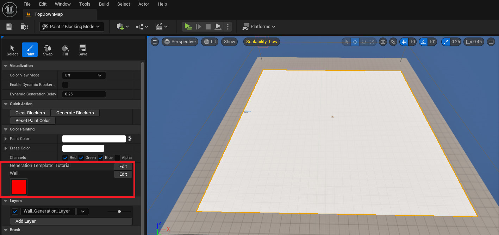

# Generation Data Assets

- [Create PDA](#create-pda)
- [Template](#template)
- [Blocker](#blocker)
  - [Fast setup](#fast-setup)
  - [Blocker settings](#blocker-settings)

This tutorial will explain how to create a working environment for the drawing tool of the plugin. The setup will only depend on `Data Assets`,
which will provide generation information for the colors drawn on the textures.

## Create PDA

Data asset creation in Unreal is a bit particular, as there are two ways to create it. You can:
- Create a `Blueprint` of the DataAsset class to add new values, inherit properties, and preset it to your needs.
- Create a `Packageable` data asset, which can only be edited and has no inheritance.

To make the `BlockerGenerator` work, you will need the second one:
- Right-click in the content viewer.
- In miscellaneous, select `DataAsset`.

Now, you will have to select the class that you want to use to generate the Data Asset. The plugin has two main classes for generation:
- `UP2B_TemplateGeneration_DataAsset`
- `UP2B_BlockerGeneration_DataAsset`

## Template

The `UP2B_TemplateGeneration_DataAsset` holds a list of blocker presets and allows you to efficiently change what the `BlockerGenerator` will generate. 
For example, you can have a `PDA_Urban_Generation` and a `PDA_Forest_Generation`.

Let's break down the parameters:
- `Template Generation Name`, Displayed by the painting tool for color selection.
- `Geometry Simplifier`, Allows tweaking how the geometry is simplified during vertices extraction. Can be overridden in the Blockers data assets.
- `Generate Blocker For Unregistered Color`, Toggle this to generate a blocker for any color shape the generator finds. Be cautious with the texture in use, as the generator has no limits.
- `Blockers Data Assets`, An array holding other types of Data Assets that bind a `Color` to a `Blocker`.

The default blocker settings will be explained in the Blockers DataAssets section. These settings define what the `Blocker Generator` will spawn.

## Blocker

### Fast setup

Before explaining how the `UP2B_BlockerGeneration_DataAsset` works, let's set up a working template. Create two Data Assets, one of each type:
- `UP2B_TemplateGeneration_DataAsset`, The template holding the `Blockers` parameters, which you will call `PDA_Tutorial_Generation`.
- `UP2B_BlockerGeneration_DataAsset`, The color-to-blocker binding that will use the template. Let's create `PDA_Wall_Blocker`.

Now that both data assets are created, let's tweak the template first:
- Rename the `Template Generation Name` to `Tutorial`.
- Disable `Generate Blocker For Unregistered Color`.
- Add `PDA_Wall_Blocker` to the `Blockers Data Assets` array.

Now, for the blocker:
- Rename the `Blocker Generation Name` to `Wall`.
- Add a new element to the `Color to Blocker`.
- Select any color except white and set the alpha to one.
- In the `Value`, select the `P2B Blocker Data`.
- Then, in the `Blocker Soft Class`, select `P2B_Blocker`.

This setup defines the `PDA_Tutorial_Generation` template to generate walls. The `PDA_Wall_Blocker` specifies that only one kind of wall can be spawned.

Select the `Blocker Generator` in the editor, go to the details panel, and change the `Template Generation Data Asset` to the one you've just created.

Finally, open the `Paint 2 Blocking Mode`, select paint, and you will see that you can select the `Wall` color to draw. You can simply click on it to update
the `Paint Color` brush.

You can now define as many wall types as needed by adding a new element to `Color to Blocker`. I also recommend providing a name for each blocker using `Blocker Name`.
You can also create another type of blocker by creating a new `UP2B_BlockerGeneration_DataAsset` and registering it in the `PDA_Tutorial_Generation` template!

### Blocker settings

Every color has a `Blocker Data` class associated with it. By default, `P2B_Blocker_Data` is used to generate basic geometry. This class can be overridden to add any number
of parameters needed by the `Blocker`. The default settings are limited and focus only on mesh generation and its location:
- `Blocker Name`, Changes the name of the spawned blocker in the editor.
- `Use Actor Instead Of Blocker`, Allows the spawning of any actor. If the actor inherits from `P2B_Blocker_Interface`, it will have access to the `Blocker Data`.
- `Blocker Soft Class` & `Actor Soft Class`, The asset spawned by the `Blocker Generator`.
- `Location Offset`, Offsets the actor's center location.
- `Generate Dynamic Mesh`, Toggles the 3D generation of the blocker.
- `Override Texture Color`, Uses another color for the 3D mesh instead of the color bound to the `Blocker`.
- `ZExtend`, Determines how much the 3D geometry will extend below and above the center. X moves downward, Y moves upward (use positive values only).
- `Draw Wireframe`, Draws the debug wireframe of the generated mesh.

Other values are straightforward and use the same names as the editor. The generator will simply apply them to the same parameters in the spawned actor.

---
_Documentation built with [**`Unreal-Doc` v1.0.9**](https://github.com/PsichiX/unreal-doc) tool by [**`PsichiX`**](https://github.com/PsichiX)_